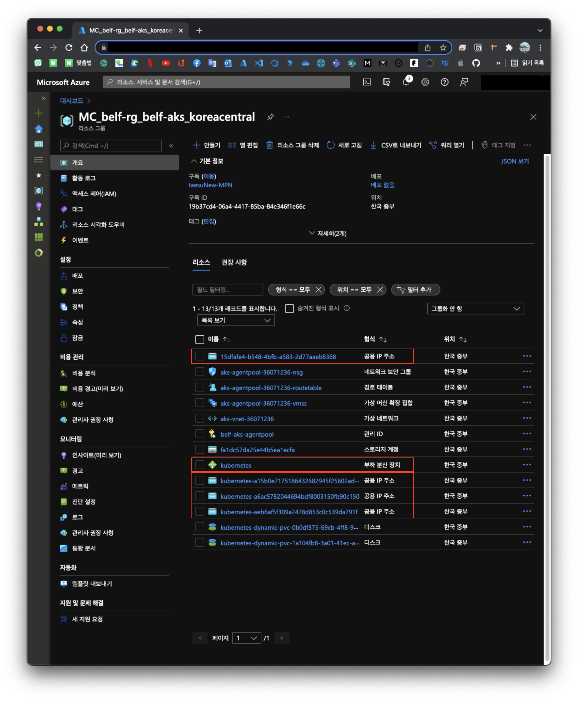
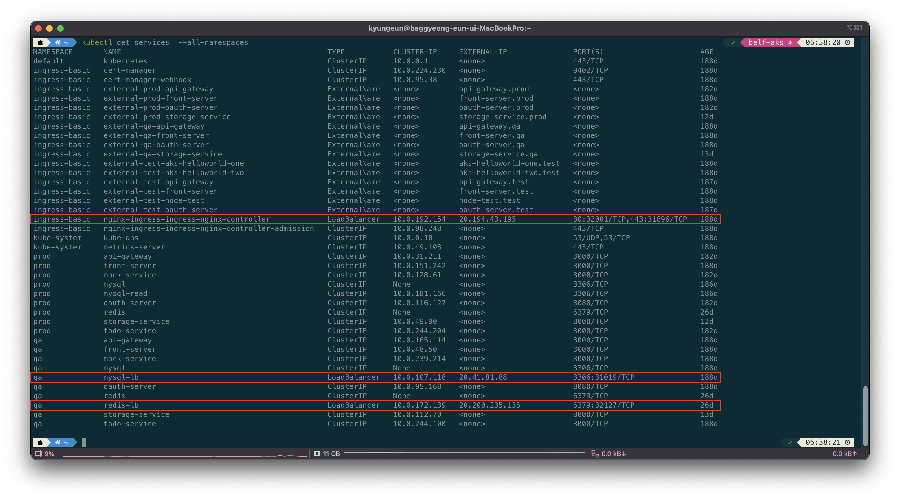
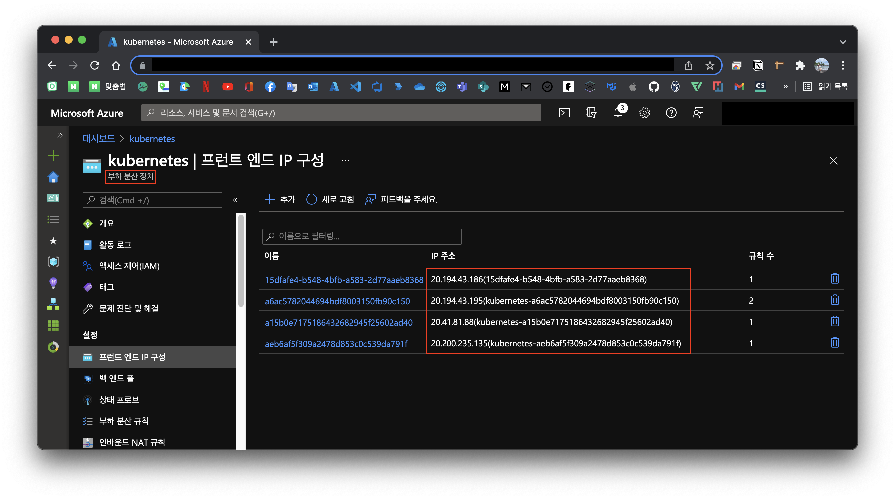
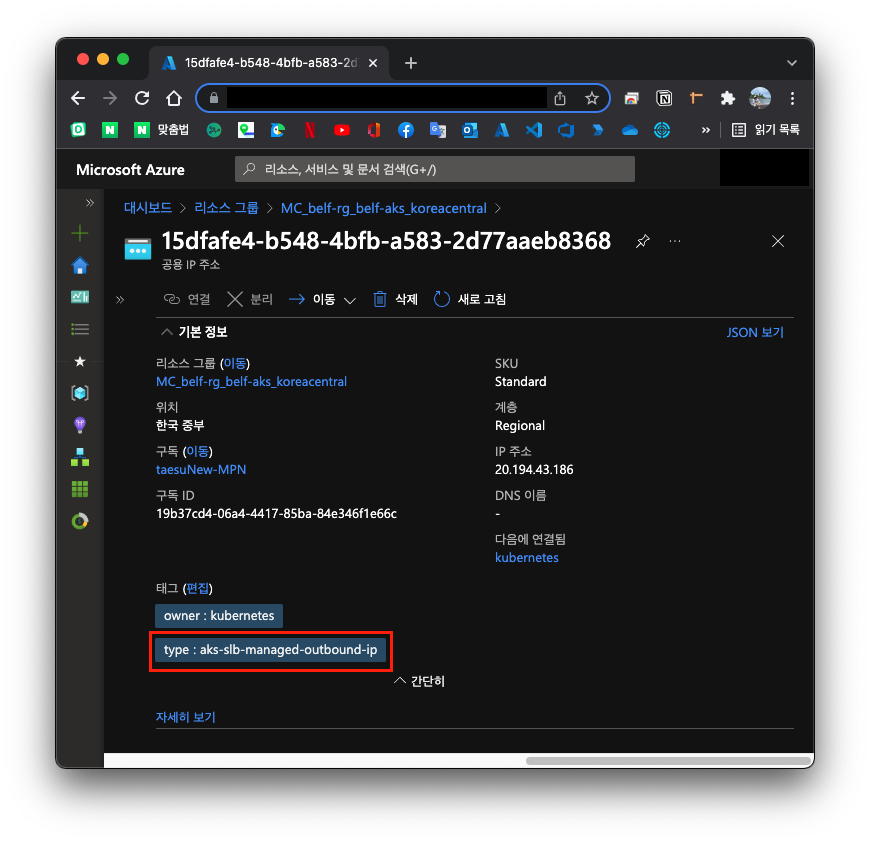
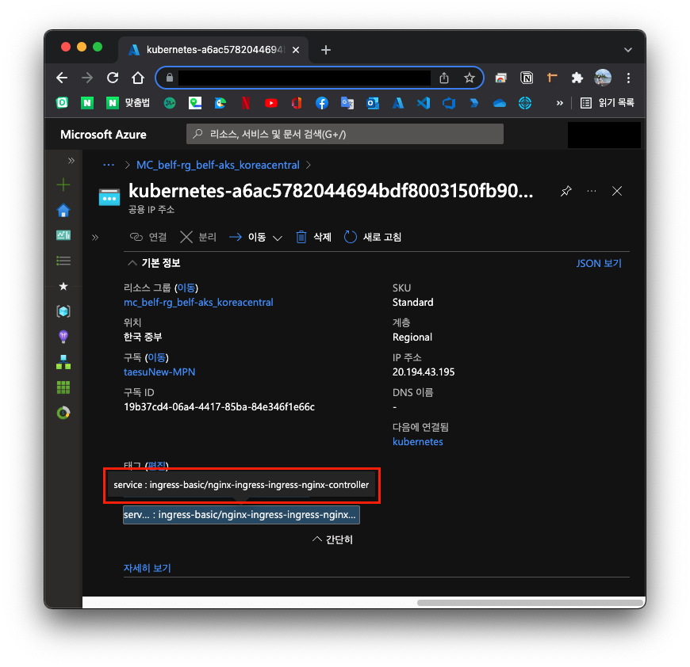
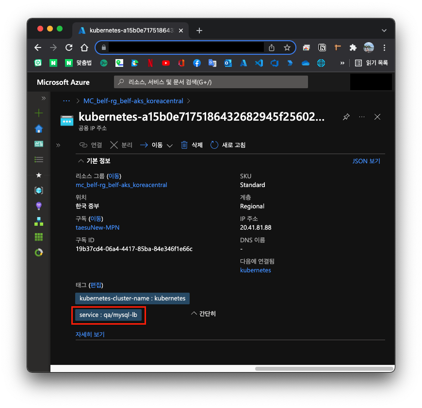
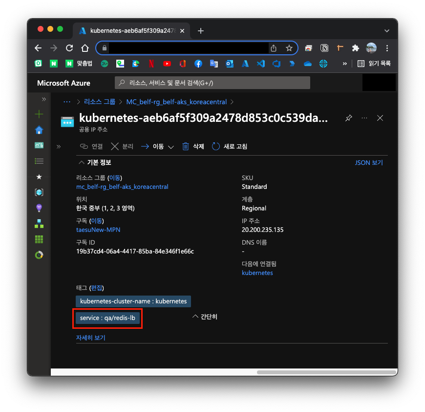

# Overview

Azure에서 AKS를 사용하면서 문득 이런 궁금증이 생겼습니다.

> ingress를 통해 외부의 트래픽을 받아오는데 ingress IP은 어디서 생성되었으며 어떻게 Load balancing이 되는거지?

> svc를 LoadBalancer으로 생성하는 경우 IP가 생성되는데 어디서 생성된거지? 해당 IP는 어떻게 Load balancing 된다고 장담할 수 있는거지?

Azure에 k8s cluster를 올려놓고 k8s의 spec에 맞게 `.yaml` 을 적용하면 예상하는 대로 동작이 되어서 Azure가 핸들링 한건지 k8s가 핸들링한건지 큰 관심을 안가지고 있었는데 AKS 관련 내용을 정리하다가 갑자기 궁금해져서 간단하게 찾아보고 정리하려고 합니다.

# 리소스 관련이므로 Azure가 하겠지?

IP 생성이랑 Load balancing 이부분은 리소스를 제공하는 Azure만 핸들링할 수 있다고 생각합니다.

그렇다면 어떤 리소스 타입으로 핸들링하느냐를 찾아야하는대 생각보다 쉽게 찾을 수 있었습니다.

# 부하 분산 장치와 공용 IP 주소

AKS를 생성하면 자동으로 `부하 분산 장치` 라는 리소스가 생성됩니다.

또한, ingress를 설치하고 LoadBalancer type svc를 생성하다 보면 리소스 그룹에서 `공용 IP 주소` 라는 것을 쉽게 찾아볼 수 있습니다.

결론부터 말하면 `공용 IP 주소` 가 하나의 IP 주소에 대한 리소스이며 k8s svc의 `EXTERNAL-IP` 를 의미합니다. `부하 분산 장치` 는 여러개의 `공용 IP 주소` 를 IP 구성으로 가지고 있습니다.

그러면 ingress가 생성되거나 혹은 LoadBalancer type svc가 생성되는 것처럼 `외부 IP가 필요한 경우` Azure가 알아서 `공용 IP 주소` 를 생성하고 `부하 분산 장치` 에 바인딩 해주는 거라고 생각할 수 있습니다.

> 이러니까 이해가 되네...

# 실제로 그런지 확인해보자

실제로 그런지 한번 확인해보겠습니다. 위의 캡처 사진은 belf project에서 사용된 리소스 그룹을 캡처한 것인데 외부로 노출되는 svc는 모두 [belf-kr/infrastructure-as-code](https://github.com/belf-kr/infrastructure-as-code/tree/v0.3.1) 에서 소비되고 있었습니다.

`.yaml` 을 읽기 귀찮으신 분들을 위하여 외부로 노출된 svc를 나열해 드리면 아래와 같습니다.

| ns            | name                                   | 이유                                                                                           |
| ------------- | -------------------------------------- | ---------------------------------------------------------------------------------------------- |
| ingress-basic | nginx-ingress-ingress-nginx-controller | [HTTPS 수신 컨트롤러](https://docs.microsoft.com/ko-kr/azure/aks/ingress-tls) 를 사용하기 위함 |
| qa            | mysql-lb                               | qa 환경 mysql 데이터 조회를 팀원도 조회할 수 있도록 외부로 노출하기 위함                       |
| qa            | redis-lb                               | qa 환경 redis 데이터 조회를 팀원도 조회할 수 있도록 외부로 노출하기 위함                       |

> `kubectl get services --all-namespaces`  
> 

> `부하 분산 장치`  
> 

외부로 노출된 svc는 총 3개인데 위의 리소스 그룹에서는 `공용 IP 주소` 가 4개가 존재하였습니다. 한개는 뭘까요?

# aks slb (공용 부하 분산 장치 사용)

`공용 IP 주소` 의 기본 정보를 보니까 태그에 친절하게 k8s metadata 들어가있어서 쉽게 찾을 수 있었습니다.

> 

> 
► 공용 IP 주소들 자세히 보기

>
> 
>
> 
>
> 
>
> 
>
> 

type이 `aks-slb-managed-outbound-ip` 인 리소스이였는데 AKS 클러스터의 송신 트래픽을 허용하기 위한 공용 IP 인거 같습니다.
해당 부분에 대해서는 더 깊게 찾아보지 않아서 궁금하신 분들은 [Undocumented public IP in AKS-provisioned load balancer](https://github.com/Azure/AKS/issues/1281#issuecomment-543867504) 를 읽어보시면 좋을 꺼 같습니다.

# 마무리

k8s에서 IP를 필요로 할 때 Azure가 어떻게 핸들링 하는지 아주 간단하게 알 수 있었습니다.

각 클라우드 프로바이더마다 처리 방법이 다르겠지만 그래도 역시 기존에 있던 클라우드 자원을 잘 조립해서 처리하는 방향일 것 같습니다.

읽어주셔서 감사합니다 :)
