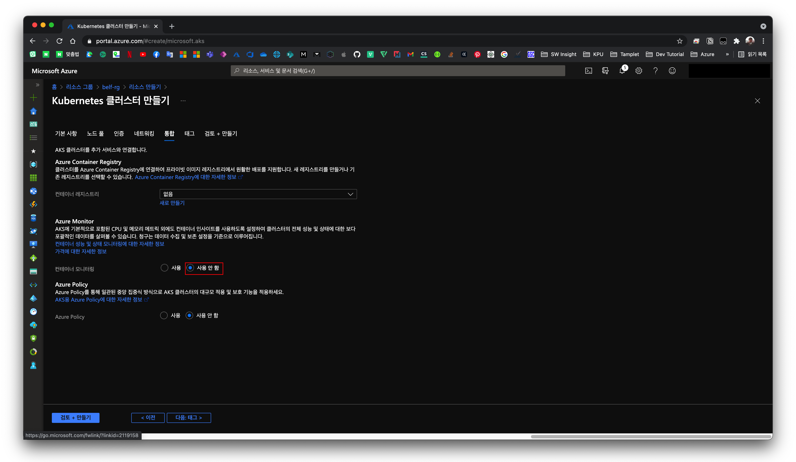

# Index

|       |                                                            |
| ----- | ---------------------------------------------------------- |
| 1편   | [소개](/devops/workflows-with-aks-github-slack-1)          |
| 2편   | [blueprint](/devops/workflows-with-aks-github-slack-2)     |
| `3편` | [인프라 생성](/devops/workflows-with-aks-github-slack-3)   |
| 4편   | [github 설정](/devops/workflows-with-aks-github-slack-4)   |
| 5편   | [slack 설정](/devops/workflows-with-aks-github-slack-5)    |
| 6편   | [github action](/devops/workflows-with-aks-github-slack-6) |
| 7편   | [회고](/devops/workflows-with-aks-github-slack-7)          |

# Overview

이전 챕터에서 말한 blueprint에 맞게 인프라를 생성하도록 하겠습니다.

Azure의 AKS(Azure Kubernetes Service) 를 중점으로 사용할 것인데 클라우드 환경을 사용하므로 우선 가격에 주의해야겠죠?

저는 회사에서 `Visual Studio Enterprise` 구독으로 Azure에 월간 \$150 (약 ₩168,698) 개별 크레딧이 제공됩니다. 해당 금액을 최대한 활용하여 인프라를 생성하려고 합니다.

# 필요한 것들이 뭐가 있지? (비용 계산)

서비스를 운영하기 위해서 필요한 것들을 나열하면서 가격을 어림잡아 계산해 보았습니다.

> 필요한 리소스를 추려서 월 단위로 [Azure 가격 계산기](https://azure.microsoft.com/ko-kr/pricing/calculator/) 를 사용하여 계산하였습니다.

| 리소스        | 타입        | 용도 및 비고                                                                                                                                                                                                                        | 가격     |
| ------------- | ----------- | ----------------------------------------------------------------------------------------------------------------------------------------------------------------------------------------------------------------------------------- | -------- |
| AKS           | k8s         | 1. 안정적인 롤링 업데이트 등 k8s 운영을 위해 Node를 3개로 잡고 컴퓨팅 파워를 줄이는 방향으로 설정되었습니다.   2. B2s: vCPU 2개, 4GB RAM, 8GB 임시 스토리지, ₩61.695(대략) / 시간   3. Node 3개 사용 기준 ₩135,112.93   | ₩135,000 |
| Azure Diks    | 정적 저장소 | 1. mysql replication 을 위해 사용 됨   2. 표준 SSD LRS   3. E3: 16 GiB, 500 프로비저닝된 IOPS, 60 프로비저닝된 MB/초, ₩1,349.580/월                                                                                     | ₩1,500   |
| Azure Storage | 정적 저장소 | 1. 공식문서의 spec에 맞게 100gb 이라면 약 ₩7,495.23   2. 가격이 저렴해서 일단은 10gb으로 시작하고 올리는 것을 전략으로 설정   3. 10gb를 사용하면 월 약 ₩814 소요됨                                                      | ₩1,000   |
| App Insight   | 모니터링    | 따로 가격이 없는 듯                                                                                                                                                                                                                 | ₩0       |
| Dashboard     | 모니터링    | 따로 가격이 없는 듯                                                                                                                                                                                                                 | ₩0       |

이외 AKS를 생성하면서 부가적으로 따라오는 DNS, IP, Load Balancer 등이 있을 것이며 실제로 운영하면서 리소스양과 옵션이 더 늘나고 줄어들 수 있을 것 입니다.

대략적으로 도합 ₩140,000 정도 산출되었는데 사실 크래딧에 비해서 많이 여유가 없는 편입니다. 예상하지 못한 곳에서 비용이 많이 청구될 수도 있고 예상하지 못한 리소스를 추가할 수도 있기 때문입니다.

하지만 사이드 프로젝트 성격이 강하여 만약에 금액이 부족한 상황이 온다면 엔지니어가 잠자는 시간과 같은 IDLE 상태에 서버를 down 시켜놓을려고 합니다.

> 일단은 한번이라도 운영을 해보면서 경험을 쌓아야할 꺼 같아요!

# AKS를 만들어보자

> Azure에 관련된 설명 및 AKS를 생성하는 방법은 공식문서가 훨씬 디테일 하게 잘 나와있습니다. 해당 글은 제가 실제로 만들어 봤던 경험에 빗대어 쉽게 설명하는 것이니 참고해주세요.

## azure resource group 생성

azure에서 resource 생성하기 위해서는 논리적인 구분 단위인 resource group이 필요하므로 만들어주도록 합니다.

resource group 이름을 입력하시고 영역을 선택하도록 합니다. 저는 한국 중부로 선택하였습니다.

## aks 생성

위에서 생성한 resource group에서 상단에 있는 추가 버튼을 통하여 `Markeplace` 을 클릭하도록 합니다.

우리는 AKS를 만들 것이기 때문에 `Kubernetes Service` 를 클릭하도록 합니다.

> 만약 시작 사이드 메뉴에서 나오지 않는다면 검색 혹은 컨테이너와 같은 다른 매뉴에 찾아보새요

## aks 설정

첫번째 step은 기본 사항 입니다. 아래의 설명에 맞게 입력하도록 합니다.

1. Kubernetes 클러스터 이름
   1. aks 리소스 이름이 됩니다.
1. 지역
   1. 저는 아까운 `한국 중부` 로 선택하였습니다.
1. Kubernetes 버전
   1. k8s cluster 버전 입니다.
1. 노드 크기
   1. k8s cluster의 Node 컴퓨터 사양을 말합니다.
   1. 저는 위에서 말한대로 금액을 맞추기 위해서 `B2s` 으로 설정하였습니다.
1. 노드 개수
   1. 위의 노드 크기에서 설정한 Node의 개수입니다.
   1. 저는 위에서 말한대로 금액을 맞추기 위해서 `3` 개로 설정하였습니다.

두번째 step은 노드 풀 입니다. Azure에서 k8s의 Node는 하나의 VM으로 취급되는 것으로 확인됩니다.

노드 풀에서 `가상 머신 확장 집합 사용` 을 체크하면 여러개의 Node를 `가상 머신 확장 집합` 으로 묶어서 관리합니다.
`가상 머신 확장 집합` 으로 묶어서 관리하면 Node(VM) 이 집합 단위로 묶이기 때문에 리소스 관리포인트가 줄고 집합으로 묶인 VM을 스케일 업/다운 및 Down/Up 도 편리합니다.

저는 추후 비용 절감을 위해 비개발시 k8s cluster의 모든 Node를 Down하여 비용절감을 원하기 때문에 `가상 머신 확장 집합 사용` 을 체크하도록 하곘습니다. (체크가 기본 값)

참고로 아래 사진에 있는 `agentpool` 노드 풀은 이전 step인 기본 사항(위 사진) 에서 선택한 주 노드 풀 입니다.

추후, 저성능의 Node와 고성능의 Node를 따로 집합으로 관리하여 k8s에서 Pod의 성격에 맞게 Node을 배포하면 다이나믹하게 컴퓨터 성능을 사용할 수 있어 재밌는 그림이 나올 꺼 같습니다.

> 

> 
► 가상 머신 확장 집합 구경하기

>
> 
> Node가 3개 이므로 인스턴스가 3개 존재하는 것을 확인할 수 있습니다.
> 
>
> 

세번째 step은 인증 입니다. 저는 azure cli를 통해서 k8s master node에 접근할 것 이고 추후, master node에 추가적으로 접근해야하는 엔지니어가 필요하면 RBAC을 사용할 것 이기 때문에 기본 값 그대로 두고 다음으로 넘어갔습니다.

네번째 step은 네트워킹 입니다. 여기서는 `HTTP 애플리케이션 라우팅 사용` 체크 이외에는 모두 기본 값을 사용하도록 했습니다.

> `HTTP 애플리케이션 라우팅` 이란?  
> 쉽게 말해서 DNS 영역을 생성해주고 Ingress에 등록되는 도메인을 자동으로 Azure DNS 영역의 레코드에 추가/삭제 해주는 것 입니다.
> 

> 🚨 여기서 `HTTP 애플리케이션 라우팅` 를 체크한 이유는? 🚨  
> [공식문서](https://go.microsoft.com/fwlink/?linkid=2032149) 에서는 `HTTP 애플리케이션 라우팅 사용` 을 프로덕션에서는 사용하지 말라고 합니다. 그럼에도 여기서 사용하는 이유는 체크 시 리소스 그룹에 알아서 DNS을 생성해주기 때문입니다.  
> 
> 어짜핀 우리도 **HTTPS를 사용하기 위해서 따로 수신 컨트롤러를 만들겁니다.** 그럼에도 `HTTP 애플리케이션 라우팅 사용` 을 체크한 이유는 `HTTPS 수신 컨트롤러` 를 만들기 위해서는 도메인이 필요하기 때문입니다. 정확히 말하면 `HTTPS 수신 컨트롤러` 를 만드는 과정에 TLS 발급을 위하여 도메인이 필요하기 때문입니다.
> 
> 정리하자면 만약 여러분의 환경이 `HTTPS 수신 컨트롤러` 가 필요하지 않고 k8s svc를 IP가 아닌 도메인으로 접근하고 싶은데 DNS가 없어서 DNS가 필요하다면 체크하셔도 됩니다. 저는 이후 생성할 때는 <u>GoDaddy에서 도메인을 구입</u>한 상태라서 체크하지 않았습니다. 그래도 해당 섹션에서는 <u>`HTTP 애플리케이션 라우팅 사용` 가 체크된 것을 기준으로 설명</u>합니다. 혹시라도 이해가 안되는 부분이 있다면 댓글을 남겨주세요.

네번째 step은 통합 입니다. 여기서는 `Azure Monitor` 의 기능을 `사용 안 함` 이외에는 모두 기본 값을 사용하도록 했습니다.

> 이전에 스터디 당시 `Azure Monitor` 기본 값인 사용으로 설정하고 테스트한 결과 비용이 많이 청구되어서 사용하지 않게 되었습니다.

> 컨테이너 레지스트리의 경우 추후 이어질 섹션에서 소개하겠지만 GitHub Container Registry를 사용할 것 이기 때문에 ACR은 사용하지 않을 것 입니다.

이렇게 AKS를 만들기 위해서 필요한 설정을 모두 완료하였습니다. 이제 `검토 + 만들기` 버튼을 통하여 AKS를 만들고 오세요!

# k8s cluster 접속

AKS가 생성되었으니 이제 k8s에게 명령을 날리기 위해서 `kubectl` 을 사용해야겠죠? 그러기 위해서는 k8s cluster 접속해야 하는데 우선 azure cli에 로그인이 필요합니다.

azure cli가 설치되어있지 않다면 [Azure CLI를 설치하는 방법](https://docs.microsoft.com/ko-kr/cli/azure/install-azure-cli) 를 참고하여 설치 후 로그인 하도록 합니다.

AKS 리소스의 연결 버튼을 누르면 친절하게 연결에 필요한 Azure 구독과 AKS 이름에 대한 cli 스니펫이 나옵니다. 복붙해서 k8s cluster 접속하도록 합니다.

접속 후 `kubectl get node` 으로 Node를 조회하면 정상적으로 3개가 표시되는 것을 확인할 수 있습니다.

# ingress 생성 (ps. HTTPS 수신 컨트롤러 만들기)

외부의 트래픽을 효과적으로 받기 위해서는 ingress가 필요하겠죠? 여기서는 Azure에서 가이드하는 `HTTPS 수신 컨트롤러` 를 사용할 것 입니다.

[해당 문서](https://docs.microsoft.com/ko-kr/azure/aks/ingress-tls) 를 참고해서 따라하시면 되며 자세한 내용은 공식문서를 참고해주세요.

## 수신 컨트롤러 만들기

ingress를 배포할 namespace를 만들고 helm repository에 ingress-nginx를 추가하도록 합니다.

helm 명령을 사용하여 nginx-ingress 를 설치합니다.

공식 문서 발췌: 설치하는 동안 Azure 공용 IP 주소가 수신 컨트롤러에 대해 생성됩니다. 이 공용 IP 주소는 수신 컨트롤러의 수명 동안만 고정됩니다.

`kubectl get all -n ingress-basic` 으로 조회해보면 외부로 나가는 IP가 생성된 것을 확인할 수 있습니다.

해당 IP 주소로 이동하면 아직 수신 규칙은 생성되지 않았기 때문에 NGINX 수신 컨트롤러의 기본 404 페이지가 표시되는 것을 확인할 수 있으며 이를 통해 정상적으로 ingress가 배포된 것을 확인할 수 있습니다.

# DNS 등록

# 네임 스페이스 생성

# 스토리지 클레스 생성

1.  azure files를 위함

# 정리

1. aks가이드에 있는 yaml이 레거시라서 모던으로 교체했습니다.
1. https 활성화
1. 이메일 주소 변경
1. 삭제하게 편하게 테스트 컨테이너는 `test` namespace에 배치함
   1. 주의, service endpoint는 ns에 맞게 설정되므로 ingress의 path도 수정해줘야합니다.
1. ingress apply시 open된 nginx ip를 입력한 DNS 정보를 기입합니다.
