# Index

|       |                                                            |
| ----- | ---------------------------------------------------------- |
| 1편   | [소개](/devops/workflows-with-aks-github-slack-1)          |
| 2편   | [blueprint](/devops/workflows-with-aks-github-slack-2)     |
| 3편   | [인프라 생성](/devops/workflows-with-aks-github-slack-3)   |
| `4편` | [github 설정](/devops/workflows-with-aks-github-slack-4)   |
| 5편   | [slack 설정](/devops/workflows-with-aks-github-slack-5)    |
| 6편   | [github action](/devops/workflows-with-aks-github-slack-6) |
| 7편   | [회고](/devops/workflows-with-aks-github-slack-7)          |

# Overview

이전 시간에는 개발 된 제품이 배포될 수 있는 인프라를 만들었습니다.

이번 시간에는 개발 프로세스에 개발할 수 있도록 repo 생성 및 정책을 설정할 것 입니다.  
중점적으로 설정할 내용은 아래와 같습니다.

1. build 된 이미지가 저장될 수 있도록 `github container registry` 활성화
1. 함부로 merge하고 배포할 수 없도록 PR에 필수 리뷰어 추가 및 branch 보호 규칙 설정

자, 시작해 볼까요?

# Organizations 설정

## Organizations 만들기

우선 우리 팀원들이 뛰어놀 수 있는 조직이 필요할 것 입니다.  
아래와 같이 Organizations를 만들도록 합니다.

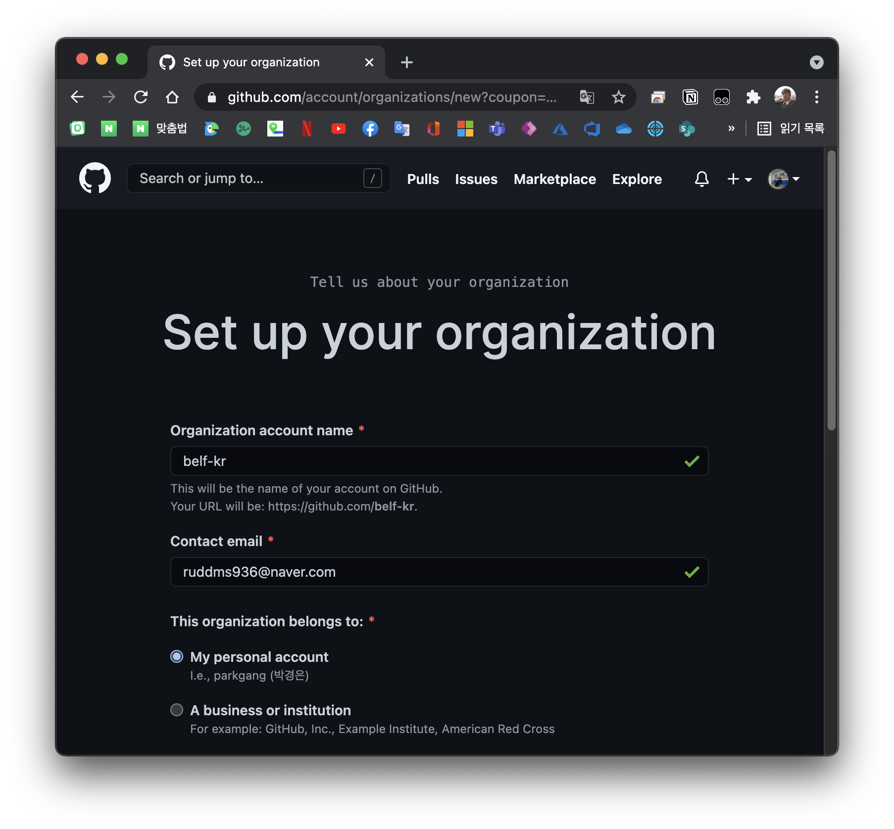

## Organizations Packages Permissions 설정

해당 프로젝트는 Azure를 사용하기 때문에 사실 container registry로 `ACR` (Azure Container Registry) 하는 것이 더 궁합에 좋을 것 입니다.

container registry가 필요한 이유는 CI/CD를 통해 AKS가 build된 image를 pull 하기 위한 용도로만 사용될 것이며 추가적인 Azure Service와의 연계를 기대하지 않습니다.

때문에 비용이 더 부과될 여지가 있는 `ACR` 가 아닌 github에서 무료로 지원하는 `github container registry` 를 사용하기로 하였습니다.

아래 사진과 같이 `Enable improved container support` 를 활성화 하도록 합니다.

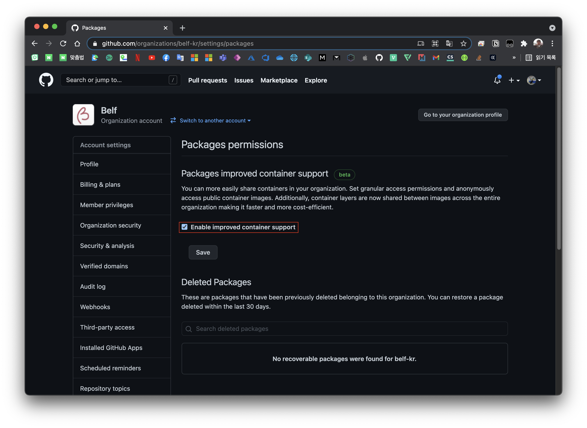

AKS가 권한 문제 없이 image을 pull 받을 수 있도록 모든 package(image) 을 public으로 변경해줍니다.

> 참고로 github bug 인거 같지만 org level에서 org package를 public으로 설정하더라도 처음 publish된 package는 모두 private으로 설정된 것을 확인할 수 있었습니다. 때문에 첫 publish된 package의 경우 수동으로 public으로 변경해주도록 합니다. 그렇지 않으면 AKS에서 권한 없음으로 image를 pull 받지 못합니다.

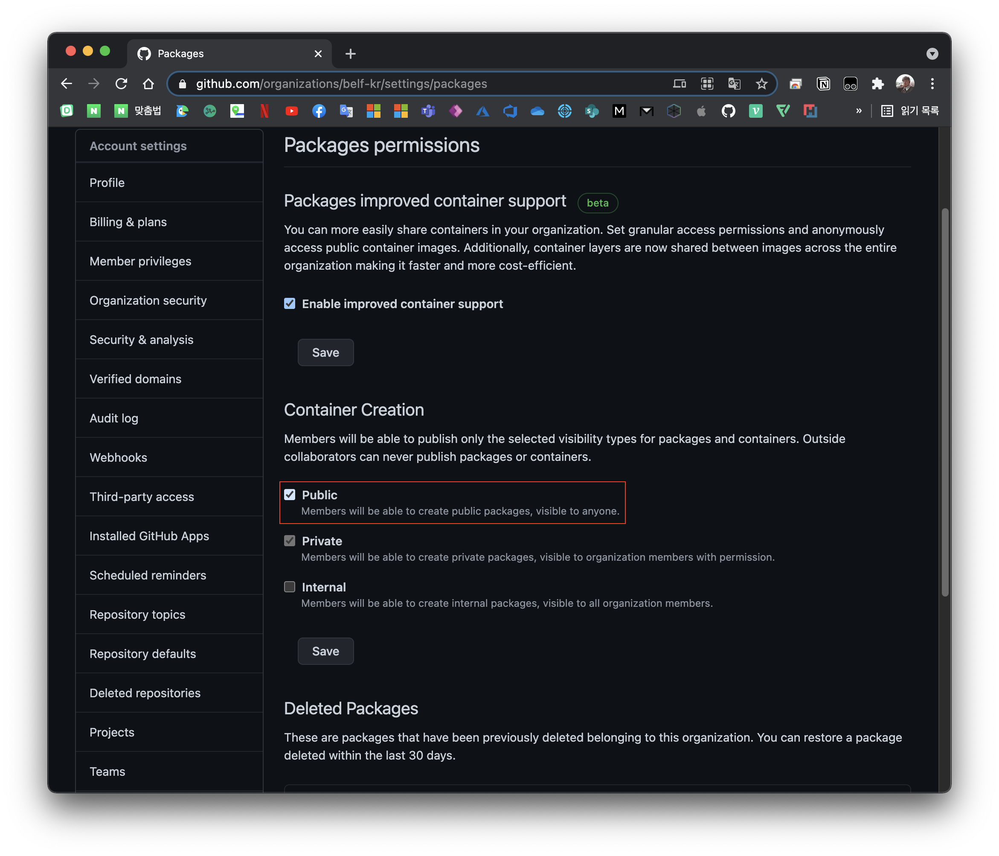

## Teams 생성 및 Members 추가

이제 org를 만들었으니 org에서 팀원의 액세스 수준을 유연하게 설정하기 위하여 teams을 생성하도록 합니다.

생성 방법은 전혀 어렵지 않으니 아래의 사진을 참고해서 생성하도록 합니다.

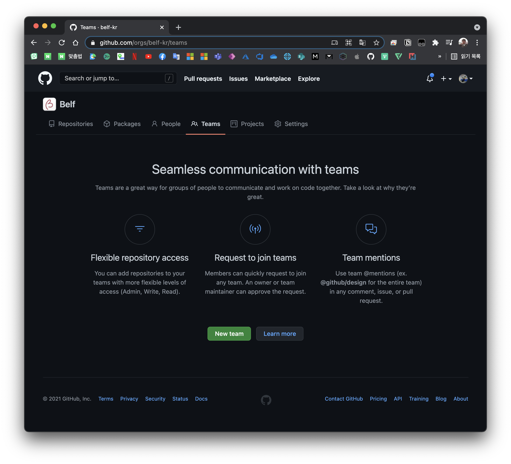

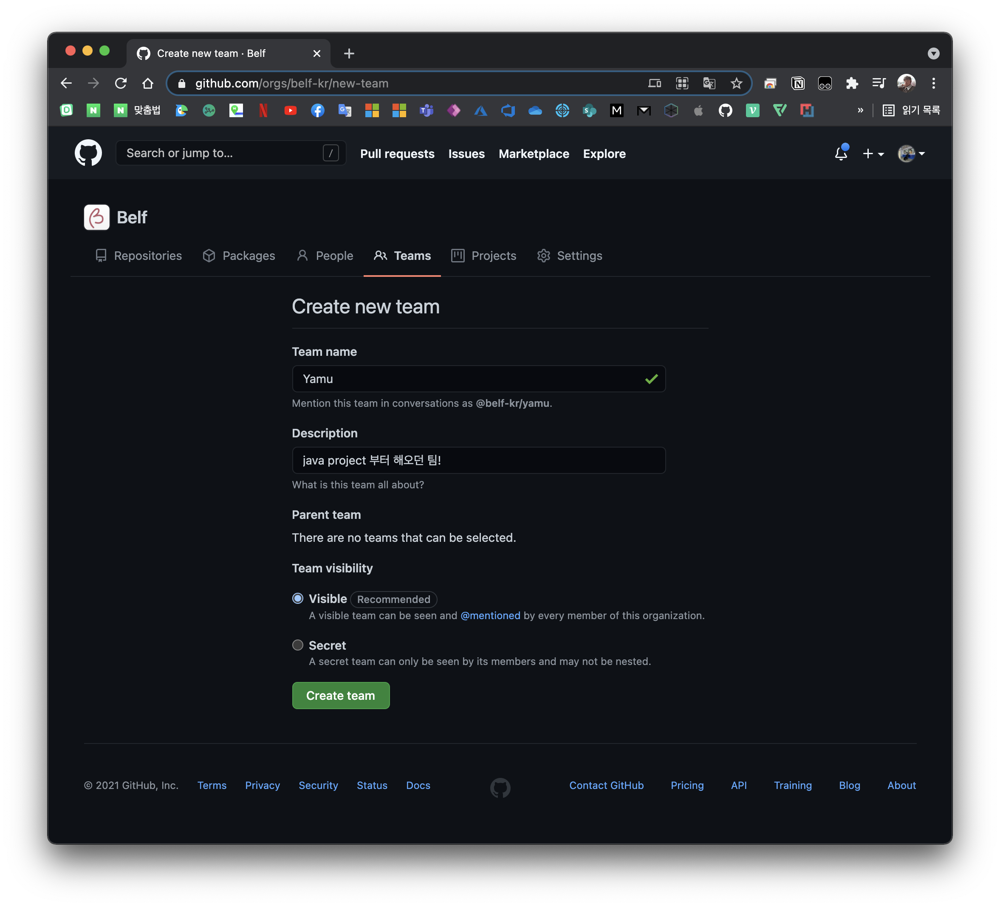

teams 생성 후 `Add a member` 을 통하여 팀원을 초대하도록 합니다.

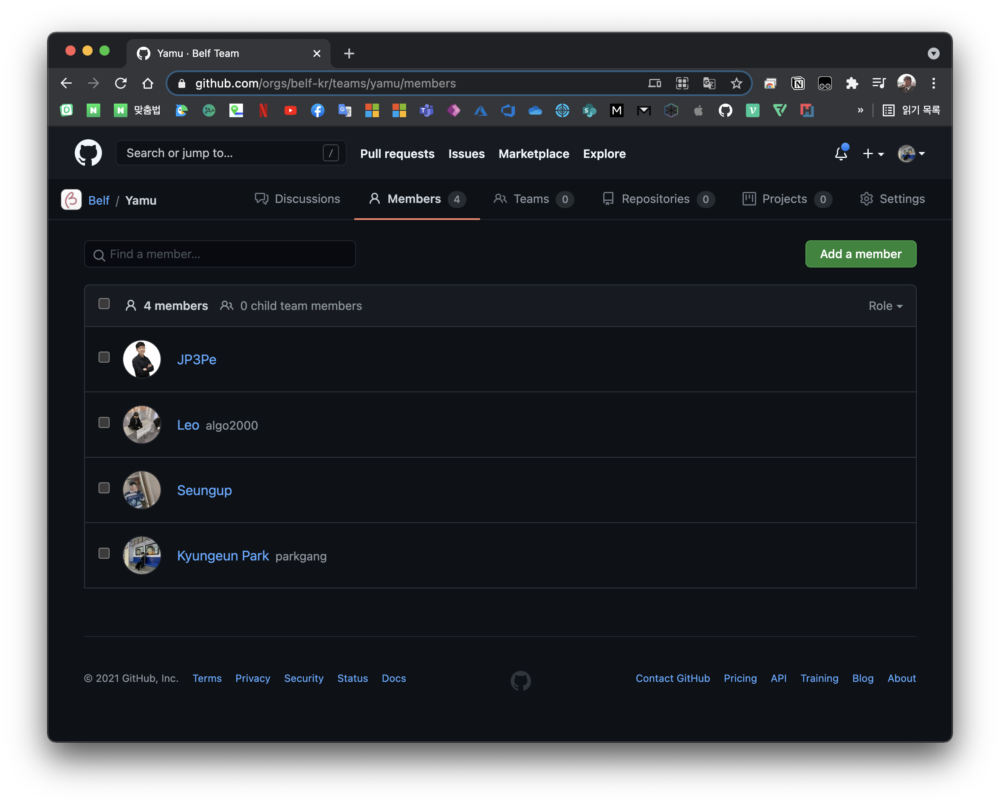

# Repositories 설정

해당 프로젝트는 `MSA` 이기 때문에 여러 개의 repo가 생성될 것이고 각 repo에 따라서 정책이 다르게 설정될 수도 있을 것입니다.

그래도 해당 프로젝트의 Standard 정책은 있기 때문에 일단 하나의 repo를 기준으로 설정해보도록 하겠습니다.

> 필요에 따라서 새로운 repo 생성 시 동일하게 설정 및 변경하시면 됩니다.

## Repositories 생성

아래와 같이 repo를 생성하도록 합니다. 여기서 주의점은 기본적으로 `README.md` 를 포함하도록 합니다. 그래야 repo가 생성부터 `main` 가 기본 branch로 설정되어 일관적입니다.

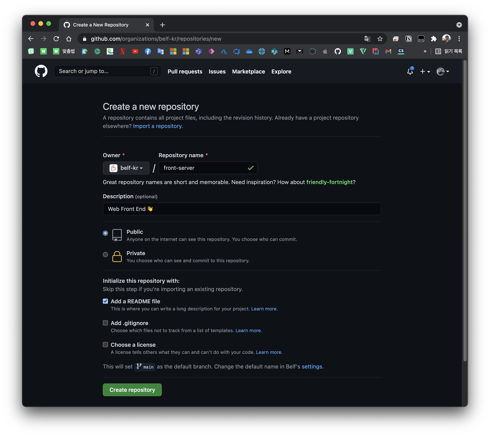

## 필수 리뷰어 지정

이후 생성된 repo에 제품이 실행되어 테스트할 수 있는 간단한 Code를 작성하도록 합니다.

> 저는 `create-next-app` 를 이용하여 Boilerplate Code를 사용하였습니다.

이전에 [2편](/devops/workflows-with-aks-github-slack-2) 에서 작성된 [워크플로우는](/devops/workflows-with-aks-github-slack-2/#워크플로우는) 내용을 보시면

1. `develop` from `feature` 으로 걸리는 PR은 `qa` 에서 제품이 정상적으로 동작하는지 확인하는 중요한 단계이고
1. `main` from `develop` 으로 걸리는 PR은 `prod` 으로 배포를 준비하는 중요한 단계이며 해당 제품이 배포됐을 때 다른 서비스에 지장은 없는지, 배포해도 문제가 없는 시점인지 검증하는 단계입니다.

즉, PR 통과 여부는 중요한 단계 이므로 원래대로면 제품 소유자가 승인 여부를 담당해야하지만 해당 프로젝트에서는 devops 엔지니어를 필수 리뷰어로 넣기로 설정하였습니다.

형식은 아래와 같이 root에 `.github` 디렉터리 안에 `CODEOWNERS` 파일로 작성하면 됩니다.

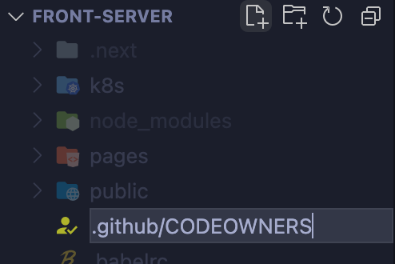

```
* @parkgang ruddms936@naver.com
```

위에 예제로 작성된 내용은 다음과 같습니다.

1. `*`
   1. 모든 코드에서 대해서
1. `@parkgang ruddms936@naver.com`
   1. 사용자에게 필수적으로 승인받아야한다.

> 햇갈리면 이미 작성된 [front-server](https://github.com/belf-kr/front-server/blob/main/.github/CODEOWNERS) 를 참고하세요!

## Branch 보호 규칙 설정

이제 함부로 branch를 건드릴 수 없도록 보호 규칙을 설정할 것 입니다. 관리하는 branch는 `main` 과 `develop` 이므로 이 2개에 대해서 설정하면 됩니다.

repo → settings → branches 으로 들어가셔서 설정하면 됩니다.

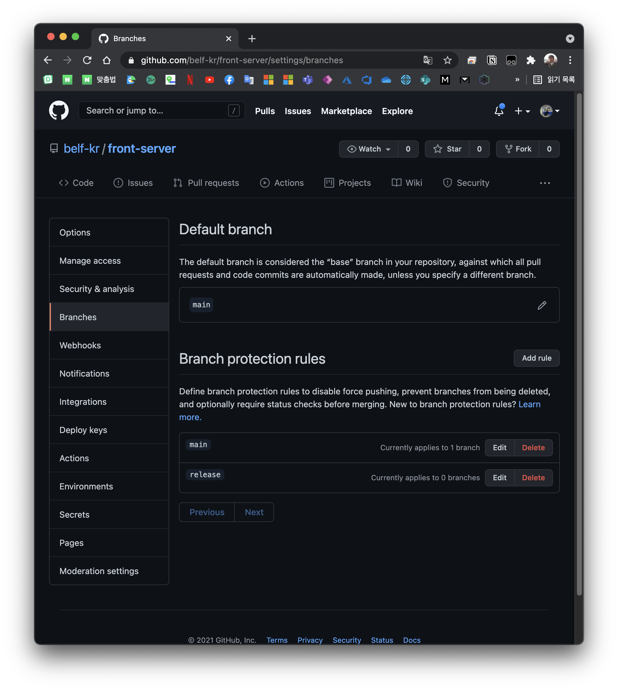

설정된 규칙의 경우 아래와 같습니다.

| main                                                    | develop                                                 |
| ------------------------------------------------------- | ------------------------------------------------------- |
| 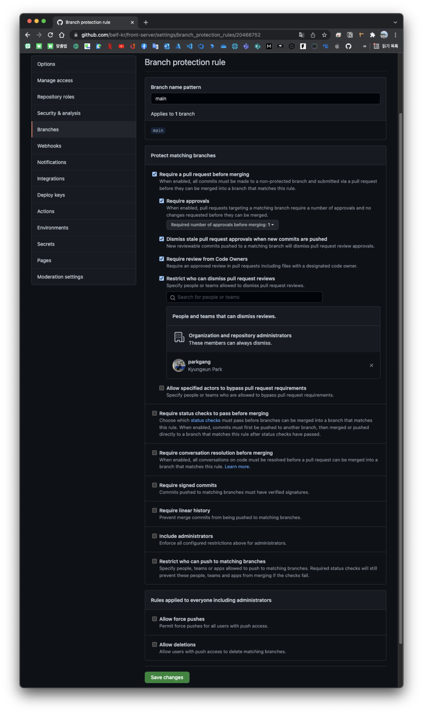 | 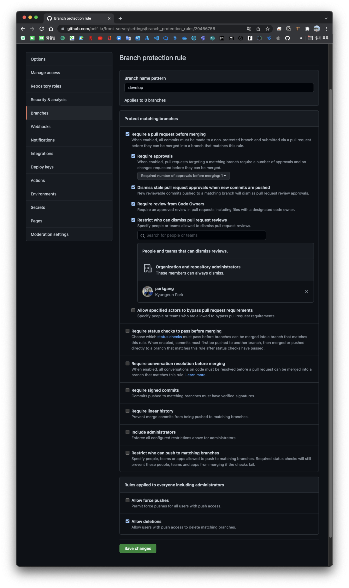 |

공통적으로 반드시 PR을 통해서만 merge되도록, PR은 필수 리뷰어가 승인해야된다는 내용입니다.

근데 `develop` 의 경우 `Allow deletions` 라는 옵션이 활성화 되어있는 것을 확인할 수 있습니다. `develop` 는 삭제되지 않고 계속 유지되면서 개발되어 나가야 하는데 왜 이렇게 됐을까요? 여기에서는 비하인드 스토리가 있습니다.

`main` from `develop` PR의 경우 `rebase merging` 를 통하여 마지막 `main` 으로 HEAD가 이동되는 것이 명확합니다. 왜냐면 `develop` 이 `main` 으로 merge된 것은 `prod` 으로 release된 것을 의미하고 이후 `develop` 은 release된 <u>`main` 으로 부터 다시 시작</u>하는 것이기 때문입니다.

> git graph가 명확한 것도 있고요

하지만 github의 `rebase merging` 는 제가 기대하는 대로 동작하지 않았습니다. 혹시라도 내가 git을 잘못 이해하고 사용하는 것은 아닌지 local에서도 테스트 해보고 다른 git host service에서도 테스트 해봤지만 결론은 github가 이상하게 동작한다는 것으로 나왔습니다.

| step                                | github                                                  | azure devops                                            |
| ----------------------------------- | ------------------------------------------------------- | ------------------------------------------------------- |
| `develop` 생성 후 commit            | 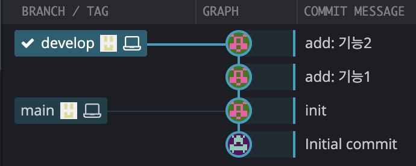 | 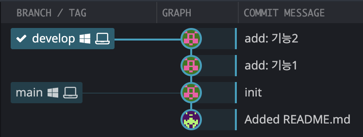 |
| `main` from `develop` 으로 `rebase` | 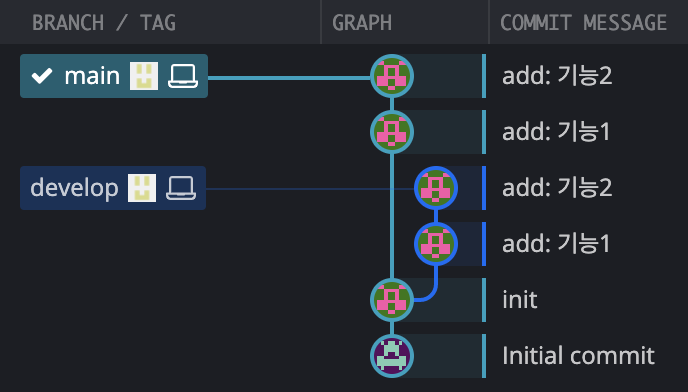 | 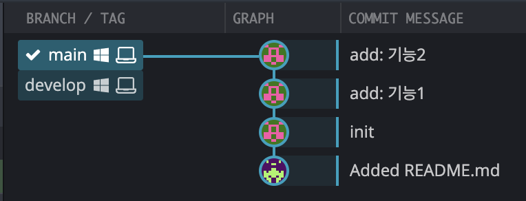 |
| `rebase` 된 `develop` 에서 commit   | 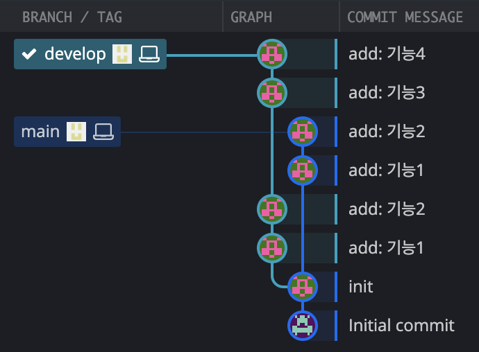 | 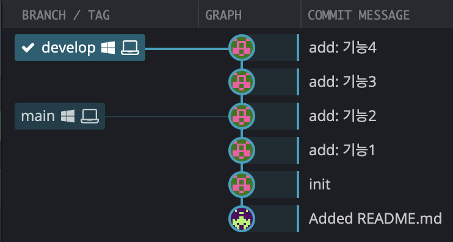 |

> 위의 테스트는 동일한 repo 이름, 동일한 commit 내용 및 message으로 진행되었습니다.

위의 사진을 보면 github에서 `rebase` 시 commit은 `main` 으로 잘 `rebase` 되었지만 `develop` 는 HEAD가 이동되지 않고 이전 `main` 에서 분기된 것처럼 보이는 것을 확인할 수 있습니다. 무시하고 `develop` 에서 추가 commit 시 git graph가 이상해지는 것을 확인할 수 있으며 이상태로 PR시 충돌이 발생합니다.

> 왜냐면 `develop` commit 중 `add: 기능1`, `add: 기능2` 는 이미 `main` 에 있는데 `develop` 분기가 이전 `main` 에서 시작된 것으로 나오므로 PR시 `add: 기능1`, `add: 기능2`, `add: 기능3`, `add: 기능4` 를 모두 끌어오기 때문입니다.

그 반대로 azure devops는 예상한 대로 `rebase` 시 commit도 잘 반영되고 무엇보다 `develop` 가 `rebase` 된 `main` 으로 부터 새롭게 분기가 시작되는 것을 확인할 수 있습니다.

왜 github의 `rebase` 가 위와 같이 동작하는지는 이유를 찾지 못하였습니다. github가 버그라서 저렇게 동작한다? 라는 것은 말이 안되는거 같고 github는 `rebase` 위와 같이 동작하는게 정상이라고 생각해야되는 건지... **혹시라고 이유를 아시는 분은 답변 주시면 정말 감사하겠습니다.**

무튼, 이러한 이유로 `develop` 는 `rebase` 되더라도 `develop` 를 자동으로 삭제하도록 만들고 엔지니어가 다시 `develop` 를 생성하는 방향으로 해결하였습니다. 이 때문에 `develop` 는 삭제를 허용하는 것 입니다.

> `rebase` 후 `develop` 를 새롭게 다시 만들면 분기가 새롭게 시작하기 때문에 문제가 해결되거든요!

## Merge Settings

1. `Allow squash merging` 활성화
1. `Allow rebase merging` 활성화
1. `Automatically delete head branches` 활성화
1. 왜 squash, rebase 사용하게 됬는지 설명 및 git graph 첨부

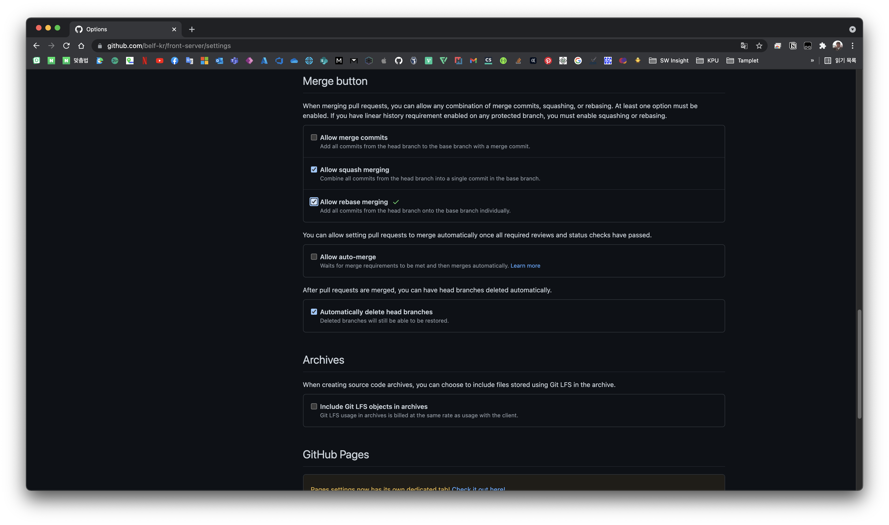

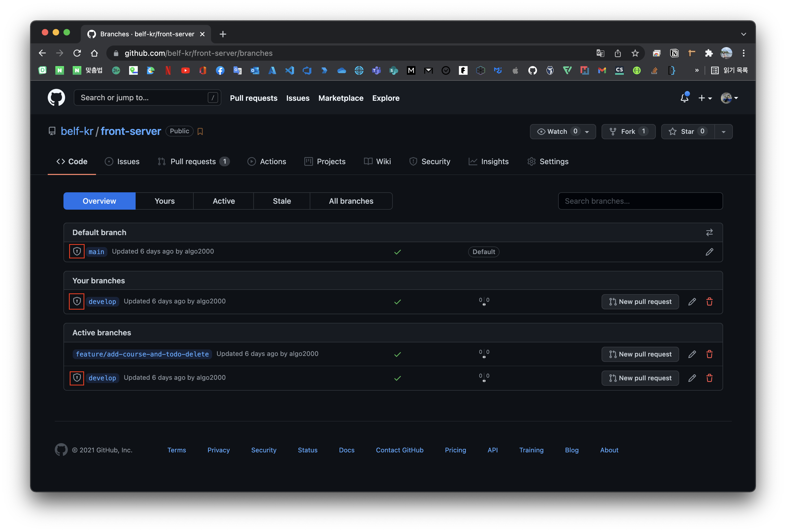

# teams에 repositories 추가

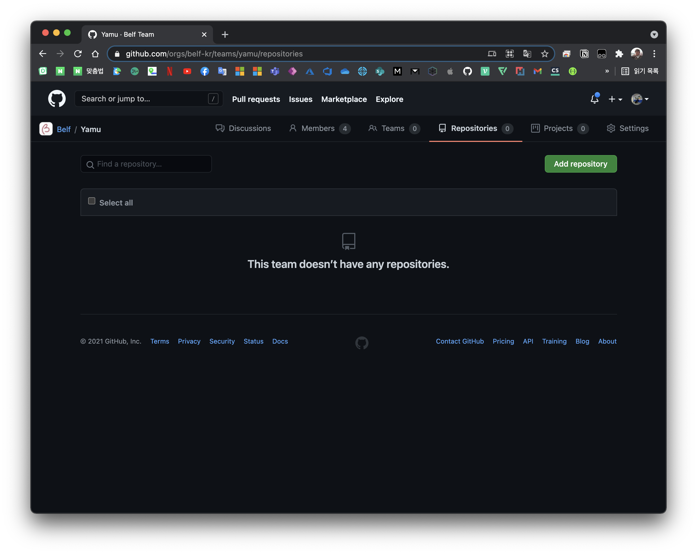

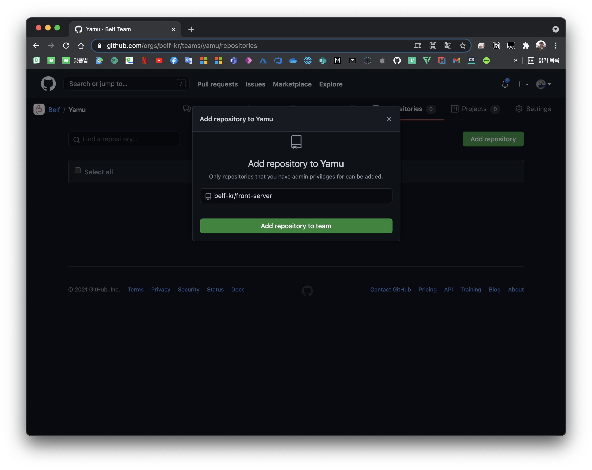

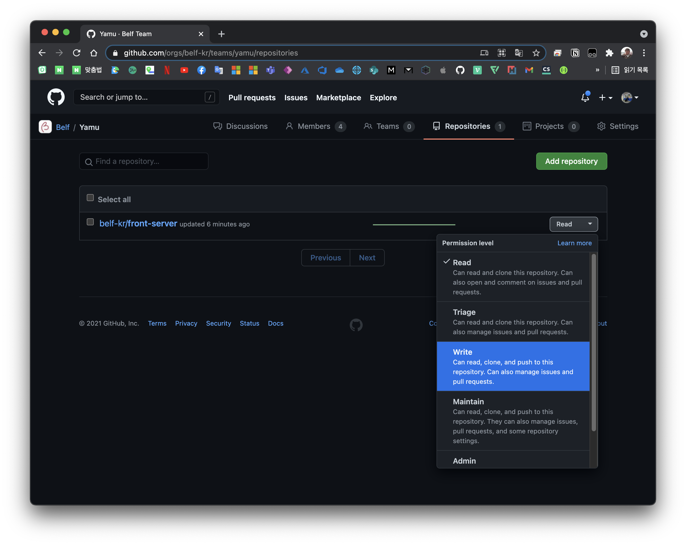

# 마무리
