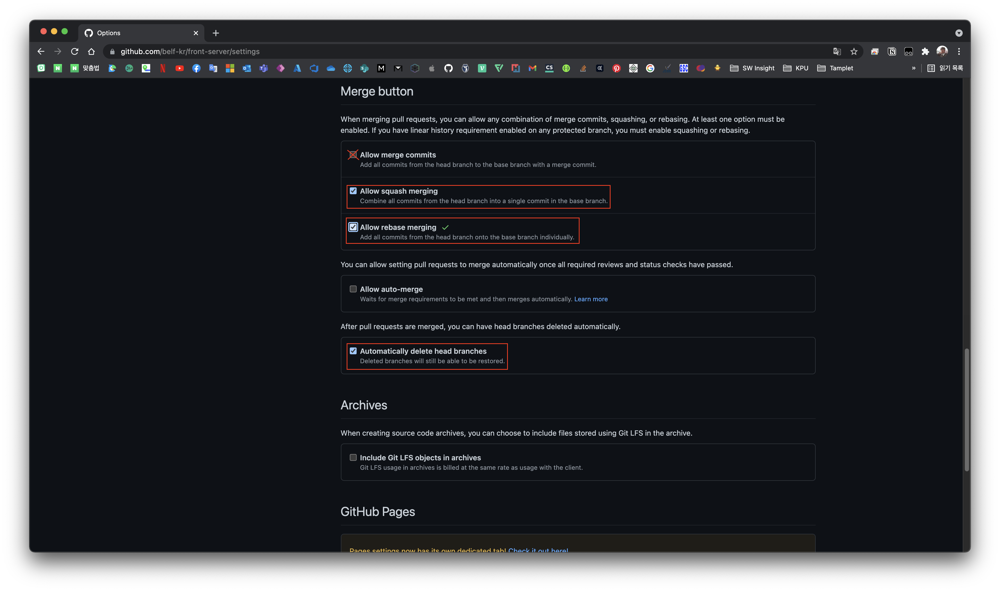

# Index

|       |                                                            |
| ----- | ---------------------------------------------------------- |
| 1편   | [소개](/devops/workflows-with-aks-github-slack-1)          |
| 2편   | [blueprint](/devops/workflows-with-aks-github-slack-2)     |
| 3편   | [인프라 생성](/devops/workflows-with-aks-github-slack-3)   |
| `4편` | [github 설정](/devops/workflows-with-aks-github-slack-4)   |
| 5편   | [slack 설정](/devops/workflows-with-aks-github-slack-5)    |
| 6편   | [github action](/devops/workflows-with-aks-github-slack-6) |
| 7편   | [회고](/devops/workflows-with-aks-github-slack-7)          |

# Overview

이전 시간에는 개발 된 제품이 배포될 수 있는 인프라를 만들었습니다.

이번 시간에는 개발 프로세스에 개발할 수 있도록 repo 생성 및 정책을 설정할 것 입니다.  
중점적으로 설정할 내용은 아래와 같습니다.

1. build 된 이미지가 저장될 수 있도록 `github container registry` 활성화
1. 함부로 merge하고 배포할 수 없도록 PR에 필수 리뷰어 추가 및 branch 보호 규칙 설정

자, 시작해 볼까요?

# Organizations 설정

## Organizations 만들기

우선 우리 팀원들이 뛰어놀 수 있는 조직이 필요할 것 입니다.  
아래와 같이 Organizations를 만들도록 합니다.

## Organizations Packages Permissions 설정

해당 시리즈는 Azure를 사용하기 때문에 사실 container registry로 `ACR` (Azure Container Registry) 하는 것이 더 궁합에 좋을 것 입니다.

container registry가 필요한 이유는 CI/CD를 통해 AKS가 build된 image를 pull 하기 위한 용도로만 사용될 것이며 추가적인 Azure Service와의 연계를 기대하지 않습니다.

때문에 비용이 더 부과될 여지가 있는 `ACR` 가 아닌 github에서 무료로 지원하는 `github container registry` 를 사용하기로 하였습니다.

아래 사진과 같이 `Enable improved container support` 를 활성화 하도록 합니다.

AKS가 권한 문제 없이 image을 pull 받을 수 있도록 모든 package(image) 을 public으로 변경해줍니다.

> 참고로 github bug 인거 같지만 org level에서 org package를 public으로 설정하더라도 처음 publish된 package는 모두 private으로 설정된 것을 확인할 수 있었습니다. 때문에 첫 publish된 package의 경우 수동으로 public으로 변경해주도록 합니다. 그렇지 않으면 AKS에서 권한 없음으로 image를 pull 받지 못합니다.

## Teams 생성 및 Members 추가

이제 org를 만들었으니 org에서 팀원의 액세스 수준을 유연하게 설정하기 위하여 teams을 생성하도록 합니다.

생성 방법은 전혀 어렵지 않으니 아래의 사진을 참고해서 생성하도록 합니다.

teams 생성 후 `Add a member` 을 통하여 팀원을 초대하도록 합니다.

# Repositories 설정

## Repositories 생성

## 필수 리뷰어 지정

1. CI/CD 를 통제하기 위해서 PR 승인은 제가 하도록 디자인할 것이다.

## Branch 보호 규칙 설정

## Merge Settings

1. `Allow squash merging` 활성화
1. `Allow rebase merging` 활성화
1. `Automatically delete head branches` 활성화
1. 왜 squash, rebase 사용하게 됬는지 설명 및 git graph 첨부

# teams에 repositories 추가

# 마무리
