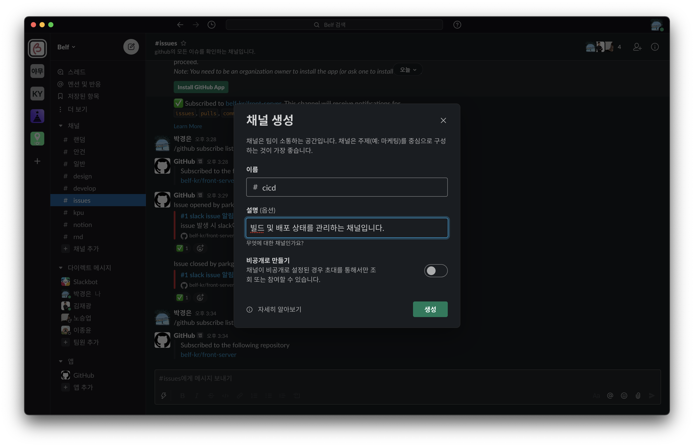

# Index

|       |                                                            |
| ----- | ---------------------------------------------------------- |
| 1편   | [소개](/devops/workflows-with-aks-github-slack-1)          |
| 2편   | [blueprint](/devops/workflows-with-aks-github-slack-2)     |
| 3편   | [인프라 생성](/devops/workflows-with-aks-github-slack-3)   |
| 4편   | [github 설정](/devops/workflows-with-aks-github-slack-4)   |
| `5편` | [slack 설정](/devops/workflows-with-aks-github-slack-5)    |
| 6편   | [github action](/devops/workflows-with-aks-github-slack-6) |
| 7편   | [회고](/devops/workflows-with-aks-github-slack-7)          |

# Overview

프로젝트 진행 도중 많은 대화가 오고 가게 됩니다. 대한민국에서 많이 사용되는 카카오톡과 같은 메신저를 사용할 수도 있지만 기본적으로 카카오톡은 업무를 위한 메신저가 아닙니다.

또한, 채팅 내용에 대해서 스레드 분리가 안되기 때문에 어떤 토픽에서 무슨 내용이 오고갔는지 확인이 어렵고 무엇보다 자동화된 환경에서 프로젝트 및 서비스의 상황을 모니터링할 수 있어야하는데 카카오톡은 다른 Service와 연계도
어렵습니다.

때문에 해당 프로젝트는 업무용 메신저이자 팀 협업 도구인 Slack을 사용할 것입니다.

이번 시간에는 github에서 일어나는 이벤트는 감지하여 Slack에 notification할 수 있도록하고 CI/CD 성공시 메시지를 보낼 수 있도록 Webhooks을 만드는 작업을 하도록 하겠습니다.

# slack 워크스페이스 생성

# github app 설정

## 채널 생성

## 워크스페이스에 github app 추가

## GitHub 계정 연결

## Organizations 연결

## issue 등록 시 알림 테스트

## 필요한 구독만 남기기

| slack issue 채널 필요한 정보만 알림 받도록 수정 | slack release 채널 필요한 정보만 알림 받도록 수정 |
| ------------------------------------------------------------------------ | -------------------------------------------------------------------------- |
|                  |                    |

# Webhooks 생성

## 채널 생성

## App 생성

## App 수정

## Webhooks 생성

## Webhooks 테스트

# 마무리
