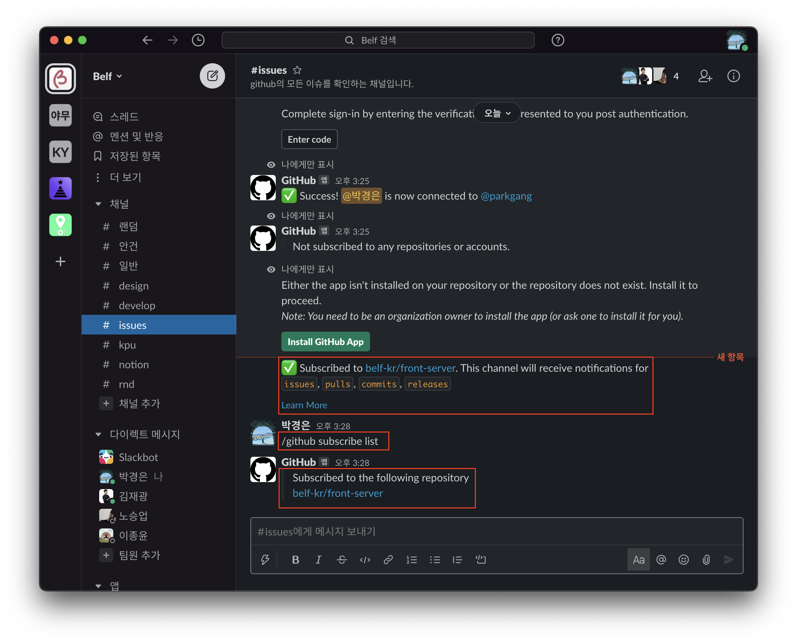
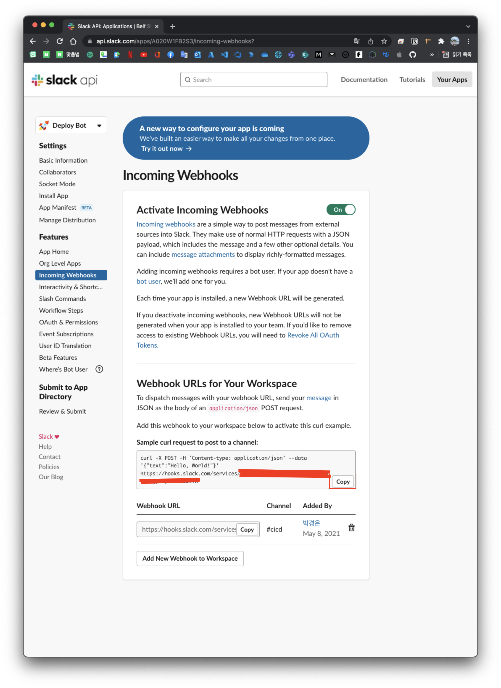

# Index

|       |                                                            |
| ----- | ---------------------------------------------------------- |
| 1편   | [소개](/devops/workflows-with-aks-github-slack-1)          |
| 2편   | [blueprint](/devops/workflows-with-aks-github-slack-2)     |
| 3편   | [인프라 생성](/devops/workflows-with-aks-github-slack-3)   |
| 4편   | [github 설정](/devops/workflows-with-aks-github-slack-4)   |
| `5편` | [slack 설정](/devops/workflows-with-aks-github-slack-5)    |
| 6편   | [github action](/devops/workflows-with-aks-github-slack-6) |
| 7편   | [회고](/devops/workflows-with-aks-github-slack-7)          |

# Overview

# slack 워크스페이스 생성

# github app 설정

## 채널 생성

## 워크스페이스에 github app 추가

## GitHub 계정 연결

## Organizations 연결

## issue 등록 시 알림 테스트

## 필요한 구독만 남기기

| slack issue 채널 필요한 정보만 알림 받도록 수정 | slack release 채널 필요한 정보만 알림 받도록 수정 |
| ------------------------------------------------------------------------ | -------------------------------------------------------------------------- |
|                  |                    |

# Webhooks 생성

## 채널 생성

## App 생성

## App 수정

## Webhooks 생성

## Webhooks 테스트

# 마무리
