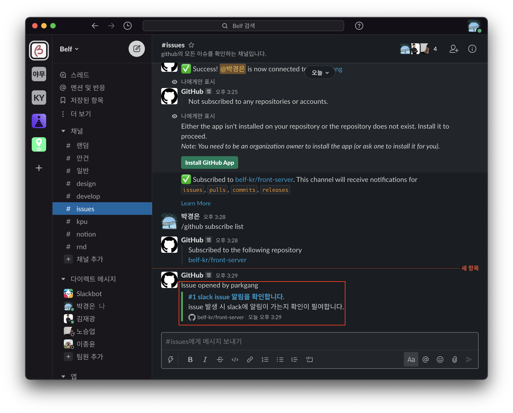
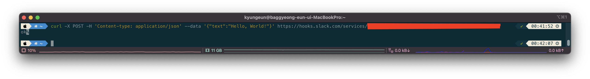

# Index

|       |                                                            |
| ----- | ---------------------------------------------------------- |
| 1편   | [소개](/devops/workflows-with-aks-github-slack-1)          |
| 2편   | [blueprint](/devops/workflows-with-aks-github-slack-2)     |
| 3편   | [인프라 생성](/devops/workflows-with-aks-github-slack-3)   |
| 4편   | [github 설정](/devops/workflows-with-aks-github-slack-4)   |
| `5편` | [slack 설정](/devops/workflows-with-aks-github-slack-5)    |
| 6편   | [github action](/devops/workflows-with-aks-github-slack-6) |
| 7편   | [회고](/devops/workflows-with-aks-github-slack-7)          |

# Overview

프로젝트 진행 도중 많은 대화가 오고 가게 됩니다. 대한민국에서 많이 사용되는 카카오톡과 같은 메신저를 사용할 수도 있지만 기본적으로 카카오톡은 업무를 위한 메신저가 아닙니다.

또한, 채팅 내용에 대해서 스레드 분리가 안되기 때문에 어떤 토픽에서 무슨 내용이 오고갔는지 확인이 어렵고 무엇보다 자동화된 환경에서 프로젝트 및 서비스의 상황을 모니터링할 수 있어야하는데 카카오톡은 다른 Service와 연계도
어렵습니다.

때문에 해당 프로젝트는 업무용 메신저이자 팀 협업 도구인 Slack을 사용할 것입니다.

이번 시간에는 github에서 일어나는 이벤트는 감지하여 Slack에 notification할 수 있도록하고 CI/CD 성공시 메시지를 보낼 수 있도록 Webhooks을 만드는 작업을 하도록 하겠습니다.

# Slack 워크스페이스 생성

slack의 워크스페이스는 이름 그대로 팀원과 작업할 수 있는 작업 공간을 의미합니다.  
[slack 공식 홈페이지](https://slack.com/) 에서 워크스페이스를 만들고 오도록 합니다.

# Github App 설정

개발되는 서비스는 개발 프로세스에 맞게 수정되고 배포될 것이며 그 프로세스 중심에는 Github가 있습니다.

Github에서 무슨 일이 일어나는지 모니터링하기 위하여 slack에 github app을 추가하도록 합니다.

## 채널 생성

Github의 이벤트를 받을 채널을 생성하도록 합니다.

## 워크스페이스에 Github App 추가

아래 사진의 순서대로 Github App을 추가하도록 합니다.

## GitHub 계정 연결

`Connect Github account` 버튼을 클릭하여 GitHub 계정을 연결하도록 합니다.

## Repo Subscribe 설정

위 작업을 통해서 GitHub App 연결은 되었습니다. 채팅창에 `/github subscribe {repo url}` 명령어로 서비스가 개발되는 repo에 대해 구독해 보도록 하겠습니다.

> 관련된 명령어는 [integrations/Slack](https://github.com/integrations/Slack#configuration) 에서 찾아볼 수 있습니다.

근데 repo 연결 전에 해당 repo가 소속된 Organizations에서 권한을 허용해 줘야 합니다.  
`Install GtiHub App` 을 클릭하여 진행하도록 합니다.

저는 org에 소속된 모든 repo에 대해 구독할 계획이기 때문에 `All repositories` 를 선택하였습니다.

이후 성공했다는 메시지를 확인할 수 있으며 `/github subscribe list` 를 통하여 구독된 repo를 확인할 수 있습니다.

## issue 등록 시 알림 테스트

정상적으로 구독 여부를 확인하기 위하여 issue를 생성해보도록 하겠습니다.

issue 생성 시 정상적으로 메시지가 전송되는 것을 확인할 수 있습니다.

## 구독 추가 및 제거하기

너무 많은 구독은 모니터링을 피곤하게 만들며 오히려 메시지를 안읽게 되는 사이드 이펙트가 도출될 수 있습니다.  
`/github subscribe list feature` 으로 활성화된 구독 목록을 확인하고 필요한 구독을 추가 및 제거하도록 합니다.

> 참고로 처음에는 issue 채널을 만들고 모든 repo의 issue를 하나의 채널에 받도록 디자인했는데 실제 프로젝트에 들어가니 매우 많은량의 issue가 하나의 채널에 전송되어 노티 및 모니터링하는 의미가 퇴색되었습니다.
>
> 진행하면서 동적으로 대응하긴 했지만 release와 같이 제품의 개발 상황을 Timeline으로 봐야하는 정보는 하나의 채널로 관리하고 이외 branch, issue와 같이 repo와 관련된 내용은 별도의 채널을 나눠서 관리하도록 변경되었습니다.

| slack issue 채널 필요한 정보만 알림 받도록 수정 | slack release 채널 필요한 정보만 알림 받도록 수정 |
| ------------------------------------------------------------------------ | -------------------------------------------------------------------------- |
|                  |                    |

# Webhooks 생성

## 채널 생성

## App 생성

## App 수정

## Webhooks 생성

## Webhooks 테스트

# 마무리
