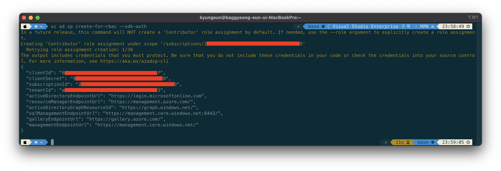
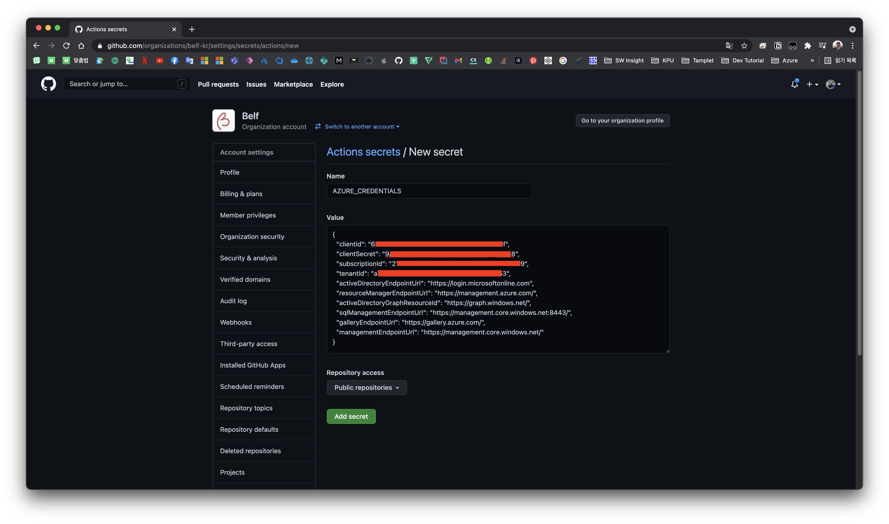
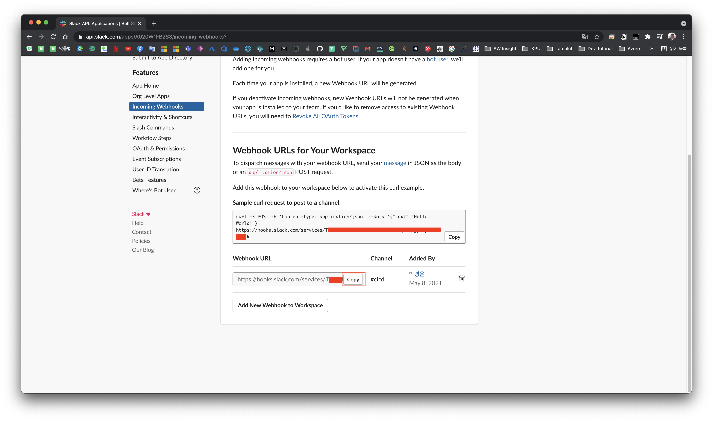
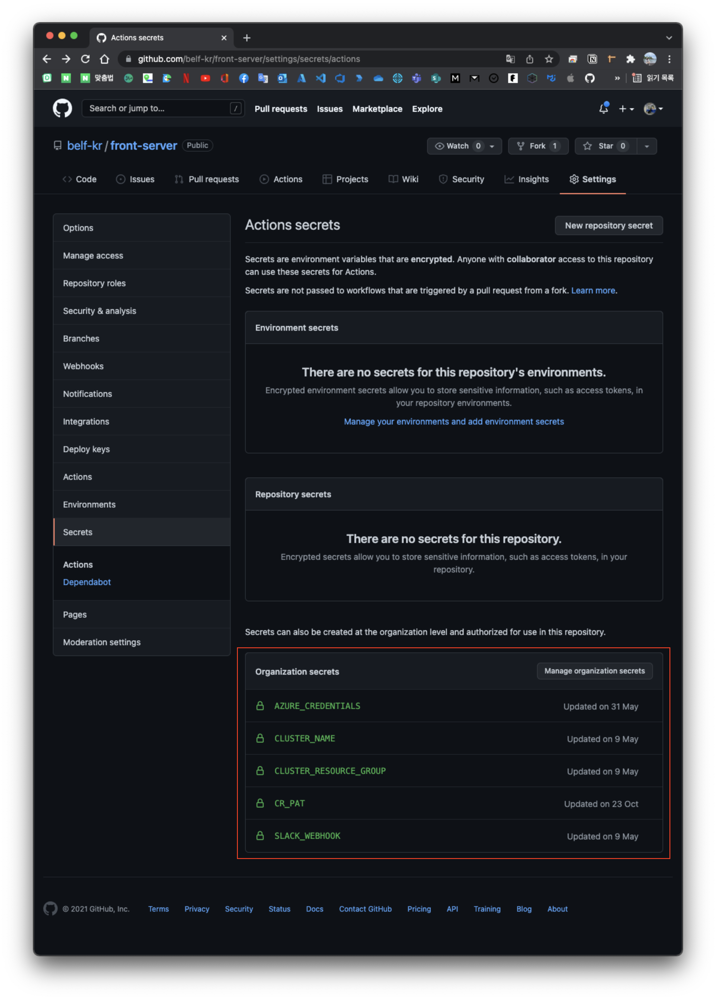

# Index

|       |                                                            |
| ----- | ---------------------------------------------------------- |
| 1편   | [소개](/devops/workflows-with-aks-github-slack-1)          |
| 2편   | [blueprint](/devops/workflows-with-aks-github-slack-2)     |
| 3편   | [인프라 생성](/devops/workflows-with-aks-github-slack-3)   |
| 4편   | [github 설정](/devops/workflows-with-aks-github-slack-4)   |
| 5편   | [slack 설정](/devops/workflows-with-aks-github-slack-5)    |
| `6편` | [github action](/devops/workflows-with-aks-github-slack-6) |
| 7편   | [회고](/devops/workflows-with-aks-github-slack-7)          |

# Overview

드디어 워크플로우 구축 마지막 섹션입니다. 😼

이전부터 설정하고 만들어 놓은 인프라를 자동화 파이프라인으로 태울 수 있도록 설정할 것입니다.

# Github Action

CI/CD Service는 Github Action을 사용할 것입니다.

## 배포 정책

해당 시리즈의 워크플로우를 구축하면서 `develop` branch으로 걸리는 PR은 `qa` 를 위한 배포, release는 `main` 을 위한 배포라고 말했었습니다. 해당 요구사항을 명시적으로 정의하면 아래와 같습니다.

1. qa
   1. release branch가 push 될 때
1. prod
   1. release tag가 생성될 때

## yaml

사용되는 yaml은 아래와 같으며 github action 관련 파일은 `.github/workflows` 에 정의하면 됩니다.

`qa` 와 `prod` 의 트리거 조건이 달라서 2개의 yaml이 존재하며 아래의 yaml도 정답은 아닙니다.

또한, 아래의 yaml은 배포 환경에 맞게 `Dockerfile` 을 따로 정의해서 돌아가도록 되어있습니다. 즉, 중요한 것은 yaml 내용을 이해하는 것이며 여기서는 큰 틀에서 돌아가는 step에 대해 설명하도록 하겠습니다.

> 아래의 yaml은 [front-server@v1.2.0 - aks-qa-deploy.yaml](https://github.com/belf-kr/front-server/blob/v1.2.0/.github/workflows/aks-qa-deploy.yaml) 의 내용이며 해당 yaml 이외 pvc를 사용하는 case도 [storage-service@v1.1.0 - aks-qa-deploy.yaml](https://github.com/belf-kr/storage-service/blob/v1.1.0/.github/workflows/aks-qa-deploy.yaml) 에 존재합니다. 이외 `prod` yaml도 구경해보세요!

### steps

1. repo를 checkout 합니다.
1. 명시된 `Dockerfile` 대로 image를 build 합니다.
1. container registry에 로그인 합니다.
1. build 된 image를 container registry으로 push 합니다.
1. AKS에 로그인 합니다.
1. k8s에 namespace를 생성합니다.
1. 정의된 k8s yaml에 맞게 object를 적용합니다.
1. k8s ingress에 등록합니다.
1. slack에 배포 완료 알림을 전송합니다.

```yaml
name: AKS-Deploy-Qa

on:
  pull_request:
    branches:
      - develop

env:
  IMAGE_HOST: ghcr.io/${{ github.repository }}
  IMAGE_NAME: nextjs-qa
  IMAGE_TAG: ${{ github.sha }}
  NAMESPACE: qa

jobs:
  apply:
    runs-on: ubuntu-latest
    steps:
      - name: repo checkout
        uses: actions/checkout@v2

      - name: build image
        run: docker build . --file Dockerfile.qa --tag $IMAGE_NAME

      - name: log into registry
        run: echo "${{ secrets.CR_PAT }}" | docker login ghcr.io -u ${{ github.actor }} --password-stdin

      - name: push image
        run: |
          docker tag $IMAGE_NAME $IMAGE_HOST/$IMAGE_NAME:$IMAGE_TAG
          docker push $IMAGE_HOST/$IMAGE_NAME:$IMAGE_TAG

      - name: aks login
        uses: azure/aks-set-context@v1
        with:
          creds: '${{ secrets.AZURE_CREDENTIALS }}'
          resource-group: '${{ secrets.CLUSTER_RESOURCE_GROUP }}'
          cluster-name: '${{ secrets.CLUSTER_NAME }}'
        id: login

      - name: create namespace
        run: |
          kubectl create namespace ${{ env.NAMESPACE }} --dry-run=client -o json | kubectl apply -f -

      - name: aks apply object
        uses: Azure/k8s-deploy@v1.4
        with:
          namespace: ${{ env.NAMESPACE }}
          manifests: |
            ./k8s/qa.yaml
          images: |
            ${{ env.IMAGE_HOST }}/${{ env.IMAGE_NAME }}:${{ env.IMAGE_TAG }}

      - name: aks apply service for ingress
        uses: Azure/k8s-deploy@v1.4
        with:
          namespace: ingress-basic
          manifests: |
            ./k8s/qa-external.yaml

      - name: slack notification
        uses: rtCamp/action-slack-notify@v2
        env:
          SLACK_WEBHOOK: ${{ secrets.SLACK_WEBHOOK }}
          SLACK_MESSAGE: ${{ github.repository }}가 ${{ env.NAMESPACE }} 환경에 배포되었습니다 🚀
```

# 이외 주의사항

## image에 `latest` tag는 사용하지 않습니다.

배포 시 어떤 이미지를 pull 해야하는지 매우 모호하기 때문입니다.

## image 이름에 `.` 은 포함하지 않도록 합니다.

Github에서 정상적으로 페이지를 불러오지 못합니다.

> 아래의 사진은 image 이름을 `front-server/next.js` 으로 설정하고 packages에 들어간 결과 나온 화면입니다.
> 

# Github Organizations Secrets

위 yaml을 보면 알 수 있지만 Azure 접속 정보와 같은 정보는 secrets으로 관리되고 있는 것을 확인할 수 있습니다.

org에 있는 repo들은 모두 같은 container registry, k8s cluster, slack workspace를 사용하므로 org level에서 secrets을 관리하도록 합니다.

organizations → settings → secrets 으로 들어가셔서 추가하면 됩니다.

## Github Container Registry Token

Github Container Registry에 접근할 수 있도록 Token을 발급받도록 합니다.


## Azure Credentials

Azure CLI에 AKS가 있는 Azure 계정으로 로그인하여 `az ad sp create-for-rbac --sdk-auth` 으로 creds 발급 후 내용을 삽입하도록 합니다.





이외 AKS가 존재하는 리소스 그룹 이름과 AKS 이름도 삽입하도록 합니다.


## Slack Webhook URL

[이전 섹션](/devops/workflows-with-aks-github-slack-5/#webhooks-생성) 에서 생성한 Slack Webhook URL도 삽입하도록 합니다.




## 최종

모두 추가된 secrets의 경우 아래와 같습니다.


> 참고로 repo의 secrets에서도 org에서 추가된 secrets의 종류를 구경할 수 있습니다.
> 

# CI/CD 테스트

이제 개발 프로세스에 맞게 CI/CD가 정상적으로 trigger 되는지, aks에 정상적으로 배포되었는지 확인하도록 합니다.


> 혹시라도 CI/CD에서 image pull fail이 발생한다면 해당 image가 public로 설정되어있는지 확인해보세요.
> Github Container Registry 버그인지는 모르겠지만 org level에서 `public` 으로 설정하더라도 처음 publish된 image의 경우 `private` 이 기본으로 설정되어 발생한 문제일 수 있습니다.

# 마무리

워후 🙌 이렇게 자동화된 워크 플로우 구축을 모두 완료했습니다~~ 🥳

여기까지 따라오시느라 고생하셨습니다. 워크 플로우 구축 후기 및 회고는 다음 챕터에서 나눠보도록 하겠습니다.

끝까지 읽어주셔서 감사합니다 :) 다음 챕터에서 봬요~
