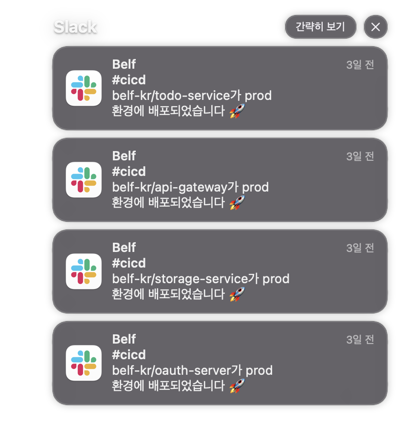

# Index

|       |                                                            |
| ----- | ---------------------------------------------------------- |
| 1편   | [소개](/devops/workflows-with-aks-github-slack-1)          |
| 2편   | [blueprint](/devops/workflows-with-aks-github-slack-2)     |
| 3편   | [인프라 생성](/devops/workflows-with-aks-github-slack-3)   |
| 4편   | [github 설정](/devops/workflows-with-aks-github-slack-4)   |
| 5편   | [slack 설정](/devops/workflows-with-aks-github-slack-5)    |
| 6편   | [github action](/devops/workflows-with-aks-github-slack-6) |
| `7편` | [회고](/devops/workflows-with-aks-github-slack-7)          |

# Overview

총 7개의 챕터로 구성된 위크플로우 구축하기 시리즈가 끝났습니다. 😚

회고를 작성하는 시점은 만들어진 워크플로우를 직접 사용해 [belf](https://github.com/belf-kr) project가 끝난 시점입니다.

중간에 사진과 같은 부분이 일관적이지 않고 끼워진 부분이 있거나 AKS의 경우 문서가 업데이트되면서 제가 작성한 글과 다른 부분이 있을 수 있어 어려움을 겪은 독자분들이 있었을 거 같습니다. 그럼에도 불구하고 끝까지 구축을 해보셨다면 많은 insight와 함께 좋은 경험이 되었기를 기대합니다.

# 그래서 전체적으로 어땠어?

> 결과적으로 매우 만족스러웠습니다.

처음엔 자동화 구축을 위해서 AKS 문서를 읽고 Rnd 하는 부분에서 많은 삽질이 있었지만 덕분에 많은 경험치를 얻을 수 있고 무엇보다 실제로 팀원이 자동화된 시스템 환경에서 개발되어 가는 부분을 보니까 많이 뿌듯했습니다.

예상대로 팀원의 대부분이 회사를 다니고 있기 때문에 개발 기간이 일정하지 않아 병목 문제가 발생하기도 하였지만 Backlog를 만들어서 던져놓으면 시간 될 때마다 `점진적` 인 `반복` 으로 개발 프로세스에 맞게 개발만 하면 알아서 서버에 배포되고 그러면 다른 엔지니어들이 확인이 가능하니까 의사소통 비용이 줄어서 생산성에 도움이 되었습니다.

또 크게 느꼈던 부분이 1학기를 종강하고 2학기 개강 전까지 `약 3개월` 동안 개발이 진행되지 않고 멈추게 되었지만 이미 System적으로 구축된 개발 프로세스 및 자동화 환경으로 인하여 2학기가 개강하고 바로 프로젝트 개발이 진행되더라도 큰 이슈가 없었습니다. 이때 정말 System 화가 되어있다는 감사함을 느끼게 되었습니다.

> 안 그랬다면 나는 다시 개발 프로세스를 설명하고 1학기에는 배포가 됐는데 이번에는 왜 안되지 어떻게 했더라? 하고 머리를 싸매고 울고 있었겠죠? 😭

이외에도 많은 것들이 있긴 했습니다. 무엇보다 핵심 가치는 나를 포함한 팀원이 개발에만 집중할 수 있는 환경과 더불에 바로바로 결과물을 확인할 수 있다는 것이 큰 장점이었습니다.

언제 어디서든지 아래와 같이 배포 완료 알림을 받을 때마다 참으로 설렜습니다.

> 하지만 팀원의 `Onboarding` 까지 반년이라는 시간이 걸린긴 했습니다...

# 아쉬운 점은?

자동화 환경을 만들고 운영을 해보니까 아쉬운 점이 꽤 많이 발생하였습니다. 아쉬운 점은 아래와 같았습니다.

1. 중복되는 yaml이 많았다.
   1. `qa` 와 `prod` 의 yaml은 매우 유사했으며 PVC와 같이 영구적인 저장소를 사용하지 않는 service들은 대부분 yaml이 비슷하였습니다.
   1. 그냥 하나의 service를 잡아서 source of truth 형태로 디자인되어 사용해왔는데 그냥 helm을 도입했을 걸 싶었습니다.
1. github action 실패 시 slack 알림이 안 가는 거
   1. 제목 그래도 CI/CD 성공 시에만 알림이 전송되도록 디자인되어 아쉬웠습니다.
1. 인프라를 Terraform 등을 이용하여 완벽하게 IaC으로 만들지 못한 것
   1. 개발하면서 Azure에 비용이 부족하여 다른 계정으로 이동해야하는 이벤트들이 있었습니다.
   1. k8s 관련 리소스들은 IaC으로 관리되었기 때문에 마이그레이션에 큰 문제는 없었지만 Azure에서 다시 리소스를 생성하는 작업과 같은 부분까지 자동화가 되어있지 않아서 아숴었습니다.
1. ingress 불필요하게 도메인이 많은 점, 하나의 도메인을 path 단위로 `/` 화 시키지 못한 것
   1. 이것은 nginx ingress controller의 지식이 부족하여 발생한 문제인데 `test.com` 과 `qa.test.com` 이 있다면 `test.com` 을 기준으로 path을 분리하는 라우터 규칙을 적용할 수 있어야하는데 그냥 일일이 도메인을 정의하는 불편함이 있었습니다.
1. 더 가벼운 docker image를 연구하지 못한 것
   1. 그래도 [oauth-server](https://github.com/belf-kr/oauth-server) 의 경우 image를 가볍게 하기 위한 노력이 들어갔는데 다른 service는 모두 챙기지 못하였습니다.
   1. [front-server](https://github.com/belf-kr/front-server) 의 경우 image 용량만 `1.3GB` 달하며 image을 push하고 pull하는 시간이 오래걸리는 문제가 있었습니다.
   1. 물론 static resource 때문에 그런 것은 이해되지만 그래도 image를 가볍게 해봤다면 어땠을까라는 생각이 들긴 합니다.
1. ORM 연결을 위해서 연결하려는 DB가 생성되어 있어야 하는데 DB container를 올리는 곳과 ORM이 다른 코드로 관리되어 자동화 되지 않은 점
   1. belf의 back-end service의 경우 모두 ORM을 사용하도록 되어있습니다.
   1. ORM 사용 시 연결하려는 DB가 DB Server에 미리 생성되어 있어야 하는데 이 부분이 자동화되지 않아서 아쉬웠습니다.
   1. 인프라 엔지니어에게 "미리 만들어주세요" 요청해서 해결할 수 있는 문제이긴 했지만 더 좋은 방법은 없을지 생각하게 되는 이슈이었습니다.
1. MSA의 중복되는 interface를 해결하지 못한 점
   1. 이건 MSA를 적용하면서 약간 당연하게? 겪을 수 있는 문제라고 생각하였습니다.
   1. 말 그대로 API를 소비하는 여러 service에서 같은 service에 대해 interface spec이 파편화되면서 발생한 문제입니다.
   1. 해결방법은 여러가지가 있을 수 있지만 추가적은 스터디를 통해 알게된 정보로는 다음에 또 MSA를 사용한다면 `gRPC` 도입해서 해결해보고 싶은 마음이 있습니다.
1. `qa` 라는 namespace로 네이밍한 것이 아쉽다.
   1. 실제 qa 인력이 없는데 굳이 `qa` 라는 네임스페이스가 맞았던걸 까? 라는 생각이 프로젝트 후반에 생각되기 시작했습니다.
   1. 차란히 `stage` 위딩이 더 올바른 표현이라고 생각 들었습니다.
1. test 자동화가 없는 것
   1. 자동화의 끝은 테스트 자동화까지라고 생각하는데 작성하지 못한 것이 아쉽습니다.

# 마무리

이번에 만든 워크플로우 구축은 나에게 매우 경험이 되었습니다. 역시 운영을 해보면서 많은 것을 경험하고 느끼게 되었습니다.

자동화는 정해진 것은 없다고 생각하며 이해를 기반으로 프로젝트 성격과 상황에 맞게 잘 적용하는 것이 핵심이라고 생각합니다. 이외도 더 많은 흥미로운 방법들이 있을 테니 더 찾아보고 운영해 보시는 것을 추천합니다.

끝으로 끝까지 해당 시리즈를 읽어주셔서 감사합니다 😍 오타 및 내용에 문제가 있다면 언제든지 말씀해 주세요!
