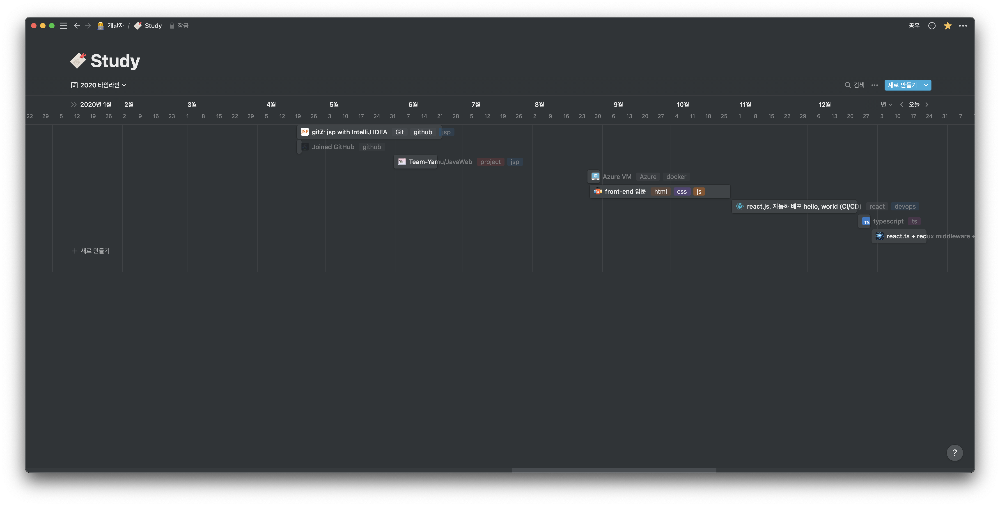

> 깃허브 첫 가입!



> 웹 제품을 만들기 위한 공부의 서막

# TL;DR

1. 첫번째로 작성해보는 회고!
1. 첫 직장! 🔥
1. 전체적으로 웹 제품을 만드는 방법에 대해 알게 되었다.

# Intro

생각해보니 공부한 걸 잘 정리하는 습관은 있었는데 한 해를 회고가 없더군요.

> 그래서 이번년도 부터 시작해보려고 합니다 😉

2020년을 회고하기엔 조~금 늦은 2021 2분기 이지만 짧게 회고를 해보려고 합니다.

# 나의 2020년은?

2020년은 처음으로 깃허브에 가입한 해이기도 하고 SW 엔지니어라는 직업으로 첫 출근을 한 해이기도 합니다.

저의 첫 개발은 C언어로 펌웨어 프로그래밍을 하다가 여기까지 오게 되었는데 그래서 그런지 front-end? back-end? 로 왜 구분을 하는 것이고 sql을 왜 배워야 하지? 이런 생각이 난잡하던 해이었습니다.

> 전 C언어만 알면 모든 것을 해결할 수 있는 줄 알았거든요... 진심으로... 🥴

그래도 다행히 2분기부터 대학 친구와 함께 JSP 스터디를 진행하면서 정신을 차리게 되었습니다. 아마 이 스터디가 없었더라면 전 매우 많이 후퇴되어 있었을 거 같아요.

근데 스터디를 진행하면서 느낀 것은 back-end의 경우 java를 사용헀기 때문에 C-family programming languages 답게 문법적으로나 동작에 대해서 이해가 안 되는 부분이 적었습니다.

문제는 front-end 이었는데요 태어나서 처음 보는 마크업 언어를 보고 이게 프로그래밍 언어인지... 아니라고 하기엔 문법이라는 게 보이긴 하는데 그래서 마크업이라고 하는 건 가... 이걸 어떻게 사용해야 하는지 감조차 안 오는 상태이었습니다.

> JS 친구는 덤이었습니다. C언어를 하다가 JS를 보니까 외계어인 줄 알았어요

그래서 스터디가 종료되고 HTML, CSS, JS와 같이 front-end에 부족한 부분을 알아서 공부를 하면서 자연스럽게 프로그램 배포는 어떻게 되는 거지? 서버에 배포하면 된다고? 서버는 어떻게 만드는데? 원리는? 이런 식으로 계속 파고들어서 공부하게 되었습니다.

마침 회사에서도 클라우드와 DevOps를 경험하고 있던 시점이어서 서버와 관련된 모르는 것을 동료에게 물어보며 성장할 수 있었습니다.

> 모두 고마워요! 🥰

그 결과 연말에는 [modern-tier](https://github.com/parkgang/modern-tier) 프로젝트를 진행하면서 CI/CD 자동화 라인까지 직접 만들어보게 되었습니다.

돌이켜보면 짧은 시간 안에 많은 성장을 했다는 것이 느껴집니다.

> 사실 그냥 제 자신을 갈아 넣었습니다.

```
전반적으로 웹 애플리케이션 제품 개발 한 사이클을 돌려서 기본을 배울 수 있는 시간이었습니다.
```

# 앞으로는?

아직 부족한 것이 많지만 `2020` 년에는 웹 애플리케이션을 만드는 아주 큰 틀을 이해하는 시간이 되었습니다.

개발하면서 어떤 점이 부족하고 어떤 것을 더 중점으로 공부해야 하는지 index가 잡히는 계기가 되었습니다.

`2021` 년에는 전반적으로 배운 기술을 복습하고 고도화할 수 있도록 노력하는 한 해가 되기를 목표하여 글을 마무리하겠습니다.
