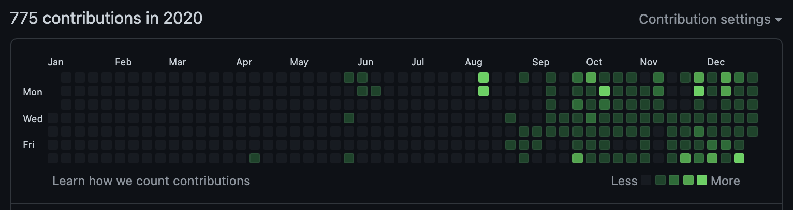
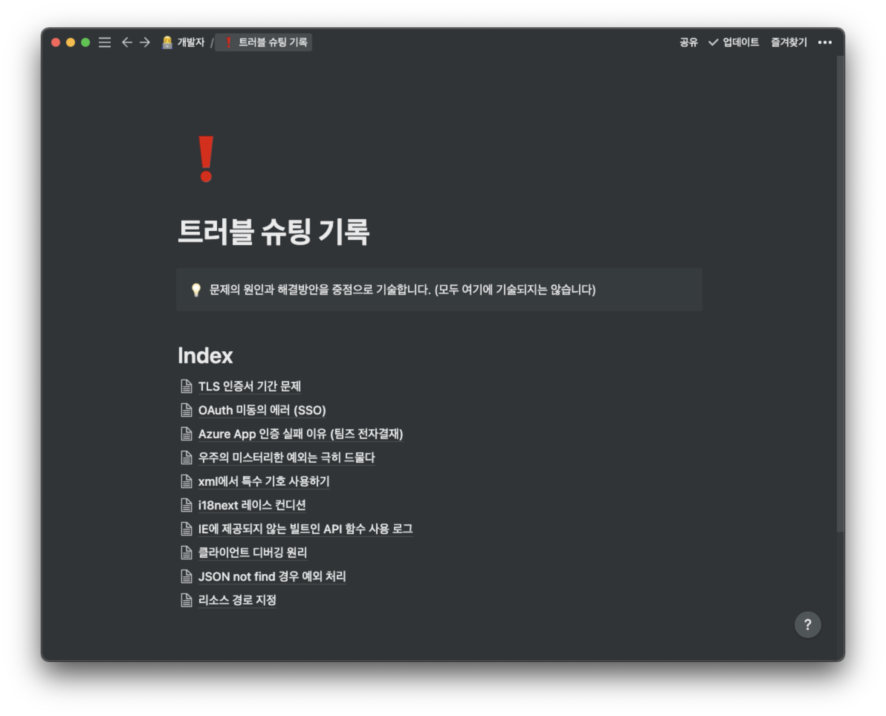

> 깃허브 첫 가입!


> 웹 제품을 만들기 위한 공부의 서막

# TL;DR

1. 첫번째로 작성해보는 회고이자 깃허브 블로그 첫 포스트이자 첫 직장에 대한 내용들 🔥
1. 나만의 블로그를 가지고 싶어서 깃허브 블로그를 시작하게 되었어요

# Intro

생각해보니 공부한 걸 잘 정리하는 습관은 있었는데 년수가 변할 때마다 회고를 하는 기록이 지금까지 없었습니다!

> 그래서 이번년도 부터 시작해보려고 합니다 😉

2020년을 회고하기엔 조~금 늦은 2021 2분기 이지만 짧게 회고를 해보려고 합니다.

우선 깃허브 블로그까지 여러 이벤트가 있었는데 먼저 소개하겠습니다.

# 이전의 나는?

나의 첫 개발 블로그는 `velog` 에서 시작되었습니다.

처음에는 열정적으로 잘 작성하였지만 어째 사람들에게 정보를 공유하기 위한 개발 블로그 라는 성격 보다는 내가 공부한 내용을 복습하고 나중에 보려고 작성하는 느낌이 강하게 들었습니다.

더구나 이미 있는 글을 나에게 맞게 바꾸어 작성하게 되는 나를 발견하고 이럴꺼면 개인 노트에 작성하는게 더 효율적이라는 생각을 하게되었습니다.

이때부터 이전부터 봐왔던 notion을 공부해서 알게 된 지식을 모두 정리하기 시작하였습니다.


> 쭉쭉 늘어나는 페이지들...

사실 notion에 웹 공유 기능이 있어서 열심히 notion에 작성하고 웹에 공유해서 블로그 처럼 사용하려고 했습니다. 하지만 터닝 포인트🔥 가 발생하게 되는데

# 왜 깃허브 블로그?

제품(SW)에 대해 아주 간단하고 사소한 오류라도 사용자 풀이 적다면 해결 방법에 대해 찾기가 어렵습니다.

물론 개발자 실력이 좋다면 그동안 쌓아온 지식을 기반하여 아주 수월하게 트러블 슈팅을 진행할 수 있을 겁니다.

하지만 깊은 지식 없이 SW가 `돌아가는 것에 치중` 하여 학습된 상태로 예상 하지 못한 새로운 이슈를 만난다면 당황스럽고 사전에 같은 문제를 고민한 글에 의존하게 됩니다.



저는 각 토픽에 맞게 트러블 슈팅 내용을 notion에 기록하고 있었습니다.

요근래 공부하고 있는 부분에서 트러블 슈팅을 진행하면서 나와 같은 문제를 고민한 글이 많지 않다는 것을 직접 체감하게 되었습니다.

> 이 트러블 슈팅 기록을 또 notion 작성해?

물론 notion에도 계속 작성되고 있습니다. 하지만, 이전에 트러블 슈팅 경험을 살펴보면 글의 퀄리티 유무와 관계 없이 누군가 나와 같은 문제를 겪고 대충이라고 해결 방법을 적어 놓은 글을 보았을 때 많은 도움이 된다는 것을 느끼게 되었습니다.

> 물론 공식문서를 보고 차근차근 배우고 트러블 슈팅하는게 맞지만 😔

딱, 이맘때쯤 깃허브 블로그로 기술 분석에 대해 제가 궁금한 점을 딱 잡아서 작성된 글이 있었는데 그걸 읽고 반해버렸습니다.

notion에 작성할 때 아래의 Side effects를 고민하고 있던 시절이여서 깃허브 블로그가 더 매력적으로 다가왔습니다.

1. 이미지와 같은 정적파일이 날라가면 어떡하지?
1. 다른 서비스로 마이그레이션은?
1. 웹 공유를 하더라도 사람들이 많이 찾아줄까?

그래서 전략적으로 듣고 까먹지 싫은 건 notion에 작성하고 사람들에게 가치를 전달할 수 있는 글은 깃허브 블로그에 작성해보자는 마음으로 시작되었습니다.

# 나의 2020년은?

사실 깃허브 블로그 이외 2020년에 처음으로 깃허브에 가입한 해이기도 하고 SW 엔지니어라는 직업으로 첫 출근을 한 해이기도 합니다.

첫 개발은 C언어로 펌웨어 프로그래밍을 하다가 여기까지 오게되었는데 그래서 그런지 front-end? back-end? 로 왜 구분을 하는 것이고 sql을 왜 배워야하지? 이런 생각이 난잡하던 해이었습니다.

> 전 C언어만 알면 모든 것을 해결할 수 있는 줄 알았거든요... 진심으로... 🥴

그래도 다행히 2분기부터 대학 친구와 함께 JSP 스터디를 진행하면서 정신을 차리게 되었습니다. 아마 이 스터디가 없었더라면 전 매우 많이 후퇴되어 있었을 거 같아요.

근데 스터디를 진행하면서 느낀 것은 back-end의 경우 java를 사용헀기 때문에 C-family programming languages 답게 문법적으로나 동작에 대해서 이해가 안되는 부분이 적었습니다.

문제는 front-end 이었는데요 태어나서 처음 보는 마크업 언어를 보고 이게 프로그래밍 언어인지 아니라고 하기엔 문법이라는게 보이긴하는데 이걸 어떻게 사용해야하는지 감조차 안오는 상태이었습니다.

> JS 친구는 덤이었습니다. C언어를 하다가 JS를 보니까 외계어인 줄 알았어요

그래서 스터디가 종료되고 HTML, CSS, JS와 같이 front-end에 부족한 부분을 알아서 공부를 하면서 자연스럽게 프로그램 배포는 어떻게 되는거지? 서버를 통해서 된다고? 서버는 어떻게 만드는데? 이런 식으로 계속 파고들어서 공부 하게 되었습니다.

마침 회사에서도 클라우드와 DevOps를 경험하고 있던 시점이어서 서버와 관련된 모르는 것을 동료에게 물어보며 성장할 수 있었습니다.

> 모두 고마워요! 🥰

그 결과 연말에는 [modern-tier](https://github.com/parkgang/modern-tier) 프로젝트를 진행하면서 CI/CD 자동화 라인까지 직접 만들어보게 되었습니다.

돌이켜보면 짧은 시간안에 많은 성장을 했다는 것이 느껴집니다.

> 사실 그냥 제 자신을 갈아 넣었습니다.

```
전반적으로 웹 애플리케이션을 제작하는 바닥이 되는 시간이었습니다.
```

# 앞으로는?

아직 부족한 것이 많지만 `2020` 년에는 웹 애플리케이션을 만드는 아주 큰 틀을 이해하는 시간이 되었습니다.

개발하면서 어떤 점이 부족하고 어떤 것을 더 중점으로 공부해야하는지 index가 잡히는 계기가 되었습니다.

`2021` 년에는 전반적으로 배운 기술을 복습하고 고도화할 수 있도록 노력하는 한 해가 되기를 목표하여 글을 마무리 하겠습니다.
