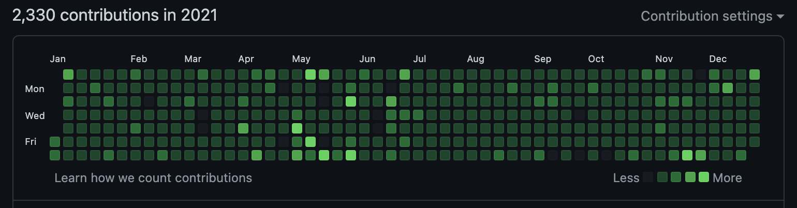
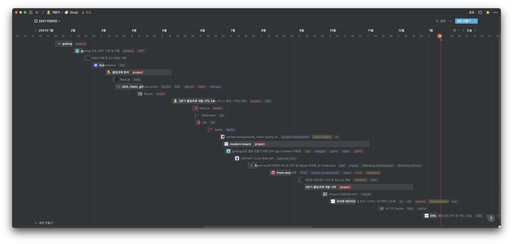

> 꾸준히 성실히 코딩 성공

> 가슴이 웅장해지는 공부량

# TL;DR

1. Go 언어 학습
1. CI/CD 고도화 (use k8s)
1. 첫 제품 제작 느낀 Front-end Engineer로써
1. 졸업작품 최우수상과 대학교 졸업
1. 병특 유무는!?

# Intro

정말 바쁘다고 생각했던 2021이 지나갔습니다.

여러모로 Big Event가 많아서 한 달 한 달이 묵직했던 거 같아요.

위에 올린 사진을 보다 싶이 데일리 커밋도 성실히 이행되었고 무엇보다 notion을 보면 되게 많은 것을 공부한 것을 볼 수 있습니다.

축약해서 이번 연도 회고와 내년을 위한 목표를 정리해 보도록 하겠습니다.

# Go 언어와 k8s

TS는 자신 있고 재밌게 사용할 수 있는데 인터프리터 기반의 script 언어만 가지고 있기엔 뭔가 아쉬워서 low-level의 컴파일 언어를 배워보고 싶었습니다.

딱 떠오르고 핫한 언어가 Rust와 Go가 있었는데 Go가 성공한 프로젝트가 있기도 하고 실제 사용하는 제품이 늘어나는 추세로 보여서 Go를 배우게 되었습니다.

사실 Go가 그렇게 좋다고 하길래 너무 궁금해서 배워본 것도 있고 DevOps의 Tool 체인들이 Go로 작성된 것도 많아서 배워서 나쁠 것은 없다고 생각했습니다.

추가적으로 작년에 CI/CD로 자동화 Pipeline까지는 구축할 수 있는데 뭔가 모를 아쉬움이 있어서 더 고도화 시켜보고 싶은 마음에 k8s을 공부하게 되었습니다.

공부한 k8s을 졸업 작품에 실제로 사용하면서 많은 경험치를 획득할 수 있었는데 배우길 잘했다고 생각이 듭니다.

> 역시 배포는 너무 재밌어

# 제품이라고 불릴 수 있는 소프트웨어란 (ps. Front-end Engineer)

이번 연도에 직무에서 크게 변한 것은 내가 Front-end Engineer으로 써 제품을 만들 수 있다는 것이었습니다.

> 아직 부족한 게 많지만...

이전까지는 제품 유지 보수 및 Power App이라는 비 개발자 개발 도구를 이용하여 제품을 만들었었는데 드디어 코드로써 개발에 들어갈 수 있게 되었습니다.

실제 실무에서 제품 퀄리티의 개발을 하면서 느낀 점이 매우 많았는데 사실 이전까지는 소프트웨어라고 한다면 프로그래밍 언어를 가지고 뭐든 만들면 된다! 실행되고 돌아가면 된다! 문제가 생기면 고쳐주면 되는 거고 프로그래밍 문법을 알면 언제든지 시간을 투자해서 고칠 수 있으니까 문제가 없다!라고 생각했습니다.

사실 위에 한말은 비즈니스 개발을 한 번도 안 했을 때 발생할 수 있는 착각이었습니다.

개발자는 항상 바쁘고 일정에 따라 움직이기 때문에 제한적인 시간인에 output을 도출해야 되고 내가 만든 프로그램이 정상적으로 수행되는지 로그로써 남기고 추적도 가능해야 되고 성능도 고려해야 되고 엄청나게 많습니다.

그냥 프로그래밍 언어를 배워서 서비스 하나 만들어봤어요!로 느낄 수 없는 경험들이 많았습니다.

그래서 중점적으로 느낀 점이 무엇이냐고 말한다면

1. 프로그래밍 언어와 프레임워크에 대한 이해도가 중요하다.
   1. 당연한 말이긴 한데 프로그래밍 언어와 프레임워크에 대한 이해도가 적어도 제품을 만들 수야 있긴 하지만 시간이 지날수록 기술 부체에 부딪히며 일정 산출에 스트레스를 받는 자신을 본다면 무슨 말인지 이해가 될 것이다.
   1. 백날 언어 문법이나 프레임워크 사용법만 익히더라도 이슈 발생 시 `제한된 시간` 안에 트러블 슈팅에 성공하려면 정말 많은 경험과 실력이 필요한 것을 느꼈다.
   1. 되게 당연할 말을 적어놨는데 지금이라도 실력이 없는 것을 인정하고 공부할 준비가 되었다면 반은 온 것이라고 생각한다.
1. 모니터링(로깅)
   1. SRE이랑 연관이 되긴 하는데 내가 만든 제품이 정상적으로 수행되는지 성공률과 실패율 등등 여러 지표를 로깅하고 추적할 수 있는 시스템을 만드는 것이 중요하다는 것을 느꼈다.
   1. 실제로 해보니 생각보다 어려운 부분이어서 작년이 CI/CD 고도화이라면 이번 연도는 모니터링, E2E 테스트와 같은 운영성에 초점을 두고 공부하게 될 거 같다.

# 대학교 졸업!

학교와 회사를 병행하던 대학교의 마지막 학기를 드디어 끝냈다!

아직 공식적으로 졸업장이 나온 것은 아니지만 이제 대학교에 안 간다는 사실이 시원섭섭하지만 개인 시간이 생겼다는 기쁨이 있다.

졸업작품까지 최우수상에 수상하면서 뿌듯하게 졸업할 수 있을 거 같다.

# 산업기능요원 (병역특례)

그리고 가장 큰 문제인 군대... 나는 특성화 고교를 나와서 대학교와 병행하더라도 병특을 받을 수 있는 기회가 있었는데 배정 순위가 낮아서 사실 기대하지 않고 있었다.

하지만 신이 주신 기회인지는 몰라도 여러 운이 겹쳐서 내가 산업기능요원 TO을 받게 되었다!

사실 그래서 산업기능요원 편입 신청이 확정되면 회고를 작성하려고 했는데 문제가 발생했다...

대학교에 재학 중이고 곧 졸업이기 때문에 기사 자격증이 필요하다는 것이다 때문에 편입 서류에서 탈락되었다.

당연히 대학교 재학 중이니까 산업기사나 기사 준비는 당연한 게 아니냐? 할 수 있지만 개인-내부적으로 복잡한 사연이 너무 많았다. 하지만 이미 지나간 일이고 덕분에 이번 연도 목표 1순위가 기사 자격증 취득으로 변경되었다. 🤯 😱 😵‍💫

# 이외

1. TDD 하려고 jest도 공부했는데 한 번도 사용하지 못헀다...
1. SRE을 경험할 수 있었다.
1. 이외는 notion에 정리된 study의 모든 것!

# 앞으로는?

마일스톤은 단한 게! 정보 처리 기사 취득이다. 지금까지 열심히 한 것이 아까워서 꼭 병특을 받고 싶다.

이제 제품 개발 능력보다는 고도화에 관심이 가고 있다. 어떻게 해야지 더 우아하고 적은 코드량으로 개발할 수 있을까? 무엇보다 SRE을 통한 운영성을 더 기르고 싶다.

현재까지 주 업무는 Front-end 이지만 개인적으로 Back-end, DevOps도 계속 공부하고 있고 모두 재밌기 때문에 나는 ??? 엔지니어에요! 라고 자신있게 말할 포지션을 못 정했다.

내년에는 포지션을 과연 정할 수 있을지 병특을 받아서 군대에 안 갈지 관전 포인트가 될 거 같다.
