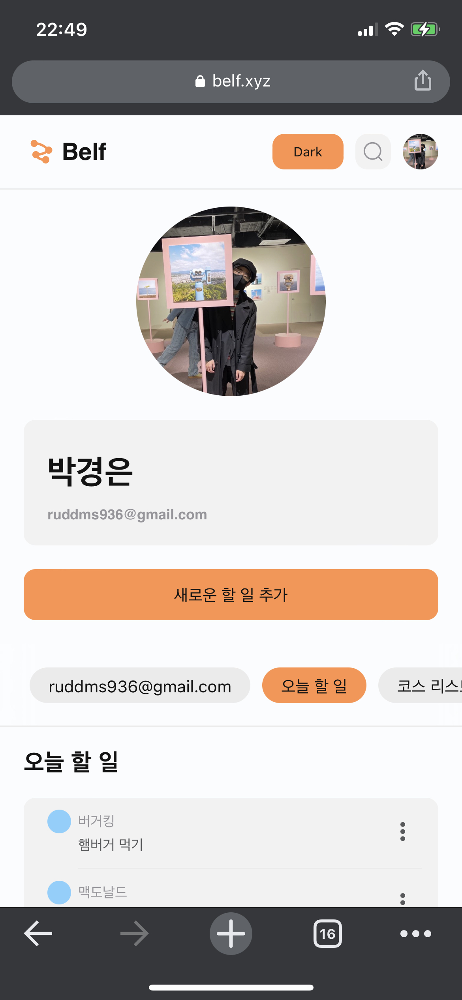
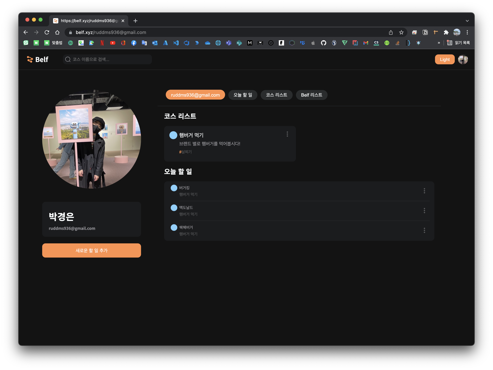

# Preview

| Mobile                                          | PCㅤㅤㅤㅤㅤㅤㅤㅤㅤㅤㅤ                       |
| ----------------------------------------------- | ---------------------------------------------- |
|  |  |

# Overview

졸업과제로 진행된 프로젝트로 기간은 약 `2021.03.10` ~ `2021.12.18` 까지 진행되므로 거즘 1년 동안 진행되었습니다.

저는 프로젝트에서 PM과 devops를 담당했으며 팀원들이 개발에만 집중할 수 있도록 환경을 만들어주고 `front-end`, `back-end` 모두 issue 발생 시 서포트해 주었습니다. 이외 [oauth-server](https://github.com/belf-kr/oauth-server) 제품도 개발하였습니다.

프로젝트가 성공적으로 종료되어 이에 대한 회고를 해보려고 합니다.

# 프로젝트 정보 🔥

> 관련 내용이 여러 군대로 파편화되어 링크로 제공되었습니다. 😂

1. [소개](https://github.com/belf-kr)
1. [project github](https://github.com/belf-kr)
1. [팀원](https://parkgang.notion.site/6de1a3d7002f4a46ab713e7d6846c490?v=52125eaffbf24e9ca82114b4c2441c80)
1. [서비스 사용 매뉴얼](https://parkgang.notion.site/36f01d56dff643dfa1db264e33f18d7d)
1. [notion 구경하기 "여기에 모든 정보가 작성되어있어요!"](https://parkgang.notion.site/Belf-27b87963790b4e43baae2e0c3c6ae123)

# 서비스 접속 주소 ✨

> 서버가 down되어 있을 수 있습니다.

1. [prod "실 서비스"](https://belf.xyz)
1. [qa](https://qa.belf.xyz)

# Background

> 사용자의 코스를 공유하는 Todo 서비스

todo의 기능과 github fork에 영감을 받아서 제작된 웹앱 제품입니다.

이번 프로젝트를 진행하면서 얻을 수 있는 값진 경험치는 k8s의 운영 경험과 정의된 워크플로우 안에서 팀원과 함께 협업하여 제품을 개발한 것입니다.

CI/CD 및 워크플로우의 경우 내용이 너무 길어서 설계부터 실습까지 [blueprint](https://parkgang.github.io/devops/workflows-with-aks-github-slack-2/) 에 정리해놓았으니 궁금하다면 구경해주세요.

이번 회고에서는 프로젝트를 진행하면서 전체적으로 경험한 것에 대해 회고하려고 합니다.

## PM으로써

[blueprint](https://parkgang.github.io/devops/workflows-with-aks-github-slack-2/) 에도 명시되어있지만 팀원의 대부분은 이미 개발자로써 직장 생활을 하고 있어서 개발을 어떻게 해야 하는지 개발 프로세스가 왜 중요한 지에 대한 설명까지는 필요가 없는 상태이었습니다.

적어도 웹앱의 개발 시작에 대한 기초적인 Background가 있는 상태이라서 어떤 개발 프로세스와 역할 배정을 해야지 최고의 효율을 뽑을 수 있을지 고민을 해보았습니다.

팀원이 좋아하고 자신 있어 하는 stack이 달라서 하나의 언어와 프레임워크로 가기는 어려웠고 MSA를 사용할 만큼 큰 규모의 서비스는 아니지만 다들 작장 생활하느라 개발 주기도 일정하지 않고 그냥 서비스를 하나 독립적으로 담당하는 게 더 좋지 아늘까? 생각이 들었고 무엇보다 제가 MSA으로 프로젝트를 진행해보고 싶었습니다.

이전에 k8s에 대해 이론 및 간단한 사용법은 공부했는데 실제로 프로젝트에 사용해보지 않아서 사용해보고 싶기도 했고 MSA를 하면서 여러 issue를 접해보고 싶었습니다.

## MSA

MSA는 MicroService Architecture의 줄임말으로써 그냥 쉽게 Service를 Micro하게 잘게 분리하는 Architecture를 말합니다.

사실 MSA는 이론 자체는 어렵지 않다고 생각합니다. 문제는 Micro 분리하는 Service 기준을 잘 정해야한다는 것이죠 이외 분산된 환경에서 로깅 및 insight를 도출 등 어려운 문제도 많습니다 하지만 해당 Architecture가 지향하는 목표는 심플하다고 생각합니다.

해당 프로젝트에서는 팀원이 수직적으로 담당할 수 있는 하나의 repo를 기준으로 Service를 분리하였습니다.

> 즉, repo를 하나의 엔지니어가 담당하는 구조인거죠!

대외적으로 MSA에 알려진 장점으로 뭐 단독 제품으로 쉽게 배포를 할 수 있다 등은 쉽게 체감할 수 있었습니다. 대외적인 것이외 제가 느낄 수 있었던 것의 `장점` 으로는 엔지니어가 하나의 service를 담당하고 있으니까 커뮤니케이션이 편리하였습니다. 제품에 대해 가장 잘 알고있기도 하고 하나면 집중하면 되는 환경이 되었습니다. `단점` 으로는 관리 포인트가 엄청나게 증가하였습니다. 사실 이부분은 진행해보니 구조의 결함일 수도 있긴한데 하나의 Service에서 CI/CD에 결함이 포착되었다면? 이외의 Service도 대응해주고 확인을 해줘야했고 MSA를 적용하면서 약간 당연하게? 겪을 수 있는 문제일 수 있지만 Service의 interface 파편화되는 것도 있었습니다.

그럼에도 불구하고 MSA를 통해서 생산성에 도움은 되었지만 확실히 거대 규모의 Service에서 어울리는 Architecture라는 인상이 강해졌습니다.

## k8s

MSA와 찰떡 궁합인 k8s 입니다. 해당 프로젝트에서는 AKS를 사용하여 배포하게 되었습니다.

실제 서비스를 운영한다는 마음으로 namespace도 정의하고 configmap으로 pod들도 관리하고 L7도 설정하고 해보면서 많은 경험을 얻을 수 있었습니다.

특히, k8s cluster 사양이 높지 않은데 가뜩이나 `qa` 와 `prod` 의 환경을 구분해서 많은 pod이 띄어지면서 발생한 k8s scheduler 배치 이슈 및 container 성능 이슈도 잡아보고 어떻게 object을 네이밍하면 좋을 지도 생각할 수 있는 계기가 되었습니다.

확실히 운영이라는 것을 해보면서 얻는 경험치는 말로 다 할 수 없는 거 같습니다.

> 이외에도 `prod` 에는 mysql replication을 사용해보는 등 재밌는 경험을 해봤습니다.

# 트러블 슈팅 내역

이외 해당 프로젝트를 진행하면서 발생한 트러블 슈팅 내역은 [Issue](https://parkgang.notion.site/Issue-e38806db386346448681eb165327031f) 에 작성되어있습니다.

# 느낀 점

k8s와 golang에 대한 제품이 없어서 아쉬웠는데 이번 프로젝트를 통해 만들 수 있어서 기뻤고 `qa`, `prod` 환경을 구분해서 `prod` 이전에 미리 사용성 및 버그를 확인할 수 있어서 미리 대응된 case 들도 있는데 이런 것을 보면서 환경 구분을 잘 해놨구나 하는 뿌듯함도 있었습니다.

이외에도 CI/CD Pipline을 한번 만들면 영원히 잘 돌아갈 줄 알았는데 중간에 예상하지 못한 곳에서 고장이 난 것도 꽤 신기한 경험이었습니다.

> 난 영원할 줄 알았는데...

# 마무리

성공적으로 프로젝트는 마무리되었고 많은 경험을 할 수 있었습니다.

아쉬운 것은 프로젝트가 끝날 때 쯤에서야 팀원들이 온보딩이 완료되어 더 주기적으로 개발하여 좋은 퀄리티의 서비스를 만들 수 있었을 꺼 같지만 다음을 기약하고 넘어가게 되었습니다.

그래도 이번 프로젝트를 계기로 개발 프로세스부터 배포까지 설계하고 서비스를 운영할 수 있는 자신감이라는 것은 생겼습니다.

> 물론 로깅관련 부분이 부족해서 빨리 이부분을 보안하고 싶네요!

다음 번에 더 좋은 제품을 만들 수 있도록 기약하며 회고를 마치도록 하겠습니다. 읽어주셔서 감사합니다. 😀
