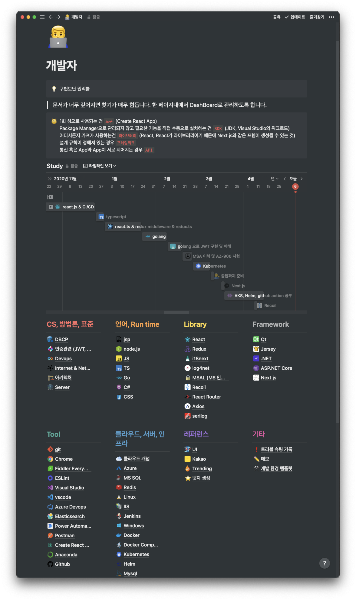
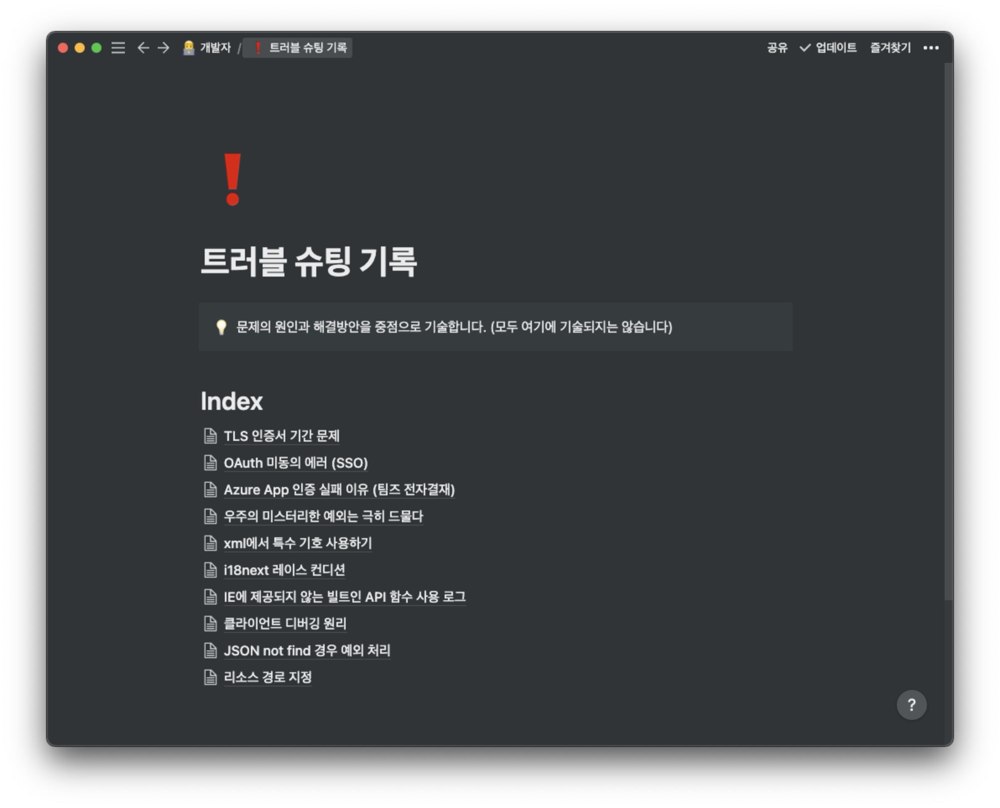

# Intro

깃허브 블로그 첫 포스트로 왜 깃허브 블로그를 사용하게 되었는지 소개하도록 하겠습니다.

# 이전의 나는?

나의 첫 개발 블로그는 `velog` 에서 시작되었습니다.

처음에는 열정적으로 잘 작성하였지만 어째 사람들에게 정보를 공유하기 위한 개발 블로그 라는 성격 보다는 내가 공부한 내용을 복습하고 나중에 보려고 작성하는 느낌이 강하게 들었습니다.

더구나 이미 있는 글을 나에게 맞게 바꾸어 작성하게 되는 나를 발견하고 이럴꺼면 개인 노트에 작성하는게 더 효율적이라는 생각을 하게되었습니다.

이때부터 이전부터 봐왔던 notion을 공부해서 알게 된 지식을 모두 정리하기 시작하였습니다.

> 쭉쭉 늘어나는 페이지들...

사실 notion에 웹 공유 기능이 있어서 열심히 notion에 작성하고 웹에 공유해서 블로그 처럼 사용하려고 했습니다. 하지만 터닝 포인트🔥 가 발생하게 되는데

# 왜 깃허브 블로그?

제품(SW)에 대해 아주 간단하고 사소한 오류라도 사용자 풀이 적다면 해결 방법에 대해 찾기가 어렵습니다.

물론 개발자 실력이 좋다면 그동안 쌓아온 지식을 기반하여 아주 수월하게 트러블 슈팅을 진행할 수 있을 겁니다.

하지만 깊은 지식 없이 SW가 `돌아가는 것에 치중` 하여 학습된 상태로 예상 하지 못한 새로운 이슈를 만난다면 당황스럽고 사전에 같은 문제를 고민한 글에 의존하게 됩니다.

저는 각 토픽에 맞게 트러블 슈팅 내용을 notion에 기록하고 있었습니다.

요근래 공부하고 있는 부분에서 트러블 슈팅을 진행하면서 나와 같은 문제를 고민한 글이 많지 않다는 것을 직접 체감하게 되었습니다.

> 이 트러블 슈팅 기록을 또 notion 작성해?

물론 notion에도 계속 작성되고 있습니다. 하지만, 이전에 트러블 슈팅 경험을 살펴보면 글의 퀄리티 유무와 관계 없이 누군가 나와 같은 문제를 겪고 대충이라고 해결 방법을 적어 놓은 글을 보았을 때 많은 도움이 된다는 것을 느끼게 되었습니다.

> 물론 공식문서를 보고 차근차근 배우고 트러블 슈팅하는게 맞지만 😔

딱, 이맘때쯤 깃허브 블로그로 기술 분석에 대해 제가 궁금한 점을 딱 잡아서 작성된 글이 있었는데 그걸 읽고 반해버렸습니다.

notion에 작성할 때 아래의 Side effects를 고민하고 있던 시절이여서 깃허브 블로그가 더 매력적으로 다가왔습니다.

1. 이미지와 같은 정적파일이 날라가면 어떡하지?
1. 다른 서비스로 마이그레이션은?
1. 웹 공유를 하더라도 사람들이 많이 찾아줄까?

그래서 전략적으로 듣고 까먹지 싫은 건 notion에 작성하고 사람들에게 가치를 전달할 수 있는 글은 깃허브 블로그에 작성해보자는 마음으로 시작되었습니다.
