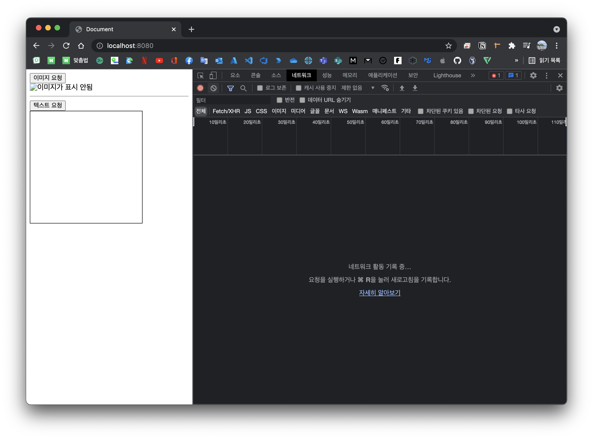
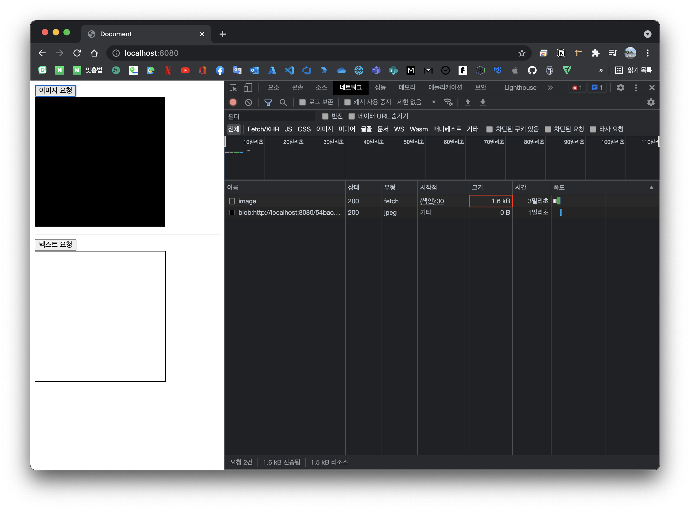
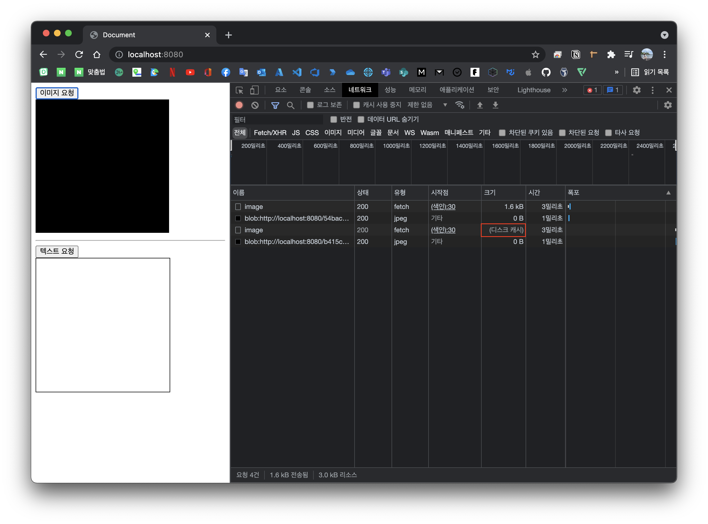
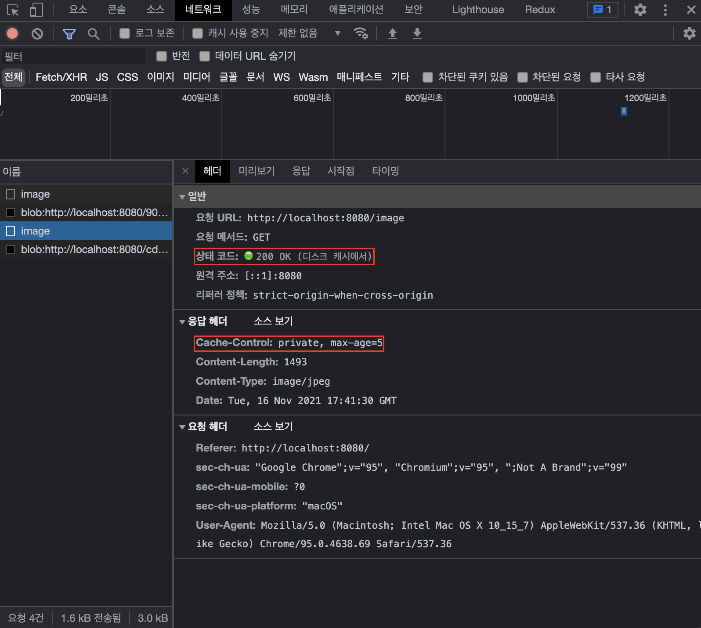
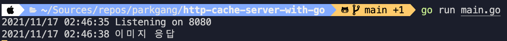
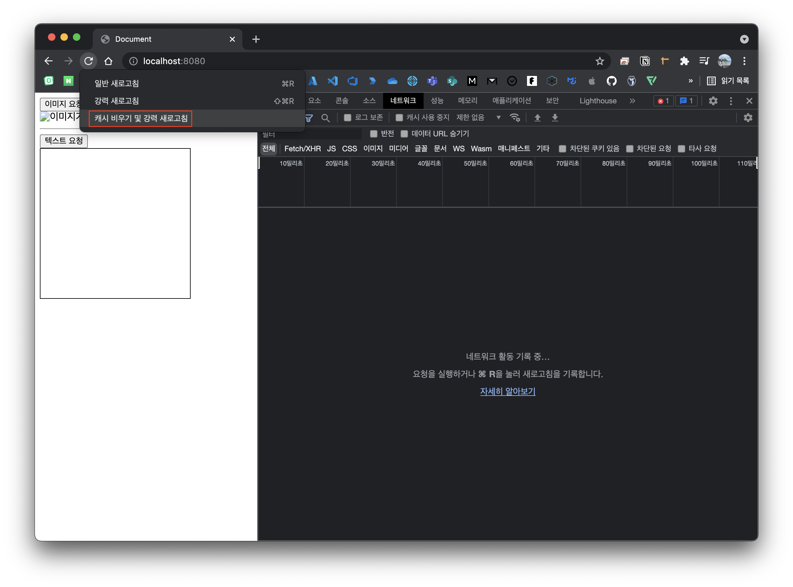
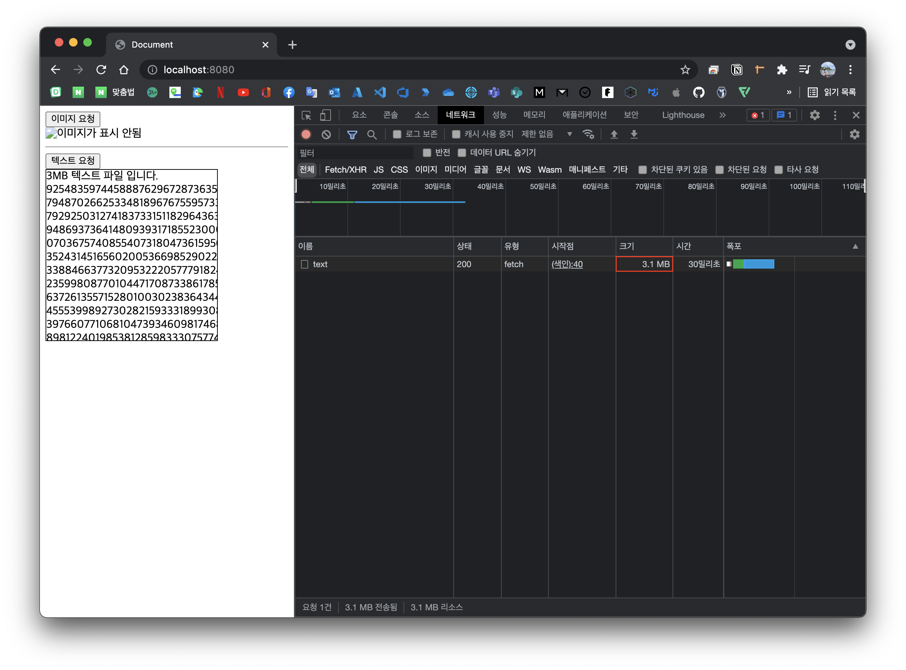
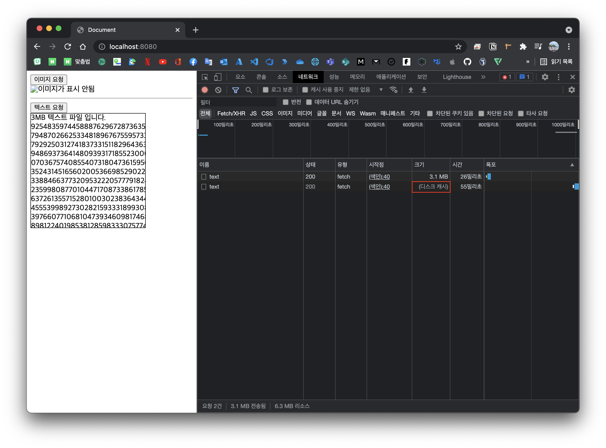
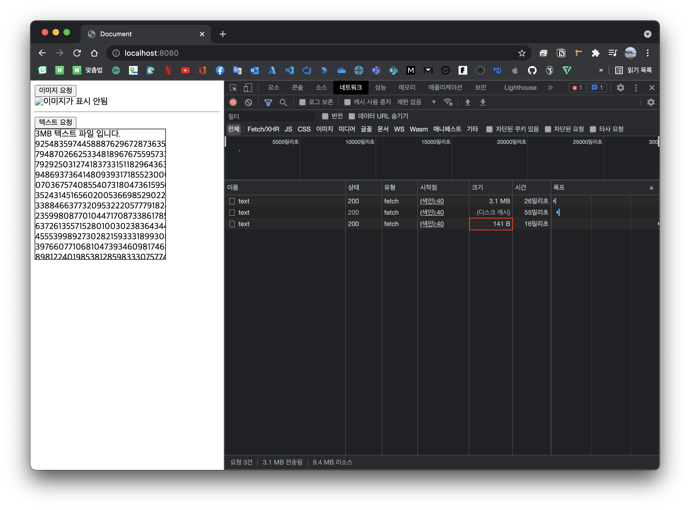
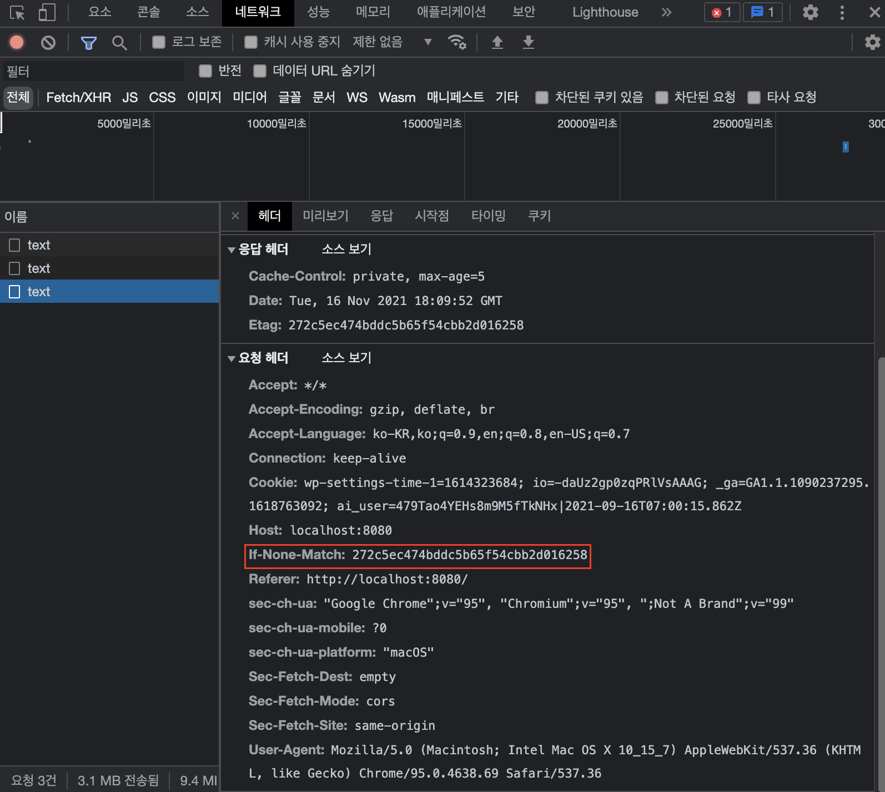

# Overview

HTTP Cache에 대해서 찾아보면 대부분 각 Header가 어떻게 동작하는지에 대해 중점으로 알려줍니다.

어떻게 보면 Client와 Server가 HTTP Spec에 규정된 Header 값을 바탕으로 캐시하는 것이 전부이긴 하지만 Header 값을 실제 프로그램이 어떻게 읽어서 처리하느냐도 중요합니다.

필자는 HTTP Cache를 공부할 때 Header에 대한 내용만 나오고 그 Header를 어떤 로직으로 보내는지 서버는 Header를 읽어서 어떻게 하는지 로직적으로 살펴볼 수 없어서 이해가 너무 힘들었습니다.

특히, `ETag` 부분은 도데체 어떤 경우에 생기며 `ETag` 가 변경되는 기준은 무엇이며 검증은 어떤 식으로 하는지 너무 답답했습니다.

이에 따라 직접 캐시 서버를 만들어서 이해하기로 결심했고 [Learning HTTP caching in Go](https://www.sanarias.com/blog/115LearningHTTPcachinginGo) 글을 기준으로 잡고 간단한 캐시 서버를 제작하게 되었습니다.

# 시작하기 전에

해당 글에서는 HTTP Cache와 관련된 Header에 대해서 자세히 설명하지 않으며 HTTP Cache와 관련된 Header가 어떻게 Request되고 Server는 어떤 식으로 처리되는지를 그에 대한 효율성을 중점적으로 서술합니다.

# TL;DR

1. HTTP Cache Header는 HTTP로 통신하는 주체들이 캐시를 처리하기 위한 하나의 interface일 뿐 그것에 대한 처리 로직을 구현하는 것은 Client (browser) 와 Server (web server) 입니다.
1. `Express.js` 니 `ASP.NET Core` 과 같은 상용화 된 웹 서버 제품을 사용하는 경우 캐시 관련 해더를 처리하는 부분은 블랙박스 영역이라고 생각하면 됩니다.

# 요구사항

1. 우선 캐시가 적용된 경우와 적용되지 않은 경우를 보기 쉽도록 이미지 파일을 읽어오는 API를 만들고 가장 궁금했던 `ETag` 처리 로직을 위해서 텍스트 파일을 읽어오는 API를 만들도록 합니다.
1. 이미지 API의 경우 제일 단순하게 `Cache-Control` Header를 통해서 `max-age` 만을 가지고 캐시 적용 유무 차이를 볼 것이고
1. 텍스트 API의 경우 파일이 수정될 때마다 `ETag` 값을 변경하여 Response 하는 로직과 함께 `Cache-Control` Header로 시간에 따른 캐시 변화도 볼 것입니다.

# 코드를 보여주세요

> 아래에 사용된 코드는 [parkgang/http-cache-server-with-go](https://github.com/parkgang/http-cache-server-with-go) 에서 살펴보실 수 있습니다.

## main.go

1. HTTP Cache를 이해하기 위한 간단한 서버라서 로직은 모두 `main.go` 에 몰아져있습니다.
1. endpoint는 `/image`, `/text` 2가지가 있고 위에서 말한 이미지와 텍스트를 조회하는 API 입니다.
   1. 이미지의 경우 메모리 상에서 생성하고 응답할 것이며
   1. 텍스트의 경우 `assets` 디렉터리에 있는 `note.txt` 파일을 사용할 것입니다.
1. `Cache-Control` Header의 경우 이미지와 텍스트 모두 동일하게 `private, max-age=5` 가 적용됩니다.
   1. 확실한 테스트를 위해 브라우저만 캐시되도록 `private` 을 지정하였고
   1. 캐시 적용 유무를 빠르게 보기 위하여 아주 짧은 시간인 `max-age` 를 5초로 지정하였습니다.
1. `ETag` 의 경우 만드는 방법이 여러가지 있는 것으로 알지만 가장 단순하게 파일이 수정된 일자를 MD5 해시 함수를 이용하여 생성하였습니다.
   1. 이로써 파일이 수정될 때마다 (파일을 그냥 저장할 때도 해당) 수정된 일자가 변경되어서 `ETag` 가 계속 변하게 될 것입니다.
1. `r.Header.Get("If-None-Match")` 쪽 코드를 보면 `ETag` 를 검증하는 로직이 있는데 request header에 `If-None-Match` 값이 존재하고 request한 `ETag` 와 현재 파일의 `ETag` 를 구해서 비교 후 같으면 `304` 를 응답하는 코드입니다.
   > 물론 제품 수준의 퀄리티는 아니지만 메커니즘 이해를 위한 구현은 이렇게 쉬운데 이 부분이 블랙박스로 처리되어 참으로 이해가 어려웠습니다.
1. 또한, 각각의 API가 실제로 호출 여부를 확인하기 위해서 호출 시 응답 전에 console에 글자를 출력하도록 코딩되어 있습니다.

```go{47,67,70-77}
package main

import (
	"bytes"
	"crypto/md5"
	"flag"
	"fmt"
	"image"
	"image/color"
	"image/draw"
	"image/jpeg"
	"io/ioutil"
	"log"
	"net/http"
	"os"
	"strconv"
	"strings"
)

var root = flag.String("root", "./assets", "file system path")

func main() {
	http.Handle("/", http.FileServer(http.Dir(*root)))
	http.HandleFunc("/image", imageHandler)
	http.HandleFunc("/text", textHandler)

	log.Println("Listening on 8080")
	if err := http.ListenAndServe(":8080", nil); err != nil {
		log.Fatal("ListenAndServe:", err)
	}
}

func imageHandler(w http.ResponseWriter, r *http.Request) {
	m := image.NewRGBA(image.Rect(0, 0, 240, 240))
	// 검은색 이미지 생성
	tempImage := color.RGBA{0, 0, 0, 255}
	draw.Draw(m, m.Bounds(), &image.Uniform{tempImage}, image.Point{}, draw.Src)

	// jpeg 형식으로 이미지를 인코딩하고 ResponseWriter에 writes 합니다.
	var img image.Image = m
	buffer := new(bytes.Buffer)
	if err := jpeg.Encode(buffer, img, nil); err != nil {
		log.Println("unable to encode image.")
	}

	log.Println("이미지 응답")
	w.Header().Set("Cache-Control", "private, max-age=5")
	w.Header().Set("Content-Type", "image/jpeg")
	w.Header().Set("Content-Length", strconv.Itoa(len(buffer.Bytes())))
	if _, err := w.Write(buffer.Bytes()); err != nil {
		log.Println("unable to write image.")
	}
}

func textHandler(w http.ResponseWriter, r *http.Request) {
	filename := "./assets/note.txt"

	// 마지막 수정 시간 가져오기
	file, err := os.Stat(filename)
	if err != nil {
		log.Println(err)
	}
	modifiedtime := file.ModTime()

	etag := fmt.Sprintf("%x", md5.Sum([]byte(modifiedtime.String())))
	w.Header().Set("Etag", etag)
	w.Header().Set("Cache-Control", "private, max-age=5")

	// etag가 변하지 않았다면 304 응답
	if match := r.Header.Get("If-None-Match"); match != "" {
		if strings.Contains(match, etag) {
			log.Println("etag가 변하지 않았음으로 304 응답")
			w.WriteHeader(http.StatusNotModified)
			return
		}
	}

	// 파일을 읽은 후 응답
	dat, err := ioutil.ReadFile(filename)
	if err != nil {
		log.Println(err)
	}
	log.Println("파일 응답")
	fmt.Fprint(w, string(dat))
}
```

## assets/note.txt

1. 텍스트 API에서 응답할 때 사용되는 텍스트 파일인데 일부로 `3MB` 으로 무겁개 해서 캐시 효과가 얼마나 큰지 알 수 있도록 디자인하였습니다.
1. 또한, `304` 응답 시 얼마나 응답 바디가 작은지 확인할 수 있습니다.

## assets/index.html

1. Server API를 소비하는 Client 웹 페이지 입니다.
1. `이미지 요청` 버튼을 누르면 이미지를 조회해서 보여주고
1. `텍스트 요청` 버튼을 누르면 텍스트를 조회해서 보여주는 아주 간단한 웹 페이지 입니다.

> 독자분들은 아시나요...? 정적 파일 요청을 브라우저의 URL에 직접 넣어서 요청하면 캐시 되지 않는다는 것을...🥲
>
> 분명 캐시가 적용된 URL인데 계속 요청을 해도 캐시되지 않고 새롭게 응답받길래 왜 그러지 하고 트러블 슈팅을 해보니 브라우저 URL에 직접 넣어서 호출해서 그렇더군요  
> 그래서 아래와 같이 간단한 웹 페이지를 만들어서 호출할 수 있도록 디자인하였습니다.  
> 에초에 GUI라서 확인하기도 쉬우실 꺼에요!

```html
<!DOCTYPE html>
<html lang="ko">
  <head>
    <meta charset="UTF-8" />
    <meta name="viewport" content="width=device-width, initial-scale=1.0" />
    <title>Document</title>
    <style>
      .text-area {
        display: inline-block;
        width: 240px;
        height: 240px;
        border: 1px solid black;
        overflow: hidden;
      }
    </style>
  </head>
  <body>
    <div>
      <button onclick="handleGetImage()">이미지 요청</button><br />
      
    </div>
    <hr />
    <div>
      <button onclick="handleGetTxt()">텍스트 요청</button><br />
      <span class="text-area"></span>
    </div>
  </body>
  <script>
    async function handleGetImage() {
      const response = await fetch(`${window.location.origin}/image`)
      if (response.ok) {
        const imageBlob = await response.blob()
        const imageObjectURL = URL.createObjectURL(imageBlob)
        document.getElementById('image').src = imageObjectURL
      } else {
        alert('HTTP-Error: ' + response.status)
      }
    }
    async function handleGetTxt() {
      const response = await fetch(`${window.location.origin}/text`)
      if (response.ok) {
        const text = await response.text()
        document.getElementsByClassName('text-area')[0].innerHTML = text
      } else {
        alert('HTTP-Error: ' + response.status)
      }
    }
  </script>
</html>
```

# 원하는 대로 동작하는지 확인해보자

## 서버 실행

1. 자 이제 캐시가 잘 되는지 확인해볼까요? 위에서 말한 repo에서 소스코드를 clone 받고 `go run main.go` 으로 서버를 시작해 봅시다.
1. 캐시 여부를 편리하기 보기위해서 저는 친숙한 `Chrome` 을 사용하도록 하겠습니다.
   > 대부분 비슷하긴 하지만 `Chrome` 이 아니여도 디버깅이 편하신 분은 다른 브라우저를 사용하셔도 됩니다.
1. 그리고 [http://localhost:8080](http://localhost:8080) 주소로 접속하고 개발자 도구를 켜주세요! 아마 아래와 같이 화면이 될 것 입니다.
   

## 이미지 캐시 확인

우선 `이미지 요청` 버튼을 클릭해 볼까요?



위와 같이 요청 후 서버에서 응답된 것을 확인할 수 있네요 응답 받은 이미지 용량은 `1.6kB` 이라고 하네요! 그럼 바로 한번 더 빠르게 `이미지 요청` 버튼을 클릭해 볼까요?



이번에는 뭔가 요청이 된거 같으나 응답 부분의 용량이 `(디스크 캐시)` 인 것을 확인할 수 있습니다. 네, 그렇습니다 캐시되서 그렇습니다. 🤭 네트워크 요청 내역을 자세히 봐볼까요?



응답 header에 `Cache-Control: private, max-age=5` 가 존재하는 것을 볼 수 있습니다. 이미지 조회 API에 넣어 둔 header인 것을 알 수 있습니다. 앞으로 5초 동안은 해당 URL 요청에 대해서 Server에 물어보지 않고 브라우저 캐시를 사용합니다.

중요한 것은 네트워크 탭에는 **마치 요청된 것** 같아 보이지만 실제로는 **Server에 요청하지 않는** 다는 것 입니다.



Server Console을 보니까 요청이 1회 들어온 것을 확인할 수 있습니다.

> 앗, 혹시라도 1회 이상 요청되었나요? 그렇다면 2가지를 의심하셔야 합니다.
>
> 첫번째로 브라우저 개발자 도구에 `캐시 사용 중지` 체크 박스가 해재되어있는지 확인해주세요. 해당 체크박스가 체크되어 있으면 캐시되지 않습니다ㅠㅠ
>
> 두번째로 `max-age` 값을 올리시거나 아니면 더 빨리 버튼을 클릭해 보세요 빠른 테스트를 위해서 캐시 시간을 5초로 지정하였는데 5초가 지나면 해당 URL의 캐시는 무효화 되어 Server에게 다시 요청을 보내게 됩니다. 해당 경우가 아닌지 한번 확인해보세요

이외 아래의 RGBA 값과 `max-age` 값을 바꾸면서 테스트 해보세요. 첫 조회된 `max-age` 시간 동안은 색상 값을 변경하더라도 조회되지 않지만 `max-age` 가 지나면 변경되는 것을 확인할 수 있습니다.

```go{4, 6}
func imageHandler(w http.ResponseWriter, r *http.Request) {
	...
	// 검은색 이미지 생성
	tempImage := color.RGBA{0, 0, 0, 255}
	...
	w.Header().Set("Cache-Control", "private, max-age=5")
	...
}
```

## 텍스트 캐시 확인

> 텍스트 확인 전 혹시 모르니까 캐시를 모두 날리면서 테스트 하세요. 개발자 도구를 활성화한 상태에서 새로고침 버튼에서 오른쪽 마우스를 클릭하면 아래와 같이 강력 세로고침 매뉴을 볼 수 있습니다.
> 

자 이제 `Etag` 가 있는 텍스트 입니다. `텍스트 요청` 버튼을 클릭해 볼까요?



위와 같이 `3.1MB` 으로 묵직한 텍스트가 응답되었습니다. 매 요청마다 `3.1MB` 을 다운로드 하면 모바일 환경에서 데이터는 남아나지 않을 것 입니다. 바로 또 다시 `텍스트 요청` 버튼을 클릭해 볼까요?



텍스트 파일도 이미지 파일과 동일하게 `Cache-Control: private, max-age=5` 가 설정되어 있기 때문에 5초 동안 캐시되어 있는 것을 확인할 수 있습니다. 그럼 이번에는 5초 기달렸다가 요청을 보내볼 까요?



이번에는 `141B` 로 매우 가벼운 응답이 온 것을 확인할 수 있습니다.

이유는 파일이 변경되지 않았기 때문에 Server에서 `ETag` 가 변경되지 않아 이전과 `ETag` 가 동일하기 때문에 `304` 를 응답하기 때문입니다.

덕분에 캐시가 끝나서 다시 `3.1MB` 응답받을 뻔! 했지만? Server에서 변경되지 않았다고 `304` 상태 코드와 `ETag` 를 header 응답해줘서 5초 동안은 캐시될 수 있도록 생명연장이 되었습니다. 😤 😮‍💨

그러면 궁금한 것이 이전 `ETag` 를 Server는 어떻게 알고 있는 걸까요?



진실은 Client (브라우저) 가 알아서 포함해서 보내기 때문입니다.

텍스트도 이미지와 같이 `max-age` 값을 바꾸거나 텍스트 파일을 수정해보면서 어떤 식으로 돌아가는지 확인해보세요. `ETag` 가 없을 때 캐시가 만료되면 어떻게 동작하는지 직접 확인하면 이해가 빠를 것 입니다.

# 마무리

만들고나니 엄청나게 특별한 로직이 존재하지는 않았습니다. 그래도 실제로 캐시 유무에 따른 변화와 함께 상용으로 사용되는 웹 서버도 이와 비슷한 메커니즘으로 처리되겠구나 하는 것을 인지할 수 있었습니다.

덕분에 앞으로 웹 앱을 배포하고 무작정 캐시 문제라고 생각할 것이 아니라 논리적으로 트러블 슈팅을 할 수 있는 귀중한 경험치가 될 거 같습니다.

저와 같이 블랙박스 영역의 웹 서버 로직이 궁금하셨을 분들에게 조금이라도 도움이 됬으면 하며 저는 이만 물러가도록 하겠습니다. 읽어주셔서 감사합니다. 😀
