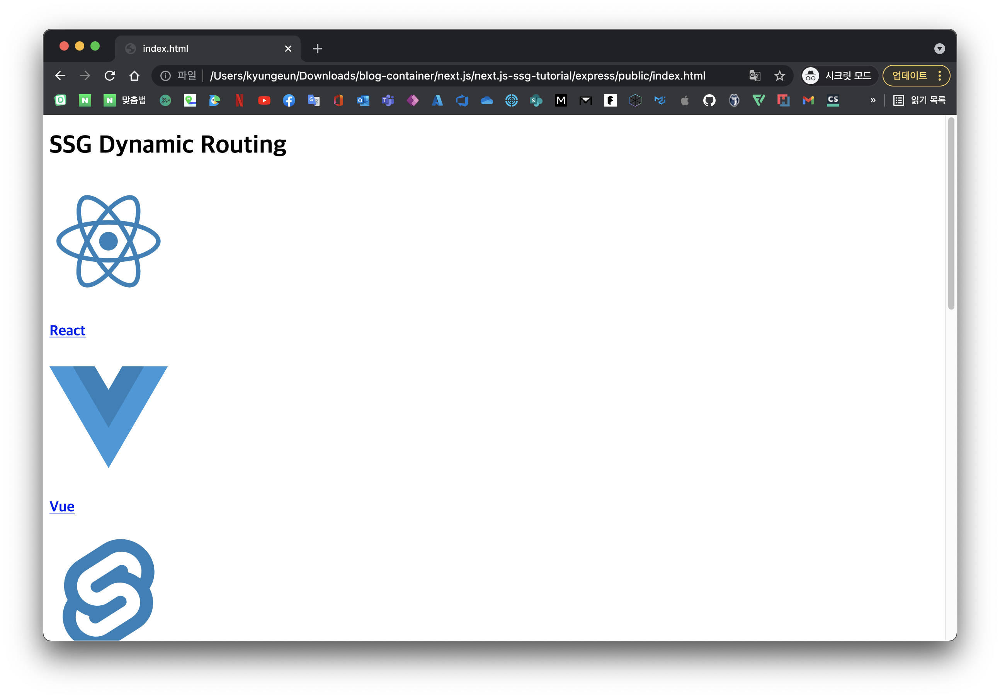
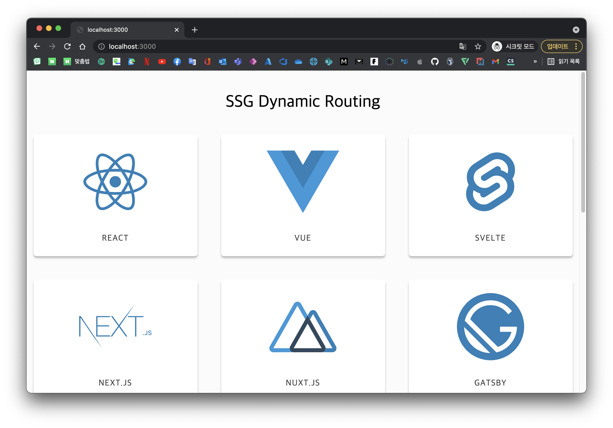
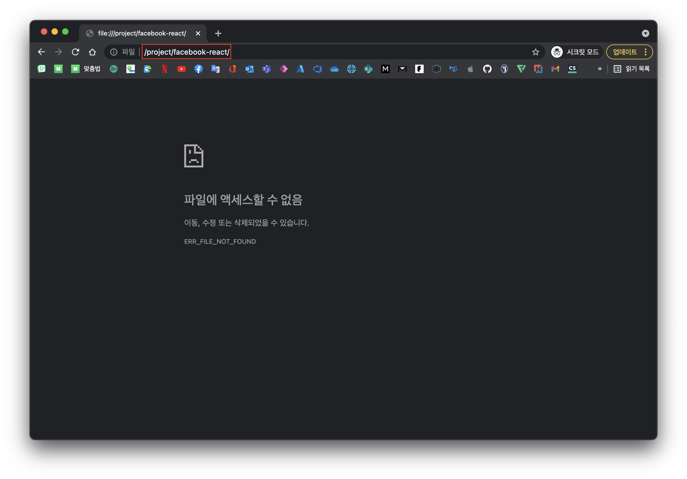
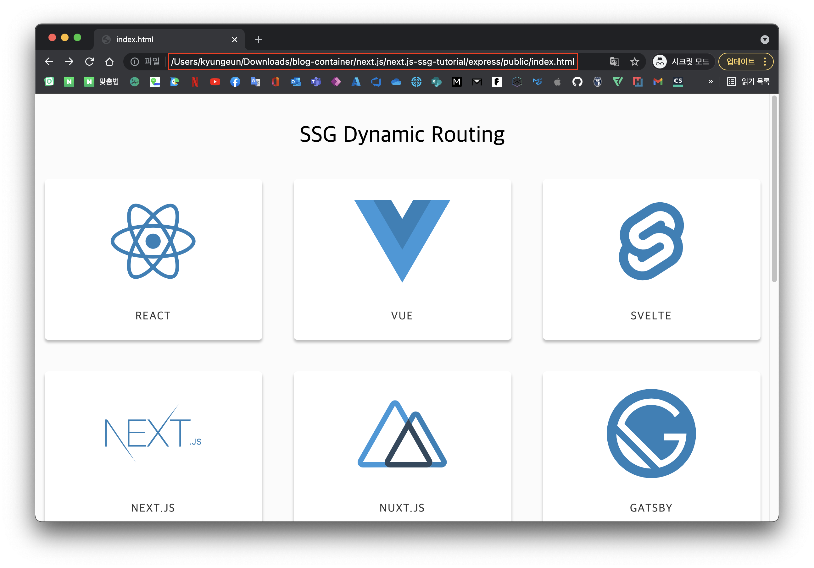
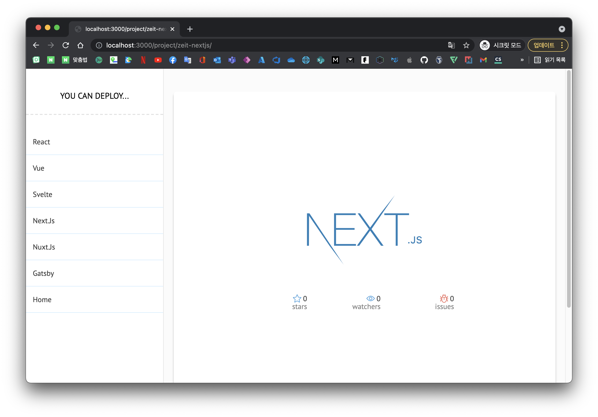
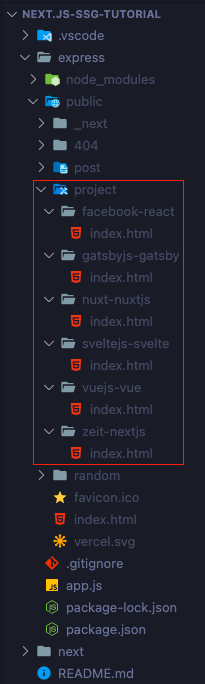
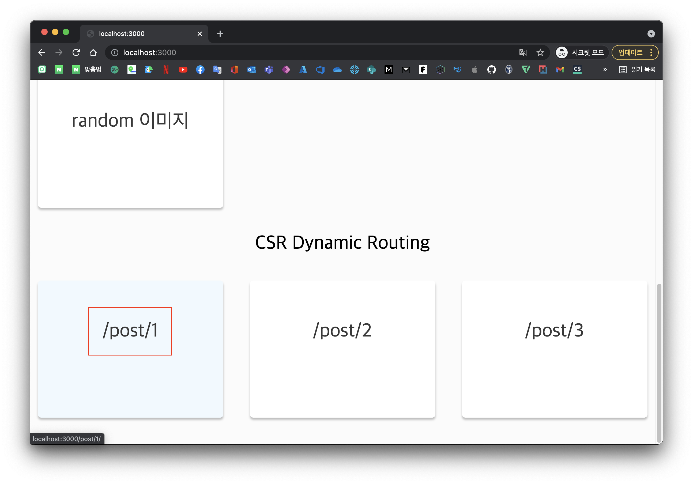
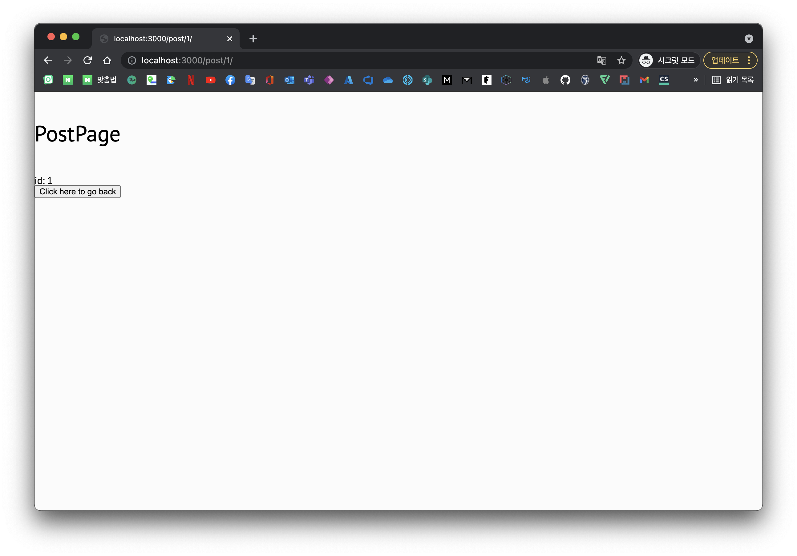
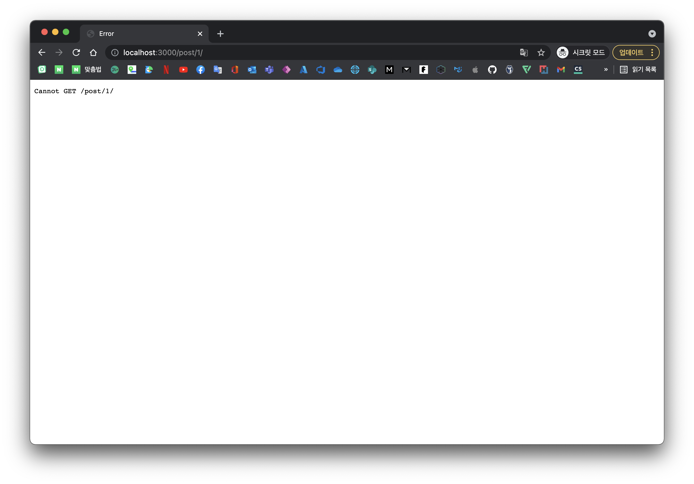

# Intro

next.js를 추천할 때 가장 자랑하는 부분이 SSR를 지원한다! 인데 내가 아는 SSR은 Server Side에서 각 페이지 별로 html을 생성해서 Response (혹은 파일 서빙) 을 해주는 것인데 next.js를 공부하고 사용해보면서 이부분에서 아직 찝찝한 부분이 있어서 next.js도 그렇게 동작하는게 맞는가? 에 대한 의문이 항상있었습니다.

> 물론 SSR 단어 뜻 그대로 서버 측에서 렌더링 한다라는 뜻을 의미하지만 필자는 계속 JSP 같은 전통적인 SSR와 엄청 햇갈렸습니다.

그동안 CRA 환경 즉, SPA에서 개발을 하고 있었는데 갑자기 next.js의 원리에 대해 궁금해서 이참에 다시 정리를 해보면서 얻은 경험치에 대해 공유해보려고 합니다.

그럼 SPA를 가공할 수 있는 여러 형태라고 할 수 있는 CSR, SSG, SSR를 비교하면서 설명해보도록 하겠습니다.

> 추가적으로 해당 글에서는 SPA, CSR, SSG, SSR과 같은 단어 설명과 next.js에 대한 설명을 포함하고 있지 않습니다.

# 내가 알고 있던 SSR은?

필자는 SSR를 들었을 때 가장 처음으로 떠오른 것은 jsp 이였습니다.

Client가 요청한 페이지를 Server Side에서 열심히 가공해서 Response 하는 것을 말이죠

이는 주로 SSR를 설명할 때 가장 많이 소개되는 시나리오로 다른 페이지로 넘어갈 때 페이지의 내용을 새로 가공해서 넘겨주기 때문에 **화면이 깜빡** 한다 라고 하는 그 메커니즘을 가진 친구입니다.

근데 next.js 해보면 SSR임에 불구하고 아주 부드럽게 CSR처럼 화면 전환이 이뤄지는 것을 볼 수 있습니다.

> <q>어라...? 내가 뭔가 잘못 이해했구나...</q>

## 그런데 어떻게 전역 상태가 관리되는 거지?

이뿐만이 아니라 위에 내가 알고 있는 SSR을 대입하면 전역 상태는 어떻게 관리되는 건지 의문이 생깁니다.

이동하는 매 페이지는 다른 html인데 전역 상태가 불가능 할 것입니다.  
하지만 next.js는 SSR임에 불구하고 잘 처리됩니다.

사실 next.js only SSR이 아닌 CSR과 SSR의 장점을 섞은 방식인 것을 알 수 있습니다.  
그럼에도 불구하고 SSR 단어는 계속 이전 개념과 충돌하게 되었습니다.

혹시라도 저와 같으신 분이 있다면 해당 글로 이해가 풀리셨으면 좋겠습니다.

# 그럼 next.js의 SSR은 어떻게 작동하는거야?

<!-- 일부로 ### 입니다 ##으로 하니까 글씨가 너무 크게 나와서 별로입니다ㅠㅠ -->

### TL;DR

1. next.js에서 말하는 SSR도 사실 하나 뿐인 SPA으로 동작합니다.
1. 다만, empty html의 SPA 형태가 아닌 Server Side에서 미리 가공된 html을 가지고 SPA으로 동작합니다.

가장 햇갈리고 오해하기 쉬운 것이 SSG, SSR 개념이 들어가니 모든 페이지가 정적으로 구어져있고 페이지 이동마다 Server Side에서 구어진 파일을 응답해서 탐색하겟지? 일 수 있습니다.

하지만 아닙니다! <ins>**첫 요청하는 페이지에 대해서만**</ins> SSG 혹은 SSR으로 Server Side에서 미리 구어 놓은 파일을 응답하는 것이고 그 이후부터는 router를 통해 이동하는 것은 CSR 입니다.

사실 next.js에서 말하는 SSG와 SSR은 Server Side에서 build 시점에 구어 줄까?<sup>SSG</sup> 아님 요청마다 구어 줄까?<sup>SSR</sup> 라고 봐도 무방합니다.

결국에는 첫 요청하는 페이지만 Server Side에서 구어진 파일을 사용하고 이후 부터는 CSR입니다.

그렇기 때문에 전역 상태와 같은 것이 가능한 것입니다. 첫 요청한 페이지를 SPA 삼아서 CSR를 하기 때문이죠 마치 다른 페이지로 이동하면 다른 구어진 파일을 사용했구나 싶을 수 있지만 사실 CSR으로 이동 중 인 것입니다.

> 물론 이동한 경로에서 새로고침을 하면 해당 URL 기준으로 다시 구어진 파일을 받겠지만요

그래서 next.js의 SSR를 설명할 때 SSG와 SSR를 빼고 설명하기가 참 어려운 거 같습니다.

이 때문에 next.js에서 말하는 SSR을 말 그대로 Server Side에서 처리하는 렌더링이라고 생각하시는게 이해에 좋습니다.

> 참고로 next.js의 Pre Rendering 시스템은 기본적으로 SSG으로 동작하며 Server Side에서 build시 기본 파일을 구어내고 매 요청마다 재사용하게 됩니다.

# serverless

Static으로 구어지기 때문에 next.js server 이외 serverless deployment가 동작할 수 있는 것을 생각할 수 있습니다.

사실 이 부분이 궁금했습니다. 이걸 잘 응용하면 굳이 정적 사이트 생성을 위해서 `Gatsby.js` 을 사용하지 않을 수 있을까라는 생각으로 말이죠

## 한번 해보자

실습을 위해서 [parkgang/blog-container/next.js/next.js-ssg-tutorial](https://github.com/parkgang/blog-container/tree/main/next.js/next.js-ssg-tutorial) 코드를 참고하시면 됩니다.

> 코드 상태는 정말 안 좋으므로 돌아가는 샘플로서만 사용해 주세요. (해당 글 샘플을 위해서 태어난 코드라 상태가 🤭)

> 해당 글을 위해서 따로 소스 코드를 생성할 까 싶었지만 사전에 미리 SSG를 테스트 하면서 이용 된 [정적으로 렌더링된 Next.js 웹 사이트 배포](https://docs.microsoft.com/ko-kr/azure/static-web-apps/deploy-nextjs) 템플릿이 글에 사용할 수 있어서 해당 템플릿 코드를 수정해서 사용했습니다.

## export

제가 미리 `export` 명령어를 작성해 놓았습니다.

`next` 디렉터리에서 `npm run export` 를 실행하여 `express/public` 으로 Static Html으로 export 되는지 확인합니다.

> 굳이 `express/public` 으로 export 하는 이유는 이따가 설명드릴께요

## 왜 파일시스템에서는 안되는 걸까?

여기서 궁금증이 생겻습니다. Static Html 인데 파일 시스템에서 router 동작이 어떻게 될까요?

`express/public` 에 있는 파일은 serverless 환경에서 돌릴 수 있는 순수한 Static Html 입니다.

한번 웹 브라우저에서 해당 파일 경로로 파일을 열어볼까요?



짠, 뭔가 나오긴 하는데 대충 봐도 css가 모두 깨져있는거 같습니다. 원래 해당 앱은 아래와 같이 렌더링 되어야 하거든요



이외에도 link인 파란색 글자를 클릭해보면 아래와 같은 화면이 나오면서 정상동작 하지 않는 것을 확인할 수 있습니다. url 경로를 보더라도 에초에 존재할 수 없는 경로로 요청을 보내는 것도 확인할 수 있습니다.



이에 대한 이유는 export된 파일의 `index.html` 을 열어보면 알 수 있습니다. 아마 대충 아래와 같은 형태를 가지고 있을 것입니다.

```html{14,19,26}
<!DOCTYPE html>
<html lang="en">
  <head>
    <link
      rel="stylesheet"
      data-href="https://fonts.googleapis.com/css?family=PT+Sans:300,400,700,800&amp;display=optional"
    />
    <link rel="preconnect" href="https://fonts.gstatic.com" crossorigin />
    <meta charset="utf-8" />
    <meta name="viewport" content="width=device-width" />
    <meta name="next-head-count" content="2" />
    <link
      rel="preload"
      href="/_next/static/css/8964a576241b890e8a20.css"
      as="style"
    />
    <link
      rel="stylesheet"
      href="/_next/static/css/8964a576241b890e8a20.css"
      data-n-g=""
    />
    <noscript data-n-css=""></noscript>
    <script
      defer=""
      nomodule=""
      src="/_next/static/chunks/polyfills-a40ef1678bae11e696dba45124eadd70.js"
    ></script>
    ...
  </head>
  ...
</html>
```

보니까 각종 css 및 script에 대한 정보를 `/` 경로로 요청하는 것을 볼 수 있습니다.

당연히 `/` 하위 경로에 해당 파일이 없을 테니 css가 깨지는 것은 당연합니다.  
한번 `index.html` 만 `/` 으로 되어 있는 부분을 모두 `./` 으로 변경하고 다시 열어볼까요?

> Editor에서 `/_next` => `./_next` 으로 찾아서 변경하면 편리합니다.



이제 css 파일이 깨지지 않고 정상적으로 렌더링되는 것을 확인할 수 있습니다.
하지만 여전히 router 기능은 동작하지 않는 것을 확인할 수 있습니다. 왜 그런 것 일까요?

## express server

사실 기본 옵션으로 `next export` 되었을 때의 경로가 `/` 으로 설정되어 있다는 것과 link시 이동되는 경로도 `/` 를 기준으로 하고 있는 것을 보면 결국 리소스 탐색을 위해서 `basePath` 가 필요하다는 것을 알 수 있습니다.

`basePath` 지정하는 가장 쉬운 테스트 방법으로 web server에서 static file를 서빙해주는 것입니다.

> 도메인 자체가 리소스의 `/` 이기 때문입니다.

중요한 것은 next.js server 이외에서 돌아갈 수 있는 것입니다.
static html을 클라우드와 같은 static web host에 push하고 사용할 것이기 때문입니다.

> 사실 export된 static 파일을 파일시스템에서 돌려볼 일은 없을 것입니다. 그럼에도 넣은 이유는 메커니즘에 대한 설명을 위한 것이었습니다.

이를 위한 테스트를 위해서 `express` 에 express server 코드를 작성해 놓았습니다.

> 일부로 express 코드도 공식문서와 동일하게 맞춰놓았습니다. 코드 리딩이 쉽도록요!

아까전에 `index.html` 경로 수정해서 찝찝하므로 다시 `next export` 후 `express` 디렉터리에서 `npm run start` 를 실행해서 서빙되는 정적파일이 잘 동작하는지 확인해봅시다.



next.js server 이외 다른 server에서 css 및 router가 정상적으로 동작하는 것을 볼 수 있습니다.

> 만약, 도메인의 하위 경로를 바꾸고 싶다면 [basepath](https://nextjs.org/docs/api-reference/next.config.js/basepath) 를 참고하세요.

## 숨겨진 router의 원리

맨 위에서 부터 첫 페이지 요청만 html 파일을 받고 이후에는 CSR이라고 설명했었습니다.
다시 한번 export된 파일의 구조를 한번 봐볼까요?



만약, `http://localhost:3000/project/facebook-react/` 경로에서 새로고침을 한다면 어떤 html 파일을 받아와야 할까요?

next.js server 이였다면 똑똑하게 이 요청은 `project/[path].tsx` 경로야! 하면서 SSR 이후 파일은 반환해줄 것입니다.

하지만 위의 테스트 시나리오는 next.js server 이외 처리되었습니다. 때문에 요청하는 경로에 파일이 없으면 그냥 없는 것입니다.

이를 위해서 `next.config.js` 파일을 보면 `trailingSlash: true` option 처리가 되어있는 것을 확인할 수 있습니다.

웹 개발자라면 새로고침을 하더라도 위 캡쳐사진의 파일 하이어라키 덕분에 정상적으로 router 되는 것을 확인하실 수 있습니다.

> 모르겠다면 댓글주세요. 🤗

## 생성되지 않은 동적경로의 경우는?

동적인 경로의 경우 `getStaticPaths()` 으로 생성되지 않았다면 어떻게 될까요?

제가 예제 코드에서 `http://localhost:3000/post/[id]` 경로의 경우 동적 경로이지만 `getStaticPaths()` 으로 생성되지 않은 것을 확인할 수 있습니다.

> export 결과물을 보면 아래와 같습니다. 이러면 당연히 새로고침하면 문제가 발생하겠죠?
> 

한번 해볼까요? express server를 시작해서 아래의 영역을 클릭해서 들어가 봅시다.



정상적으로 나오는 것을 확인할 수 있습니다. `express/public/index.html` 의 파일을 받아서 CSR 처리를 통해 router 되었기 때문입니다. 이제 여기서 새로고침을 하면 어떻게 될까요?



아래와 같이 요청한 경로에 리소스가 없기 때문에 새로고침에 실패? 하는 것을 볼 수 있습니다. 만약 next.js server에서 해당 경로에서 새로고침 했다면 정상적으로 동작했을 것입니다. next.js server는 해당 경로가 어떤 리소스를 필요로 하는지 알고 있기 때문이죠



사실 `next export` 으로 사용한다는 것은 블로그와 같이 정말 정적인 데이터인 경우 사용하는 시나리오가 대부분 일 것이기 때문에 이와 같은 시나리오의 경우는 매우 스페셜한 케이스라고 생각됩니다.

중요한 것은 next.js server 이외 돌아가는 메커니즘을 이해하는 것입니다.

## 사용을 추천하지 않는 `exportPathMap`

`next export` 와 관련되어 찾아보면 `next.config.js` 의 `exportPathMap` 옵션에 대해 그냥 써놓은 글이 많습니다.

결론부터 말하면 이제 사용되지 않습니다. (사실 사용하는 법도 모르겠습니다) `getStaticPaths()` 가 동적인 경로를 반환해주기 때문이죠

해당 내용은 [github issue로도 open](https://github.com/vercel/next.js/issues/10983#issuecomment-597829065) 되어 있는 상태입니다.

이걸 왜 사용하는지 제대로 설명해준 사람도 거의 없고 공식문서도 아직 내용이 반영되지 않은거 같아 시간이 많이 소모되었습니다...😾

> 에초에 동적 경로에서 `getStaticProps()` 만 사용하면 `Error: getStaticPaths is required for dynamic SSG pages` 가 출력되어 export가 안됩니다.

# 마무리

사실 제대로 next.js를 많이 사용하고 공부 헀다면 이런 질문이 나오지 않을 수 있다고 생각하기도 합니다.

하지만 그럼에도 불구하고 next.js의 SSR을 햇갈려하는 글은 간간히 보이는 걸로 보아 나만 그런건 아닌가 싶은 안심이 들긴했습니다.

특히, jsp와 같은 Server Side Script 언어와 대조를 하다보니 더욱 더 햇갈렸습니다.

보통 블로그와 같이 정적 웹을 만든다고 하면 `Gatsby.js` 가 주로 생각나고 많이 사용되는 것으로 알고 있는데 차란히 next.js로 SSG, SSR을 모두 처리하는게 더 좋지 아늘까? 하면서 더 궁금해서 SSG를 더 깊이 공부하게 된 거 같습니다.

해당 글이 next.js의 SSG 이해에 도움이 되셨으면 좋겠습니다. 언제든지 질문과 피드백은 환영합니다. 읽어주셔서 감사합니다.
