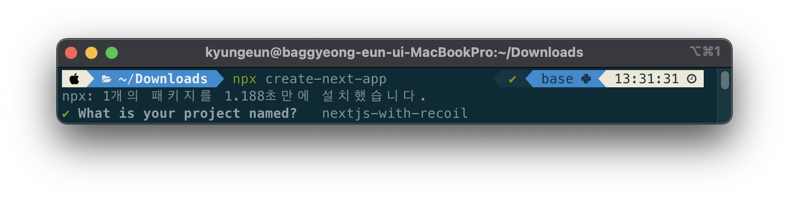
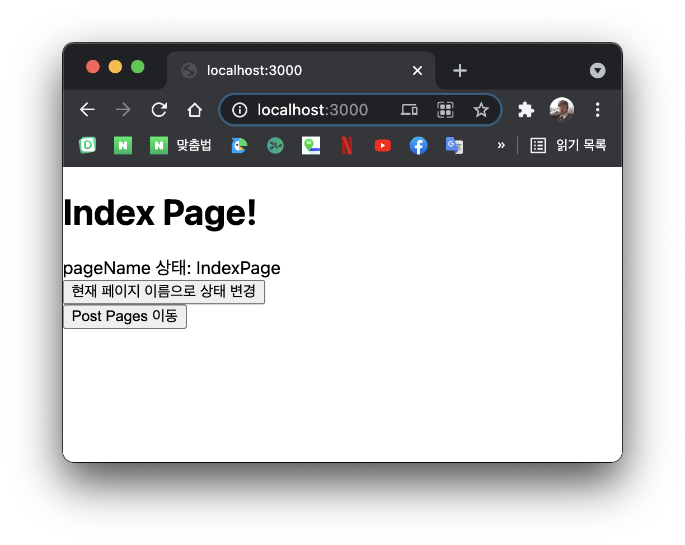
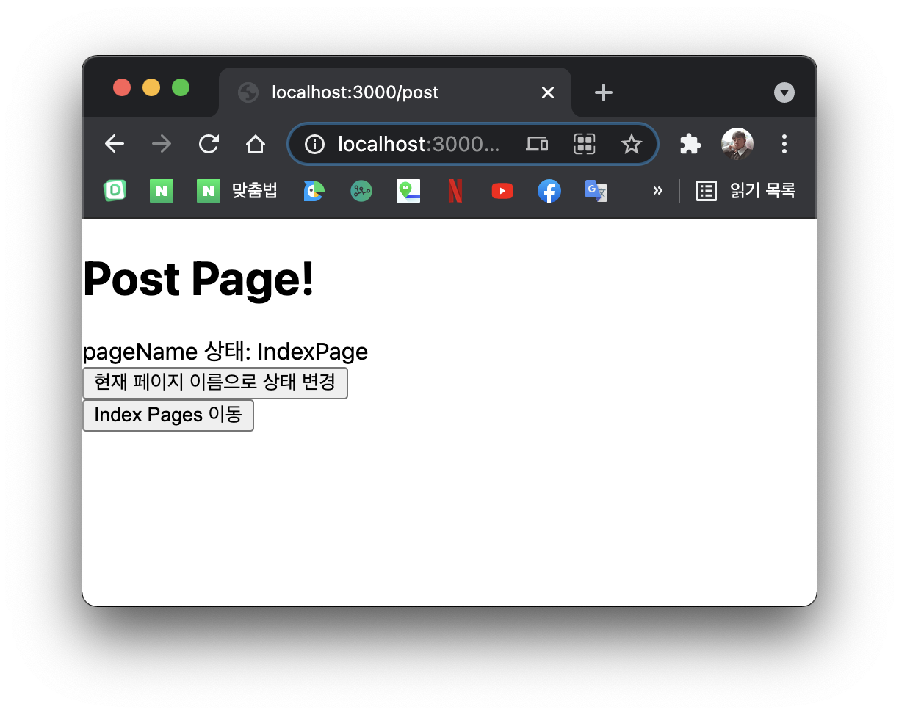

# Intro

next.js에서 recoil를 사용하는 방법을 가이드 하도록 하겠습니다.

원래는 redux를 사용했었지만 들어가는 기본적으로 필요로하는 코드의 양이 많아 내가 원하는 상태를 빠르게 저장하고 빼서 쓰고 싶었는데 개발하면서 딜레이가 생기는 경험이 있었습니다.

물론 지금은 redux toolkit이 나와서 많이 해소 된거 같지만 fackbook이 직접 개발하는 recoil이 앞으로 더 발전가능성이 높아서 사용하게 되었습니다.

recoil를 CSR에서는 사용해 보았지만 next.js와 같은 SSR에서 사용한 사례를 찾기는 어렵더군요

> 아직 공식 릴리즈도 안된 라이브러리 이니...

next.js는 SSR를 지원하기 때문에 각각의 페이지 별로 정적파일이 생성되어 CSR과 햇갈릴 수 있습니다. 하지만 사용하면서 크게 다른 점은 없습니다.

**기본적으로 CSR과 SSR의 차이, next.js와 recoil에 대해 기본적인 이해를 기반하고 설명합니다.**

# 프로젝트를 생성해보자

먼저 아래의 명령어로 next.js 프로젝트를 실행하도록 하겠습니다.

```shell
npx create-next-app
```



> 공식으로 제공하는 [with-recoil](https://github.com/vercel/next.js/tree/canary/examples/with-recoil) 템플릿이 있었지만 마지막 업데이트가 거즘 8개월 전이고 recoil 버전 업도 많이 된 상태이기 때문에 사용하지 않았습니다.

# recoil를 추가하자

아래의 명령어로 next.js 프로젝트에 recoil를 추가해줍니다.

```shell
npm i recoil
```

> next.js는 pages 별로 정적 파일을 찍어낼 텐데 어떻게 하나의 상태 관리를 할 수 있을까요?

정답은 `_app.js` 에 있습니다. next.js의 모든 pages는 렌더링을 거치기 전에 `/_app.js` 를 거칩니다.

우리가 recoil를 사용할 때 recoil 상태를 사용하는 컴포넌트의 최상위 부모 트리에 `<RecoilRoot>` 가 필요한데 해당 파일에 wrap 해주면 됩니다.

## 기본적인 \_app.js 구조

여기서 `Component` 는 각 pages component가 들어오고, `pageProps` 는 getInitialProps를 통해 들어온 props들을 나타냅니다.

```js
function MyApp({ Component, pageProps }) {
  return <Component {...pageProps} />
}

export default MyApp
```

## RecoilRoot 적용

여기에 Component 코드를 `RecoilRoot` 로 wrap 해주면 됩니다.

```js{5, 7}
import { RecoilRoot } from 'recoil'

function MyApp({ Component, pageProps }) {
  return (
    <RecoilRoot>
      <Component {...pageProps} />
    </RecoilRoot>
  )
}

export default MyApp
```

# 기본적인 상태관리 방법은?

자, 아직 남은 문제가 있지만 기본적인 recoil를 사용할 수 있는 상태까지 왔습니다.

## 테스트를 해보자!

일단 잘 작동하는지 테스트를 해볼까요? `/states` 디렉터리를 생성하고 내부에 `index.js`를 생성해 봅시다.


해당 파일에 아래의 코드를 작성합니다.

```js
import { atom } from 'recoil'

export const pageNameState = atom({
  key: 'pageNameState',
  default: '',
})
```

`/pages/index.js` 의 코드를 아래와 같이 변경합니다.

```js
import { useRecoilState } from 'recoil'
import { pageNameState } from '../states'

const IndexPage = () => {
  const [pageName, setPageName] = useRecoilState(pageNameState)

  return (
    <div>
      <div>
        <h1>Index Page!</h1>
      </div>
      <div>
        <span>pageName 상태: {pageName}</span>
      </div>
      <div>
        <button
          onClick={() => {
            setPageName('IndexPage')
          }}
        >
          현재 페이지 이름으로 상태 변경
        </button>
      </div>
    </div>
  )
}

export default IndexPage
```

router 되더라도 상태가 유지되는게 핵심이겟죠? 다른 pages도 만들어 봅시다.

`/pages/post.js` 를 생성하고 아래와 같이 코딩합니다.

```js
import Link from 'next/link'
import { useRecoilState } from 'recoil'
import { pageNameState } from '../states'

const PostPage = () => {
  const [pageName, setPageName] = useRecoilState(pageNameState)

  return (
    <div>
      <div>
        <h1>Post Page!</h1>
      </div>
      <div>
        <span>pageName 상태: {pageName}</span>
      </div>
      <div>
        <button
          onClick={() => {
            setPageName('PostPage')
          }}
        >
          현재 페이지 이름으로 상태 변경
        </button>
      </div>
      <Link href="/">
        <button>Index Pages 이동</button>
      </Link>
    </div>
  )
}

export default PostPage
```

`post` 페이지로 이동하기 쉽게 `/pages/index.js` 에 아래의 코드를 추가합니다.

```js{1,25-27}
import Link from 'next/link'
import { useRecoilState } from 'recoil'
import { pageNameState } from '../states'

const IndexPage = () => {
  const [pageName, setPageName] = useRecoilState(pageNameState)

  return (
    <div>
      <div>
        <h1>Index Page!</h1>
      </div>
      <div>
        <span>pageName 상태: {pageName}</span>
      </div>
      <div>
        <button
          onClick={() => {
            setPageName('IndexPage')
          }}
        >
          현재 페이지 이름으로 상태 변경
        </button>
      </div>
      <Link href="/post">
        <button>Post Pages 이동</button>
      </Link>
    </div>
  )
}

export default IndexPage
```

## 테스트 결과

next.js를 실행해보면 index page에서 변경된 상태가 post page까지 잘 전달되는 것을 볼 수 있습니다. 그 반대도 마찬가지 이고요 이로써 recoil이 정상적으로 동작하는 것을 확인하였습니다.




# 비동기 작업은 어떻게?
