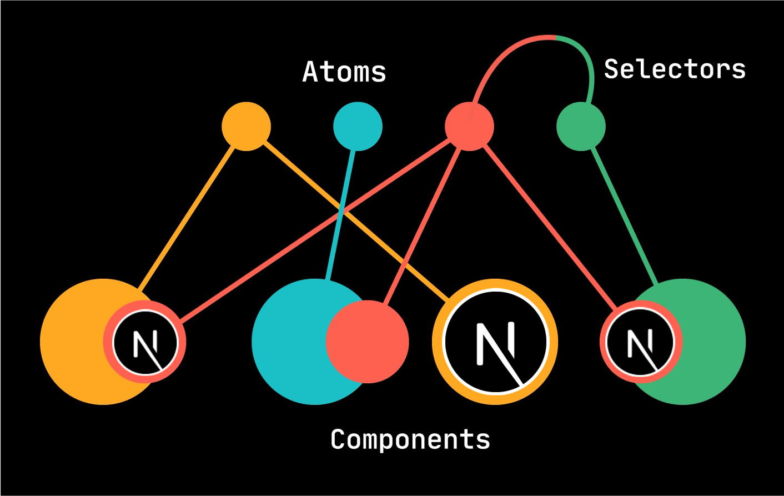
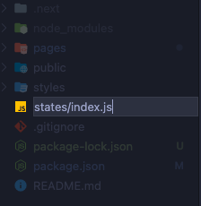
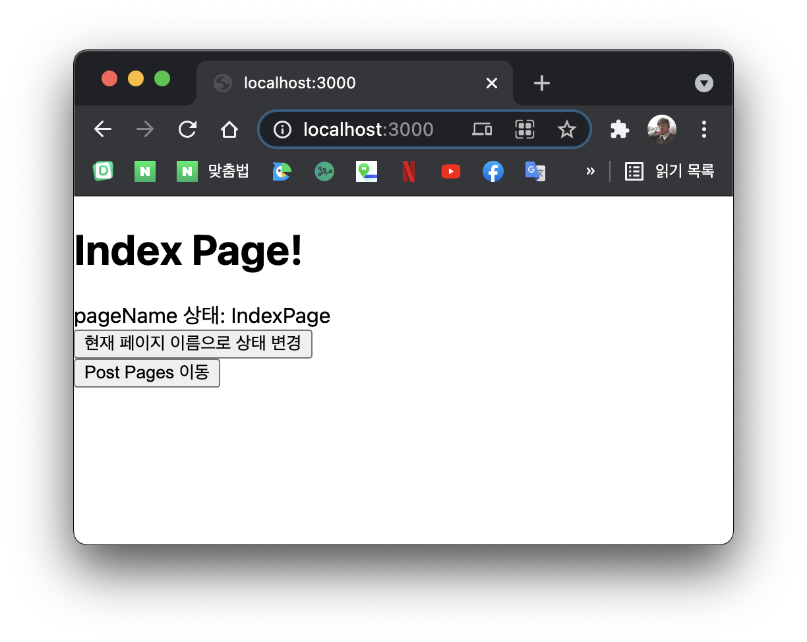
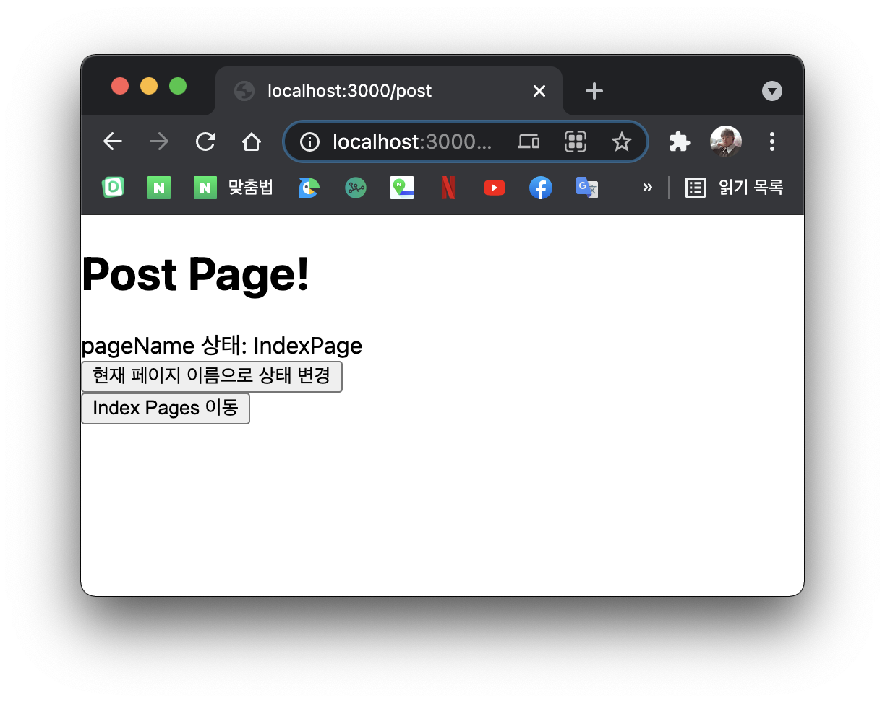
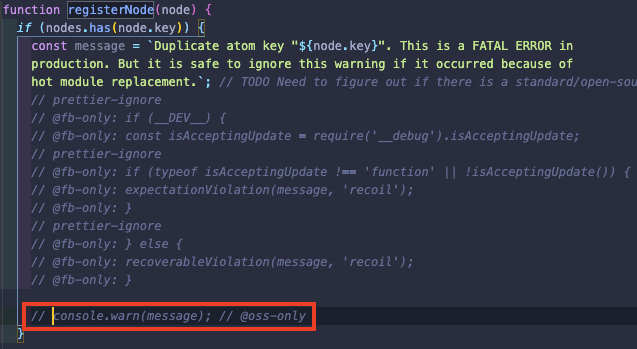
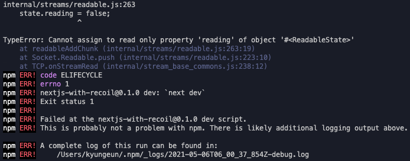
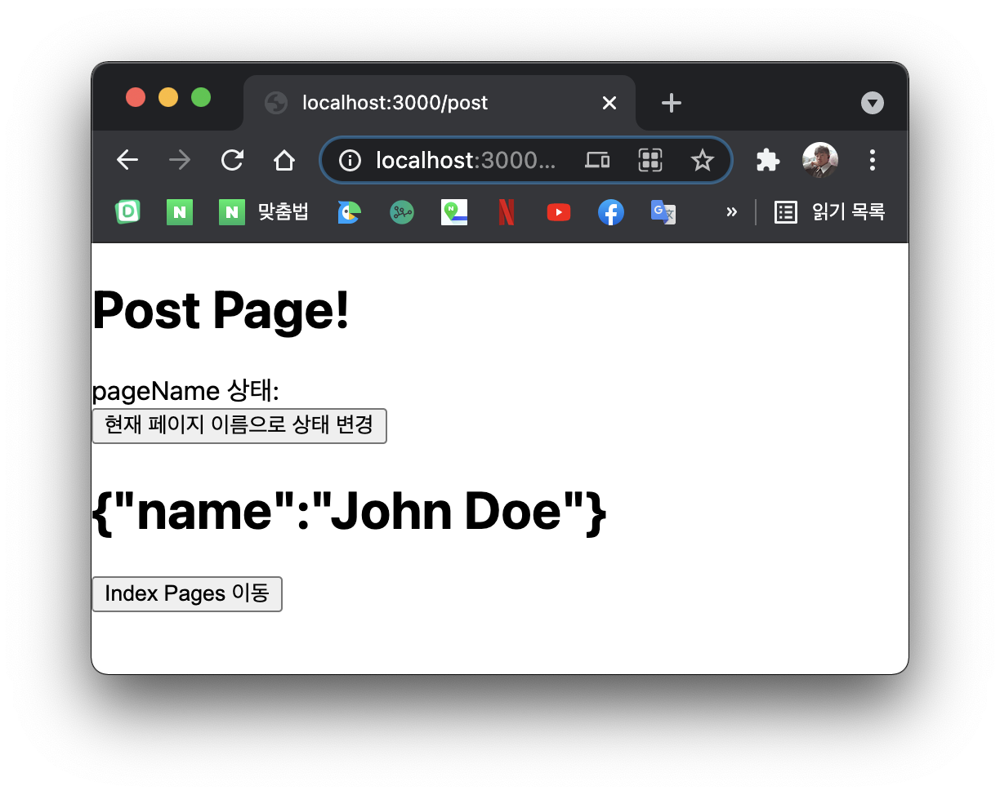
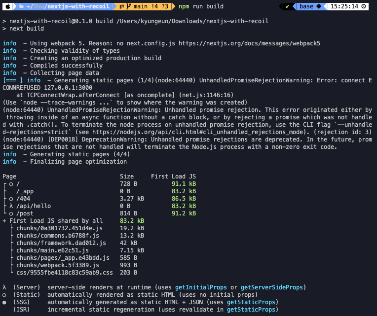
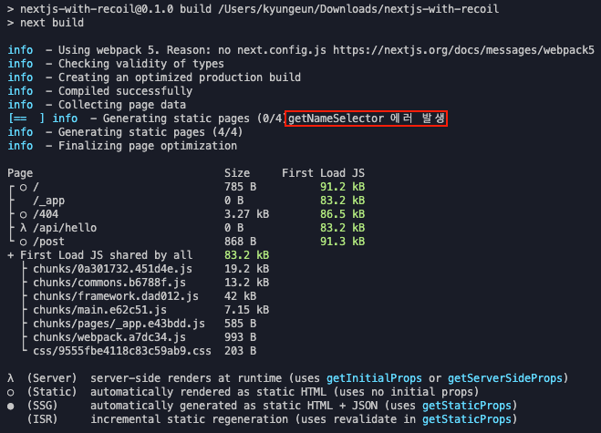

# Intro

이번 글에서는 next.js에서 recoil를 사용하는 방법을 가이드 하도록 하겠습니다.

원래는 redux를 사용했었지만 기본적으로 필요로하는 코드의 양이 많아 내가 원하는 상태를 빠르게 저장하고 빼서 쓰고 싶었는데 개발하면서 딜레이가 생기는 경험이 있었습니다.

물론 지금은 redux toolkit이 나와서 많이 해소 된거 같지만 facebook이 직접 개발하는 recoil이 앞으로 더 발전가능성이 높아서 사용하게 되었습니다.

recoil를 CSR에서는 사용해 보았지만 next.js와 같은 SSR에서 사용한 사례를 찾기는 어렵더군요

> 아직 공식 릴리즈도 안된 라이브러리 이니...

next.js는 SSR를 지원하기 때문에 각각의 페이지 별로 정적파일이 생성되어 CSR과 햇갈릴 수 있습니다. 하지만 사용하면서 크게 다른 점은 없습니다.

**기본적으로 CSR과 SSR의 차이, next.js와 recoil에 대해 기본적인 이해를 기반하고 설명합니다.**

# 프로젝트를 생성해보자

> 해당 실습이 진행된 코드는 아래의 링크에서 확인하실 수 있습니다.  
> [parkgang/next.js-with-recoil](https://github.com/parkgang/next.js-with-recoil)

먼저 아래의 명령어로 next.js 프로젝트를 실행하도록 하겠습니다.

```shell
npx create-next-app
```


> 공식으로 제공하는 [with-recoil](https://github.com/vercel/next.js/tree/canary/examples/with-recoil) 템플릿이 있었지만 마지막 업데이트가 거즘 8개월 전이고 recoil 버전 업도 많이 된 상태이기 때문에 사용하지 않았습니다.

# recoil를 추가하자

아래의 명령어로 next.js 프로젝트에 recoil를 추가해줍니다.

```shell
npm i recoil
```

> next.js는 pages 별로 정적 파일을 찍어낼 텐데 어떻게 하나의 상태 관리를 할 수 있을까요?

정답은 `_app.js` 에 있습니다. next.js의 모든 pages는 렌더링을 거치기 전에 `/_app.js` 를 거칩니다.

우리가 recoil를 사용할 때 recoil 상태를 사용하는 컴포넌트의 최상위 부모 트리에 `<RecoilRoot>` 가 필요한데 해당 파일에 wrap 해주면 됩니다.

## 기본적인 \_app.js 구조

여기서 `Component` 는 각 pages component가 들어오고, `pageProps` 는 getInitialProps를 통해 들어온 props들을 나타냅니다.

```js
function MyApp({ Component, pageProps }) {
  return <Component {...pageProps} />
}

export default MyApp
```

## RecoilRoot 적용

여기에 Component 코드를 `RecoilRoot` 로 wrap 해주면 됩니다.

```js{5, 7}
import { RecoilRoot } from 'recoil'

function MyApp({ Component, pageProps }) {
  return (
    <RecoilRoot>
      <Component {...pageProps} />
    </RecoilRoot>
  )
}

export default MyApp
```

# 기본적인 상태관리 방법은?

자, 아직 남은 문제가 있지만 기본적인 recoil를 사용할 수 있는 상태까지 왔습니다.

## 테스트를 해보자!

일단 잘 작동하는지 테스트를 해볼까요? `/states` 디렉터리를 생성하고 내부에 `index.js`를 생성해 봅시다.



해당 파일에 아래의 코드를 작성합니다.

```js
import { atom } from 'recoil'

export const pageNameState = atom({
  key: 'pageNameState',
  default: '',
})
```

`/pages/index.js` 의 코드를 아래와 같이 변경합니다.

```js
import { useRecoilState } from 'recoil'
import { pageNameState } from '../states'

const IndexPage = () => {
  const [pageName, setPageName] = useRecoilState(pageNameState)

  return (
    <div>
      <div>
        <h1>Index Page!</h1>
      </div>
      <div>
        <span>pageName 상태: {pageName}</span>
      </div>
      <div>
        <button
          onClick={() => {
            setPageName('IndexPage')
          }}
        >
          현재 페이지 이름으로 상태 변경
        </button>
      </div>
    </div>
  )
}

export default IndexPage
```

router 되더라도 상태가 유지되는게 핵심이겟죠? 다른 pages도 만들어 봅시다.

`/pages/post.js` 를 생성하고 아래와 같이 코딩합니다.

```js
import Link from 'next/link'
import { useRecoilState } from 'recoil'
import { pageNameState } from '../states'

const PostPage = () => {
  const [pageName, setPageName] = useRecoilState(pageNameState)

  return (
    <div>
      <div>
        <h1>Post Page!</h1>
      </div>
      <div>
        <span>pageName 상태: {pageName}</span>
      </div>
      <div>
        <button
          onClick={() => {
            setPageName('PostPage')
          }}
        >
          현재 페이지 이름으로 상태 변경
        </button>
      </div>
      <Link href="/">
        <button>Index Pages 이동</button>
      </Link>
    </div>
  )
}

export default PostPage
```

`post` 페이지로 이동하기 쉽게 `/pages/index.js` 에 아래의 코드를 추가합니다.

```js{1,25-27}
import Link from 'next/link'
import { useRecoilState } from 'recoil'
import { pageNameState } from '../states'

const IndexPage = () => {
  const [pageName, setPageName] = useRecoilState(pageNameState)

  return (
    <div>
      <div>
        <h1>Index Page!</h1>
      </div>
      <div>
        <span>pageName 상태: {pageName}</span>
      </div>
      <div>
        <button
          onClick={() => {
            setPageName('IndexPage')
          }}
        >
          현재 페이지 이름으로 상태 변경
        </button>
      </div>
      <Link href="/post">
        <button>Post Pages 이동</button>
      </Link>
    </div>
  )
}

export default IndexPage
```

## 테스트 결과

next.js를 실행해보면 index page에서 변경된 상태가 post page까지 잘 전달되는 것을 볼 수 있습니다. 그 반대도 마찬가지 입니다.  
이로써 recoil이 정상적으로 동작하는 것을 확인하였습니다.




# Duplicate atom key Waring

동작에는 문제가 없지만 사실 next.js console에서는 Warning을 출력하고 있습니다.

```
Duplicate atom key "pageNameState". This is a FATAL ERROR in
      production. But it is safe to ignore this warning if it occurred because of
      hot module replacement.
```

이는 SSR이라서 여러면 atom을 생성하면서 경고 메시지가 출력되는 것입니다.  
현재 공식 [이슈](https://github.com/facebookexperimental/Recoil/issues/733)로 open 되어 있습니다. 수정까지는 시간이 꽤 걸릴 수 있으니 경고 창을 보고 싶지 않다! 라면 우회 방법을 알려드리도록 하겠습니다.

## 우회 방법

되게 간단합니다. recoil module에서 해당 경고 메시지를 주석처리 하는 방법입니다.

1. `node_modules/recoil` 의 디렉터리에서 모든 `recoil.js` 파일의 `registerNode` 함수를 찾습니다.
1. 해당 함수를 잘 보시면 위에서 출력되는 경고 메시지를 출력해주는 함수입니다. `console.warn` 부분을 주석하면 더 이상 출력되지 않습니다.



> 이 방법은 개인 에게만 적용되며 추천하지 않습니다.  
> 실제로 key가 중복되는 경우를 구별할 수 없기 때문입니다.

# 비동기 작업은 어떻게?

이번에는 `selector` 함수를 이용하여 비동기 작업을 해보도록 하겠습니다.  
`Ajax` 를 위해 저는 `axios` 즐겨 사용하기 때문에 해당 모듈을 설치하도록 하겠습니다.

```shell
npm i axios
```

`/states/index.js` 에 아래의 코드를 추가합니다.

```js{1,9-15}
import { atom, selector } from 'recoil'
import axios from 'axios'

export const pageNameState = atom({
  key: 'pageNameState',
  default: '',
})

export const getNameSelector = selector({
  key: 'getNameSelector',
  get: async () => {
    const res = await axios.get('http://localhost:3000/api/hello')
    return res.data
  },
})
```

> `selector` 에서 반환되는 값은 필요한 값만 반환해야합니다.  
> CSR에서는 axios의 res 값을 모두 반환해서 사용해도 문제가 없었는데 next.js에서는 모두 반환하면 에러가 발생합니다.  
> 아마 테스트 해보시면 비동기 콜을 하는 page를 다른 페이지에서 link를 통해 들어가면 문제가 없지만 해당 page 주소로 바로 접속하면 아래와 같은 에러가 출력되면서 next.js server가 down 됩니다.
> 
> axios 에서 return 데이터 중 `.data` 만을 사용하지 않고 모두 던지면 `selector` 호출 기록은 있지만 렌더링하다가 next.js에서 run time error 가 발생합니다.  
> 해당 문제는 `npm run dev` 일 때만 발생합니다. 같은 코드인데 build 되어 start으로 실행 된 next.js server에서는 해당 문제가 발생하지 않습니다. 하지만 dev 환경의 live server가 되지 않기 때문에 전략적으로 필요한 데이터만 return 하여 사용하는 것이 좋아보입니다.

`/pages/post.js` 에 아래의 코드를 추가합니다.

```js{2,3,7,28}
import Link from 'next/link'
import { useRecoilState, useRecoilValueLoadable } from 'recoil'
import { pageNameState, getNameSelector } from '../states'

const PostPage = () => {
  const [pageName, setPageName] = useRecoilState(pageNameState)
  const name = useRecoilValueLoadable(getNameSelector)
  switch (name.state) {
    case 'hasValue':
      return (
        <div>
          <div>
            <h1>Post Page!</h1>
          </div>
          <div>
            <span>pageName 상태: {pageName}</span>
          </div>
          <div>
            <button
              onClick={() => {
                setPageName('PostPage')
              }}
            >
              현재 페이지 이름으로 상태 변경
            </button>
          </div>
          <div>
            <h1>{JSON.stringify(name.contents)}</h1>
          </div>
          <Link href="/">
            <button>Index Pages 이동</button>
          </Link>
        </div>
      )
    case 'loading':
      return <div>Loading...</div>
    case 'hasError':
      return <div>{name.contents}</div>
  }
}

export default PostPage
```

[SSR에서는 Suspense를 지원하지 않기 때문에](https://ko.reactjs.org/docs/code-splitting.html#reactlazy) `useRecoilValueLoadable` 를 사용해야합니다.

> 찾아보니 SSR에서도 Suspense 사용할 수 있는 방법이 있습니다! 나중에 시간이 될 때 소개하도록 하겠습니다.

## 테스트 결과

아래와 같이 정상적으로 렌더링 되는 것을 확인할 수 있습니다.



> 혹시라도 해당 api가 어디서 만들어 진건지? 하시면 기본 템플릿으로 만들면 생성되는 next.js api를 사용한 것입니다 😉

# 빌드 시 경고 창

자 이제 문제가 없는거 같지만 아직 한가지 더 남아있습니다...  
한번 `npm run build` 으로 build를 해보시겟어요? 또 경고가 출력됩니다.



build 시점에 `selector` 에서 호출하는 api가 정상이 아니면 에러가 발생합니다.

> 더 정확히 말하면 try 부분의 코드를 실행하는거 같습니다. 해당 부분에 `console.log` 와 같은 코드를 삽입하면 출력되는 것을 확인할 수 있습니다.

우리는 next.js의 api를 사용하고 있기 때문에 build 시점에 next.js server가 내려가 있으니 api에 호출에 실패에서 발생하는 메시지 입니다.

아래와 같이 해당 부분을 trycatch으로 묶는다면 catch에 걸리는 것을 확인할 수 있습니다.

```js{12,15-16}
import { atom, selector } from 'recoil'
import axios from 'axios'

export const pageNameState = atom({
  key: 'pageNameState',
  default: '',
})

export const getNameSelector = selector({
  key: 'getNameSelector',
  get: async () => {
    try {
      const res = await axios.get('http://localhost:3000/api/hello')
      return res.data
    } catch (error) {
      console.log(`getNameSelector 에러 발생`)
    }
  },
})
```



결론적으로 경고 메시지가 출력되어도, catch에 걸리더라도 **구어진 정적파일은 문제가 없으며 next.js server가 실행했을 때 정상적으로 동작합니다.**

`selector` get부분에 api EndPoint를 next.js 내부 api 말고 build 시점에 살아있는 api으로 호출한다면 경고 메시지 없이 빌드 되는 것을 확인할 수 있습니다.

# 마무리

사용하는데 크게 어려운 점은 없지만 비동기 콜 부분에서 많은 시간을 소비하였습니다.

에러 발생 시 정보가 생각보다 디테일 하지 않았고 CSR에서는 되던건게 안되서 코드를 잘못짠건가?🧐 했습니다.

특히 axios 결과 값을 모두 return 했을 때 next.js server가 down되는 부분에서 많은 시간을 소비하였습니다.

어서 recoil이 공식 릴리즈되서 많은 사람들이 사용했으면 좋겠네요 언제든지 질문과 피드백은 환영합니다. 읽어주셔서 감사합니다.
