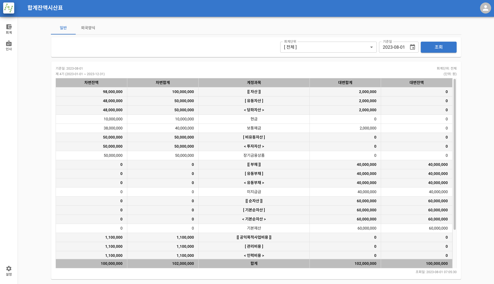
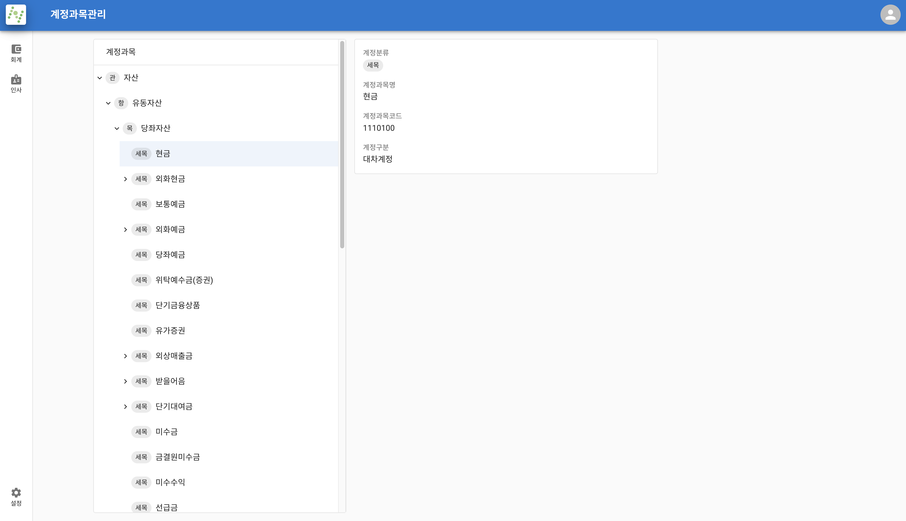
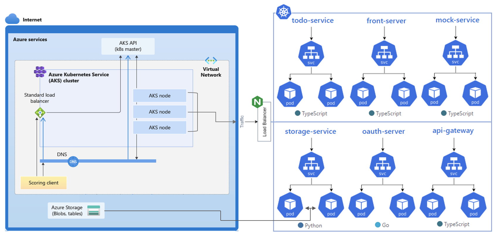

<!-- _class: invert -->

# 박경은.

Software Engineer
`자부심` `자신감` `탐구심` `기록`

ruddms936@naver.com · [parkgang.github.io](https://parkgang.github.io/)

---

<!-- [보통 제목 슬라이드는 페이지네이션 안한다고 하여 적용](https://marpit.marp.app/directives?id=skip-pagination-on-title-slide) -->
<!-- paginate: true -->
<!-- 기본 테마의 invert 일 때 h1 색상 -->
<!-- _backgroundColor: #cee7ff -->

# Contents.

[About Me](#3)
[Archives](#4)
[Skills](#5)
[Projects](#6)
[Remember Me for...](#29)

---

# About Me

##### 한 가지 포지션의 경험보다 넓은 경험을 가지고 있습니다.

`FE` `BE` 으로 포지션을 구분하지 않고 제품을 소유하여 개발해왔습니다.
그렇기에 `User Level` 부터 고려하여 설계, 개발, 운영의 큰 배경을 가지고 제품에 접근할 수 있습니다.

##### 문제가 해결되지 않으면 이유가 궁금해서 엉덩이가 움직이지 않습니다.

`호기심` 과 `탐구심` 이 강한 저를 가장 잘 표현하는 문장입니다.

##### 자신감

주변에서 자신감이 있다는 이야기를 들을 수 있었습니다.
근거 있는 자신감을 통해 팀의 긍정적인 추진력을 부여합니다.

##### 정리와 기록은 내 인생

남들보다 이건 잘한다 싶은 것은 기록입니다.
[개인지식관리(PKM)](/pkm)으로 체계화하여 꾸준히 기록하고 학습하여 성장을 도모합니다.

---

# Archives

##### GitHub

https://github.com/parkgang

소스 코드 저장소입니다.

`Daily Commit` 하려고 노력합니다.

##### concept-container

https://github.com/parkgang/concept-container

`Concept` 검증한 코드를 보관하고 있습니다.

단순히 검증하고 끝내는 것이 아닌 `보관` 을 함으로써 나중에 손쉽게 `재사용` 할 수 있도록 합니다.

##### Notion

개인 `DB` 입니다.

마음 같아서는 공개해서 보여드리고 싶지만 `개인정보` 가 포함되어 공개가 어렵습니다. 그래서 어떻게 사용하는지 [개인지식관리(PKM)](/pkm)로 정리해놨습니다.

##### Blog

https://parkgang.github.io

정리는 `Notion` 에 하고 공유할 만한 글이 있으면 블로그에 작성합니다.

---

# Skills

##### Language

`TypeScript` `C#`

##### Frontend

`React` `Next.js` `Docusaurus` `MUI` `Recoil` `TanStack Query` `React Hook Form` `Playwright`

##### Backend

`Node.js` `Express` `tRPC` `Prisma` `ASP.NET Core`

##### DevOps

`Docker` `Azure` `GitHub Actions` `Azure Pipelines`

##### Other

`Git` `GitHub` `Notion` `VSCode` `Vim`

---

<!-- _class: invert lead break-slide -->

# Project.

## 나눔셈 모던화 프로젝트

---

# Overview

- 기존에 있던 비영리회계 ERP 제품의 퍼포먼스 이슈를 해결하기 위해서 시작
- 기존 회계 프로그램의 기능을 이해하고 요구사항을 뜯어내 제품 개발
- 웹앱으로 개발되었으며 사용자가 회계 작업을 편리하게 할 수 있도록 기능 제공
- 당시 모던한 기술과 개발 프로세스를 이용하여 현대적인 개발을 경험할 수 있었음
- 도메인 지식의 중요성을 느끼고 얕은 회계 도메인 경험

---

<!-- _class: small-header-space -->

# 주요 화면

###### 사원 수정

기초 정보인 사용자를 생성하고 수정하는 `양식` `UI` 입니다.

---

<!-- _class: small-header-space -->

# 주요 화면

###### 대체전표 수정

해당 제품에서 사용되는 원자 데이터입니다.

---

<!-- _class: small-header-space -->

# 주요 화면

###### 합계잔액시산표

전표를 기반으로 계산된 보고서입니다.

---

<!-- _class: small-header-space -->

# 주요 화면

###### 회계단위 수정

보고서의 기준 범위를 잡기 위한 데이터입니다.

---

<!-- _class: small-header-space -->

# 주요 화면

###### 계정과목관리

전표의 카테고리를 부여할 수 있는 데이터입니다.

---

# E2E Test

`Playwright` 를 사용해 E2E Test를 진행하며 개발했습니다.

<video width="750" controls>
  <source src="./assets/나눔셈-playwright e2e test.mov" />
</video>

---

# 얻은 경험

- 팀으로써 일한다는 것이 무엇인지, 어떻게 협업해야 하는지
- 왜, 각 레이어를 분리해야 하는지 (e.g. 비즈니스 로직 분리)
- 왜, KISS(Keep it small and simple) 가 중요한지
- Client-Server-Model에 대한 Insight가 깊어지고 제품 설계 능력에 대해서 큰 시야 경험
- E2E Test와 같은 Test의 모범에 대해서 배우고 경험
- 도메인 지식의 중요성과 도메인 지식을 다루는 애플리케이션 개발 경험 및 얕은 회계 도메인 획득

---

<!-- _class: invert lead break-slide -->

# Project.

## 메일나라 프로모션 사이트 개편

---

# Overview

- 기존 프로모션 사이트의 기능 변경을 최소화한 상태로 모던 스택으로 전환을 통해 회원가입 및 서비스 신청 흐름 간소화를 위한 프로젝트
- `SSR` , `SEO` , `반응형` 을 고려해야 함
- `MUI` 를 이용하여 `반응형` 을 만들어보고 `커스텀 마이징` 을 통해 `룩앤필` 을 맞춰보는 경험함

---

# 주요 화면

아래의 화면은 `MUI` 으로 개발되었습니다.
`Breakpoints` 에 따라 `Grid` 를 이용하여 반응형이 구현되어 있습니다.

| `xl`                                                  | `lg`                                                  | `sm`                                                  |
| ----------------------------------------------------- | ----------------------------------------------------- | ----------------------------------------------------- |
|  |  |  |

---

# 주요 화면

동일한 양식이더라도 더 나은 `UI` 으로 개선했습니다.

| before                                                                 | after                                                                 |
| ---------------------------------------------------------------------- | --------------------------------------------------------------------- |
|  |  |

---

# 얻은 경험

- 높은 생산성과 룩앤필을 잡기 위하여 서드파티 컴포넌트를 사용하면서 얻는 이점과 커스텀 마이징 태크닉을 획득
- 컴포넌트 및 스타일 설계를 위해서 `MUI` 를 도입했는데 `MUI` 의 `System` 으로 개발을 하면서 협업을 위해 필요한 기능이 무엇인지 좋은 디자인 시스템이란 무엇인지 경험할 수 있었음
- `프로모션 사이트` 로써 기대하는 것으로 `SEO` 와 여러 `분석 스크립트` 가 존재한다는 것을 알게 됨
- 사내 개발팀과 협업하면서 질의응답 커뮤니케이션에 대해 경험할 수 있었으며 어떻게 질문을 해야 내가 원하는 정보를 얻을 수 있는지 깨달을 수 있었음
- `reCAPTCHA` 를 언제, 왜 해야 하는지 원리적 이해

---

<!-- _class: invert lead break-slide -->

# Project.

## 현대백화점

---

# Overview

- `Microsoft 365` 의 아쉬운 기능을 해결하기 위해 보안 파일 뷰어, 조직도, 등 Third Party 개발 프로젝트

---

# 주요 개선점

###### UX 개선 전

클릭 시 `Blocking` 이 발생하여 오랜 시간 동안 사용자가 아무것도 하지 못하는 것을 볼 수 있습니다.

<video width="650" controls>
  <source src="./assets/현대백화점-UX 개선 전.mp4" />
</video>

---

# 주요 개선점

###### UX 개선 후

`Skeleton UI` 으로 필요한 부분만 로드 표시를 해주고, 이동 시에는 `ProgressBar` 를 이용해 `Non-Blocking` `UX` 로 대폭 개선하였습니다. 다른 곳으로 새롭게 이동 시 네트워크 탭에서 `HTTP` 요청이 취소되는 것을 볼 수 있습니다.

<video width="600" controls>
  <source src="./assets/현대백화점-UX 개선 후.mp4" />
</video>

---

<!-- _class: invert lead break-slide -->

# Project.

## Belf

---

# Overview

- 대학교 졸업 과제로 진행된 사용자의 코스를 공유하는 Todo 서비스입니다.
- 총 4명으로 진행되었으며 졸업작품 전시회에서 최우수작 수상하였습니다.
- 빈약 하더라도 여러 기술을 넣고 통합하기 위해서 각각의 기술을 이해하고 그것이 실제로 제품이 수행되는 것을 보고 많은 경험을 할 수 있었습니다.
- [Issue](https://parkgang.notion.site/Issue-e38806db386346448681eb165327031f?pvs=4) 에 관련 `트러블 슈팅` 내용을 정리해놓았습니다.
- [서비스 사용 매뉴얼](https://parkgang.notion.site/36f01d56dff643dfa1db264e33f18d7d) 을 살펴볼 수 있습니다.
- 관련된 글이에요.
  - [MSA로 개발해 본 Belf 프로젝트 회고](/blog/2021/12/26/belf-project-retrospective/)
  - [aks, github, slack으로 워크플로우 구축하기](/series/workflows-with-aks-github-slack/)
  - [k8s의 EXTERNAL-IP는 Azure에서 어떻게 처리될까?](/blog/2021/12/06/how-is-k8s-external-ip-handled-in-azure/)

---

# 다이어그램

---

# Demo

###### Desktop

<video width="800" controls>
  <source src="./assets/belf-desktop demo.mp4" />
</video>

---

# Demo

###### Mobile

<video width="220" controls>
  <source src="./assets/belf-mobile demo.mp4" />
</video>

---

<!-- _class: invert lead break-slide -->

# Remember Me for...

---

# Remember Me for...

흥미롭게 보셨나요? 저의 매력은 여기서 끝이 아닙니다.

`개발` 외적으로도 `사진 찍기` , `운동` 등 저는 더 많은 매력을 가지고 있습니다.

그리고 제가 가진 끊임없는 학습에 대한 열정은 이 페이지들에서 다 담기 어려울 정도입니다.

더욱 자세한 저의 모습은 `면접` 에서,
더 나아가 `함께 일하는 동료` 로써 보여드리도록 하겠습니다.

---

<!-- _class: invert lead -->
<!-- _paginate: false -->

# 감사합니다.

a.k.a [parkgang](https://parkgang.github.io/)
